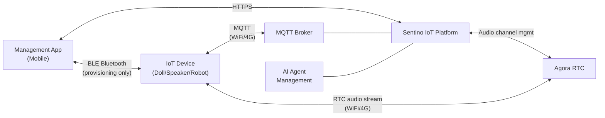
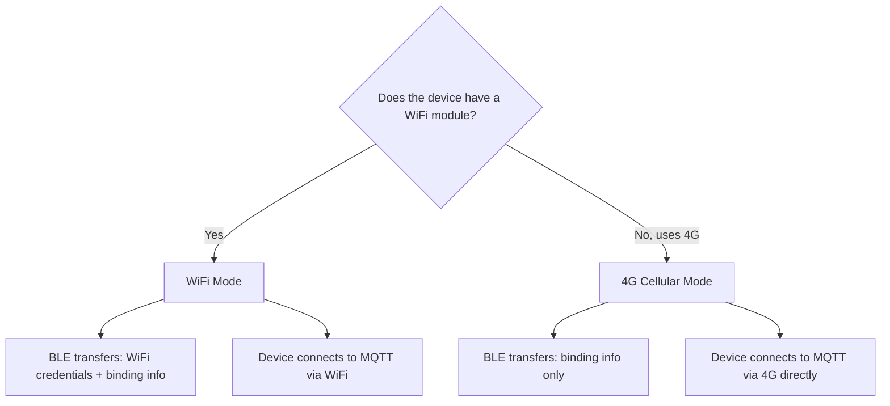
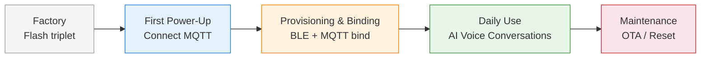
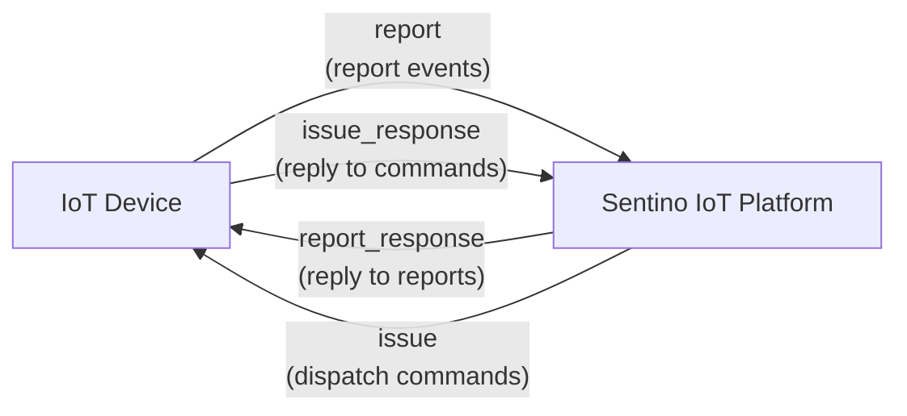
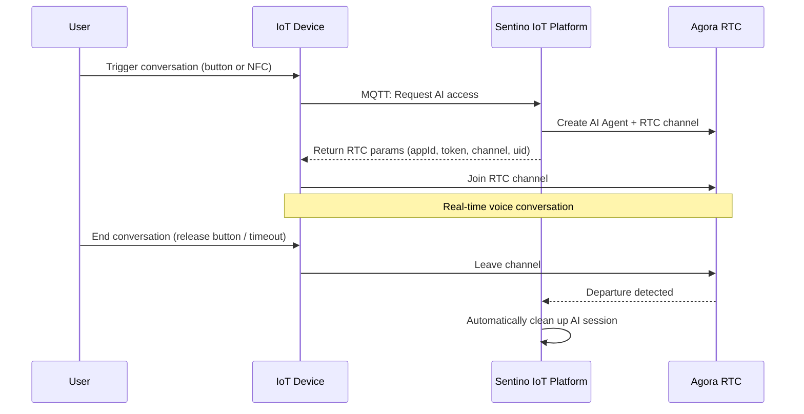

# Architecture & Concepts

This document helps you build a holistic understanding of the Sentino IoT platform. We recommend reading it before diving into other documents.

---

## 1. What Is Sentino

Sentino IoT is an IoT platform **designed for AI voice-interactive devices**. The core problem it solves is:

> Enabling an embedded device (such as a doll, speaker, or robot) to conduct **real-time voice conversations** with cloud-based AI.

The platform provides all the infrastructure needed to achieve this goal:

- **Device Access** — Devices connect to the cloud via MQTT to report status and receive commands
- **Device Provisioning** — On first use, users complete device binding via phone App Bluetooth (BLE)
- **AI Voice Conversation** — Devices conduct low-latency real-time voice calls with cloud AI Agents via Agora RTC
- **Agent Management** — Configure different AI characters (persona, voice, behavior) for devices

---

## 2. Overall Architecture



### Role Responsibilities

| Role | Does | Does Not |
|---|---|---|
| **IoT Device** | Connects MQTT, receives BLE provisioning info, obtains RTC params via MQTT, integrates Agora SDK for voice calls | Does not call REST API directly, does not generate Tokens |
| **Management App** | BLE scans devices, obtains binding info from cloud, writes to device via BLE, manages agents | Does not participate in voice calls |
| **Sentino IoT Platform** | Manages MQTT Broker, manages device lifecycle, manages AI Agents, generates RTC auth params | — |
| **Agora RTC** | Provides low-latency real-time audio channel between device and AI Agent | Does not handle business logic |

### Communication Protocol Overview

| Channel | Protocol | Purpose | When Used |
|---|---|---|---|
| Device <-> Cloud | **MQTT 5.0** | Device auth, binding, status reporting, command dispatch, obtaining RTC params | Always connected after device powers on |
| App <-> Device | **BLE** (Bluetooth Low Energy) | First-time provisioning to transfer binding info (WiFi credentials or user ID) | First-time provisioning only |
| App <-> Cloud | **HTTPS** (REST API) | User login, device management, agent management | While App is running |
| Device <-> Agora | **RTC** (UDP) | Real-time audio transmission | During voice conversations only |

---

## 3. Core Concepts

### 3.1 Device Credential Triplet

Sentino pre-assigns a unique set of identity credentials to each device, called the **triplet**:

| Field | Description | Analogy |
|---|---|---|
| **UUID** | Unique device identifier | Like a "username" |
| **KEY** | Device secret key (32 characters) | Like a "password" |
| **MAC** | Device network address | Like an "ID number" |

Additionally, there is a **Barcode** printed on the device enclosure for users to scan and initiate the provisioning process.

The triplet is **flashed to the device's NVS partition** (Non-Volatile Storage — a storage area that retains data after power-off) during manufacturing. The device reads the triplet from NVS on each power-up to connect to the cloud.

> **Security Note**: KEY is the device's identity credential, equivalent to a password. It must never be transmitted in plaintext, printed in logs, or hardcoded in source code.

### 3.2 Product

A **Product** is a collection of devices of the same model, identified by a **Product ID (pid)**. All devices under the same product share the same:

- MQTT Topic prefix
- Thing Model definition
- Provisioning mode
- OTA update channel

For example, "Bear Doll V2" is a product. This product might have 10,000 devices, each with its own triplet.

### 3.3 App

An **App** is the identity for a client application (mobile or web) connecting to the Sentino platform. The following configurations are obtained from the **"App Development" management page** on the Sentino IoT platform:

| Configuration | Purpose | Example |
|---------------|---------|---------|
| `app_id` | Application identifier, required in all REST API headers | `krfjnsim9vs7yd` |
| Channel identifier (`channel_identifier`) | Identifies the App's distribution channel | `gk6853gq` |
| `package_name` | App package name (iOS / Android) | `jp.sentino.general` |
| Data center (`data_center_code`) | Server region | `cn` |
| OAuth2 `client_id` / `client_secret` | HTTP Basic Auth authentication | TBD |

> **Note**: `app_id` and `PID` are identifiers at different levels. `app_id` identifies the client application, while `PID` identifies the product model. A single App can manage devices across multiple products. Device firmware does not need to know the `app_id`.

### 3.4 Identity Hierarchy

```
Sentino IoT Platform
│
├── App ─── REST API identity, App-side only
│   ├── app_id             ← from "App Development" page
│   ├── client_id/secret   ← OAuth2 authentication
│   └── channel_identifier
│
├── Product ─── Device model, shared across same model
│   ├── PID                ← from "Product Management" page
│   ├── Triplet allocation
│   └── Thing Model / Provisioning mode / OTA channel
│       │
│       └── Device × N ─── Unique per device
│           ├── UUID        ← from "Product Management" page, flashed to NVS
│           ├── KEY         ← MQTT HMAC signing key
│           └── MAC
│
└── User ─── Created on App login
    ├── userId              ← returned by login API
    └── assetId             ← returned by asset tree API, devices bind to this node
```

- **App side** uses `app_id` + `client_id` to call REST APIs (user login, device binding)
- **Device side** uses `UUID` + `KEY` to connect to MQTT broker, `PID` for Topic path
- **Provisioning binding**: App sends `userId` + `assetId` to device via BLE → device reports `bind` via MQTT → cloud associates them

### 3.5 Thing Model

The **Thing Model** is a structured description of device capabilities, defining what **properties** the device has, similar to a database schema.

Devices report property values via MQTT (e.g., `{"color": "red", "brightness": 50}`), and the cloud can also send property-setting commands via MQTT. The Thing Model definition is configured in the Sentino backend.

### 3.6 Agent

An **Agent** is the configuration unit for an AI character, defining the AI's behavior during voice conversations:

| Component | Description | Example |
|---|---|---|
| Persona (Prompt) | AI character description and behavior instructions | — |
| Voice (TTS Voice) | The voice the AI speaks with | Female-Gentle, Male-Energetic |
| Avatar | Character image displayed in the App | — |
| Tags | Character categories | Story, Education, Companion |

A device determines which AI character to use for conversations by "binding an agent."

### 3.5 Accounts & Device Ownership

Each user has an **account** in Sentino. Devices are associated with this account during binding.

During device binding, an `assetId` (account ID) must be specified, indicating which user the device belongs to. This information is obtained from the cloud by the Management App and passed to the device via BLE.

> **Developer Tip**: Call `POST /business-app/v1/asset/assetTree` to get the account structure, then use the root node's `assetId` as the binding parameter. The API field name `assetId` is retained for historical reasons — in the AI toy scenario, it is equivalent to the user account ID.

---

## 4. Two Connectivity Modes

Sentino supports two device connectivity modes. The choice depends on hardware capabilities:



| Comparison | WiFi Mode | 4G Mode |
|---|---|---|
| Connectivity | Connects to user's home WiFi router | Direct cellular via built-in SIM card |
| BLE provisioning content | WiFi SSID + password + userId + account ID (assetId) + MQTT address | userId + account ID (assetId) only |
| When MQTT connects | After receiving WiFi info and connecting to WiFi | **Immediately on power-up** (no provisioning wait) |
| Use case | Fixed locations (home, classroom) | Mobile scenarios or no-WiFi environments |
| Network dependency | Depends on user's router | Depends on carrier signal |

---

## 5. Complete Lifecycle

A device goes through the following stages from factory to daily use:



| Stage | Participants | Key Actions |
|---|---|---|
| **Factory** | Factory | Flash triplet (UUID/KEY/MAC) to NVS, print Barcode on enclosure |
| **First Power-Up** | Device (automatic) | Read triplet from NVS -> calculate HMAC signature -> connect to MQTT Broker -> subscribe to Topics |
| **Provisioning & Binding** | User + App | App scans code -> obtains userId/account ID -> BLE sends to device -> device MQTT reports `bind` |
| **Daily Use** | User + Device | User triggers conversation -> device MQTT reports `agora_agent_device_access` -> obtains RTC params -> joins Agora channel -> real-time voice |
| **Maintenance** | Remote | OTA firmware updates, device reset, unbinding |

---

## 6. MQTT Communication Model

Devices communicate bidirectionally with the cloud through 4 MQTT Topics:



**Two communication patterns:**

| Pattern | Initiator | Flow | Examples |
|---|---|---|---|
| **Report-Reply** | Device initiates | Device -> `report` -> cloud processes -> `report_response` -> device | Device binding, AI access request, property reporting |
| **Issue-Reply** | Cloud initiates | Cloud -> `issue` -> device processes -> `issue_response` -> cloud | OTA update, property setting, device reset |

All messages are in JSON format, differentiated by the `code` field (e.g., `bind`, `info`, `ota`, etc.). For detailed protocol definitions, see [MQTT Protocol Reference](./ref-mqtt.md).

---

## 7. AI Voice Conversation Model

The core flow of AI voice conversations has two steps: **obtain channel** and **real-time call**.



**Key design decisions:**

- **MQTT only handles "getting the ticket"** (obtaining RTC connection params), **does not carry audio streams**
- **Agora RTC carries real-time low-latency audio**
- **AI Agent is already waiting in the channel** — the device can start talking immediately upon joining
- **To end, the device just leaves the channel** — the cloud automatically detects and cleans up, no additional MQTT messages needed
- **Workflow & Device Control** — AI conversations support full workflow orchestration (Function Calling, memory retrieval). IoT devices can also control hardware via Function Calling through the RTC channel (e.g., expressions, actions, LEDs, volume)

---

## 8. Glossary

| Term (CN) | English | Description |
|---|---|---|
| 三元组 | Device Credential Triplet | Device identity credentials: UUID, KEY, MAC |
| NVS | Non-Volatile Storage | Storage area that retains data after power-off |
| 物模型 | Thing Model / TSL | Structured description of device capabilities (properties, events) |
| 智能体 | Agent | AI character configuration (persona, voice, behavior) |
| 账户 ID (assetId) | Asset ID | Device ownership identifier, specifying which user account a device belongs to |
| 配网 | Provisioning | The process of configuring network and binding information for a device on first use |
| 产品 | Product | Collection of devices of the same model, sharing pid, Thing Model, provisioning mode |
| pid | Product ID | Unique product identifier, assigned by Sentino |
| BLE | Bluetooth Low Energy | Low-power Bluetooth for short-range device communication |
| GATT | Generic Attribute Profile | Standard protocol for BLE data exchange |
| STA 模式 | Station Mode | WiFi client mode, connecting to a router |
| MQTT | Message Queuing Telemetry Transport | Lightweight messaging protocol widely used in IoT |
| QoS | Quality of Service | MQTT message quality level. QoS 0 = at most once, QoS 1 = at least once |
| Keep Alive | — | MQTT heartbeat interval; broker considers device offline if no communication within this time |
| Topic | — | MQTT message "address"; publishers and subscribers match through Topics |
| RTC | Real-Time Communication | Real-time communication, here referring to Agora's audio/video call service |
| OTA | Over-The-Air | Remote firmware updates via network |
| MTU | Maximum Transmission Unit | Maximum data size for a single BLE transmission |
| HMAC | Hash-based Message Authentication Code | Hash-based message authentication code for signature verification |
| Barcode | — | Device provisioning barcode, printed on device for App scanning |

---

**Next Steps**: [Quick Start — Device](./quickstart-device.md) | [MQTT Protocol Reference](./ref-mqtt.md)
