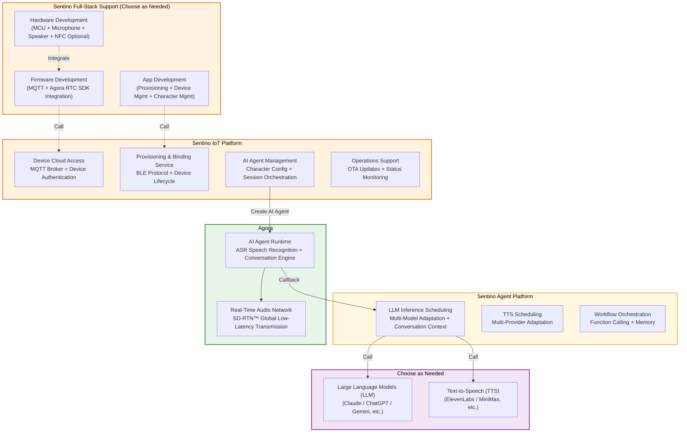
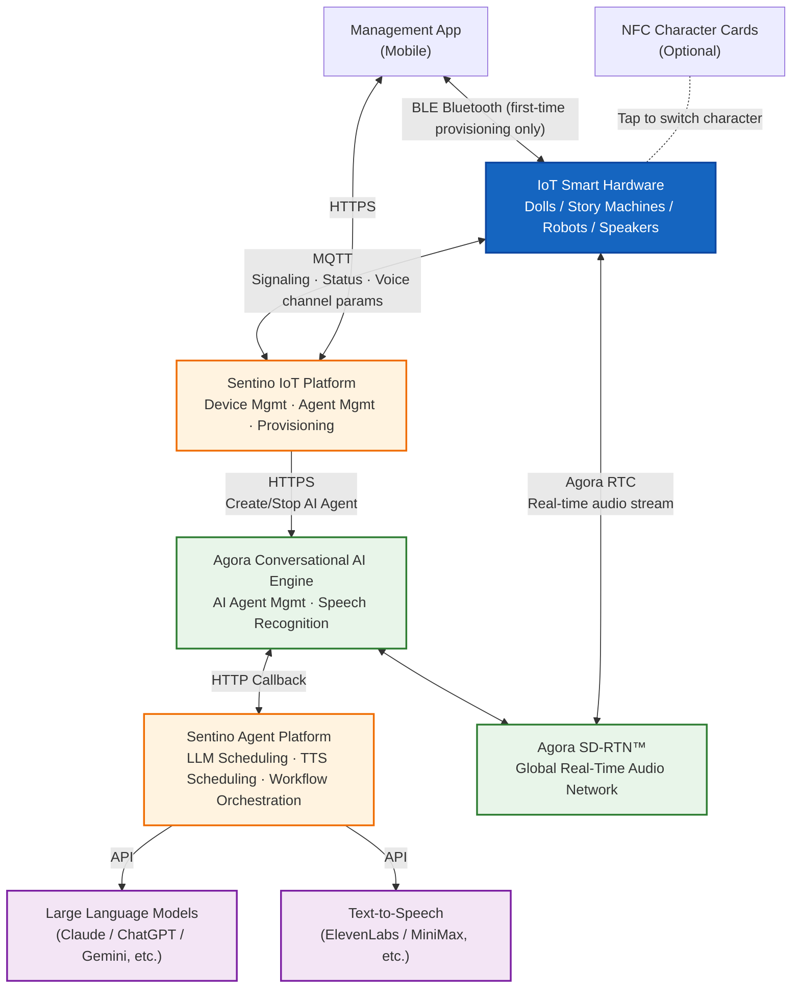
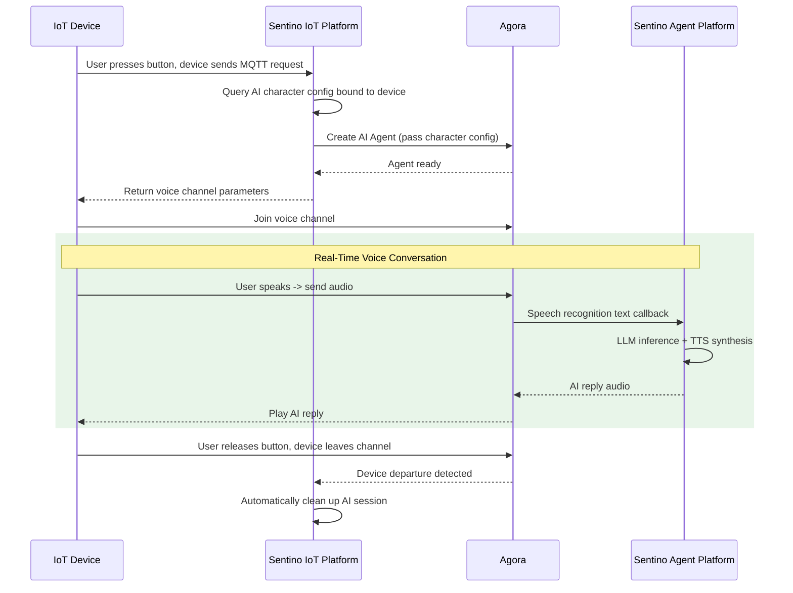

# Sentino IoT × Agora — Solution Overview (Business View)

> Intended for product and business decision-makers. This document focuses on **responsibility layering** and **how a voice conversation happens**.
>
> - Product capabilities: see [Architecture & Concepts §1](./architecture-en.md#product-capabilities-at-a-glance)
> - Detailed technical architecture: see [Architecture & Concepts §2](./architecture-en.md#2-overall-architecture) and [Technical Architecture Deep Dive](./architecture-technical-en.md)

---

## 1. Who Does What — Responsibility Layers

> **Core Value**: Sentino provides full-stack support from platform to hardware and App. Customers choose what to build in-house or delegate, enabling rapid product delivery.

---

## 2. System Architecture

**The device has two communication links:**
- **MQTT (Signaling Channel)**: Device <-> Sentino IoT Platform, used for device authentication, status reporting, and obtaining voice channel parameters
- **Agora RTC (Audio Channel)**: Device <-> Agora Audio Network, used for real-time voice conversations

---

## 3. How a Voice Conversation Happens

**Key Points**:
- The device only needs to do two things: send an MQTT request + join the voice channel
- Agora handles audio transmission and speech recognition; Sentino Agent Platform handles LLM inference and TTS synthesis
- After the conversation ends, the cloud automatically cleans up — no additional device action required

---

## 4. Related Documents

| Document | Target Reader | Content |
|----------|---------------|---------|
| [Architecture & Concepts](./architecture-en.md) | Developers | Core concepts, product capabilities, protocol overview, two product paths, glossary |
| [Technical Architecture Deep Dive](./architecture-technical-en.md) | Technical Evaluators / Architects | Detailed system topology, full data-flow sequence, key design decisions |
| [AI Toy Integration Solution](solutions/solution-ai-toy-en.md) | Product Managers | User journey, NFC design, mass production readiness |
| [Device Integration Guide](guides/guide-device-en.md) | Firmware Engineers | MQTT protocol integration |
| [AI Voice Conversation Integration](guides/guide-ai-voice-en.md) | Firmware Engineers | Agora RTC integration |
