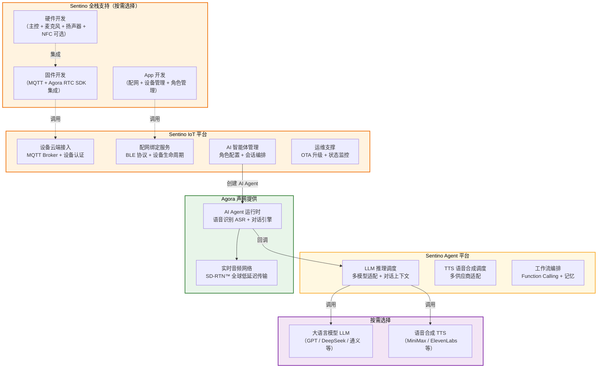
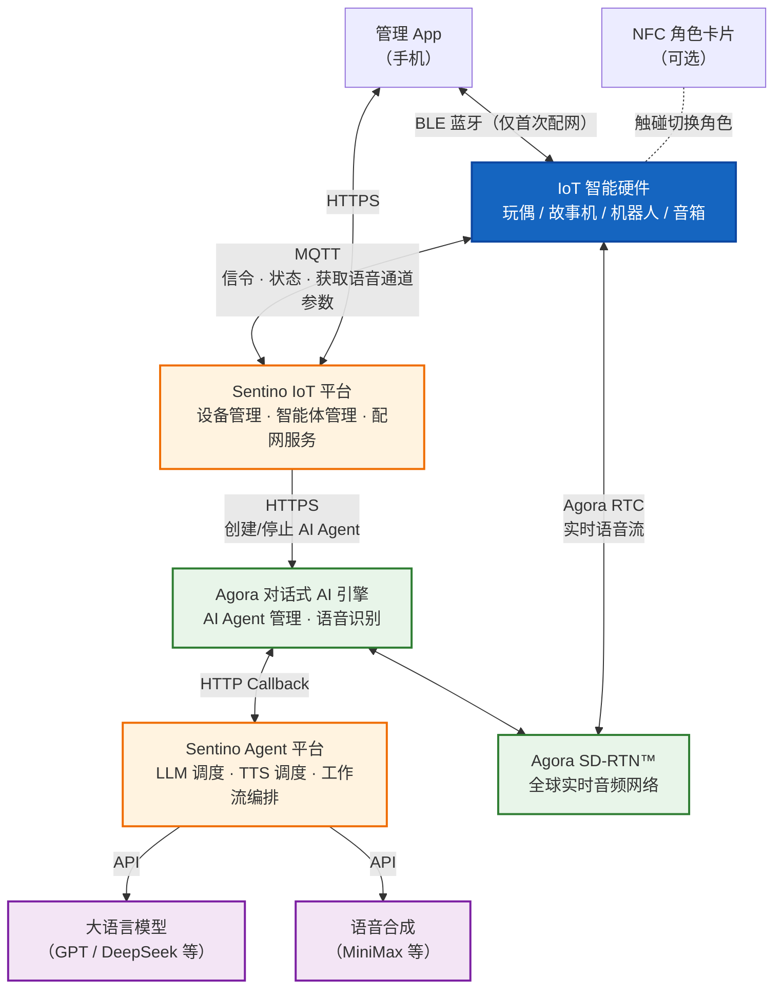
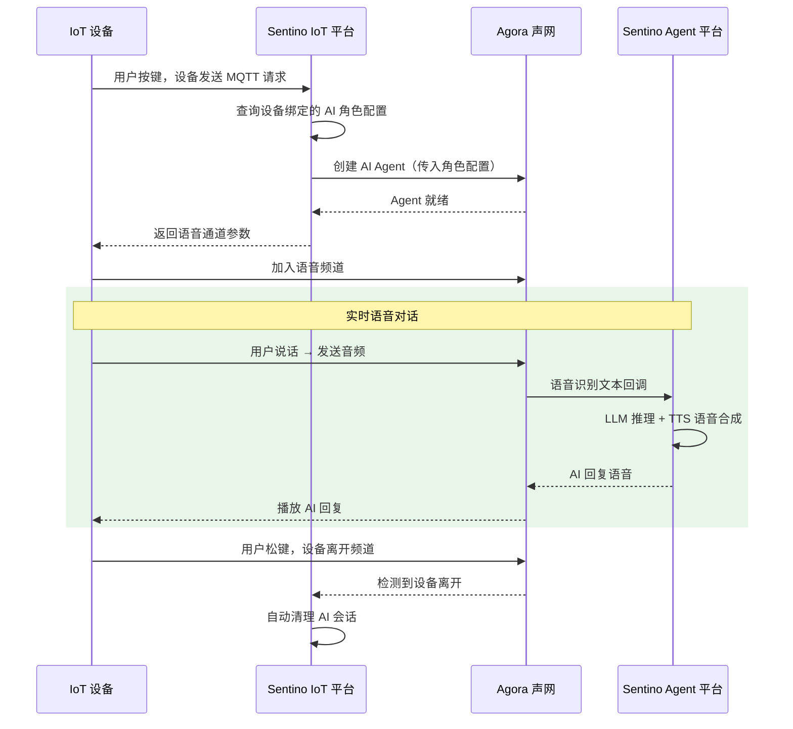

# Sentino IoT × Agora 方案概览（商务视角）

> 本文面向产品和商务决策者，重点呈现**责任分层**和**一次语音对话的发生过程**。
>
> - 产品能力一览见 [架构与概念 §1](./architecture.md#产品能力一览)
> - 详细技术架构见 [架构与概念 §2](./architecture.md#2-整体架构) 与 [技术架构详解](./architecture-technical.md)

---

## 1. 谁做什么 — 责任分层

> **核心价值**：Sentino 提供从平台到硬件、App 的全栈支持，客户按需选择自研或委托，快速实现产品落地。

---

## 2. 系统架构

**设备有两条通信链路：**
- **MQTT（信令通道）**：设备 ↔ Sentino IoT 平台，用于设备认证、状态上报、获取语音通道参数
- **Agora RTC（音频通道）**：设备 ↔ Agora 音频网络，用于实时语音对话

---

## 3. 一次语音对话是怎么发生的

**要点**：
- 设备只需做两件事：发 MQTT 请求 + 加入语音频道
- Agora 负责音频传输和语音识别，Sentino Agent 平台负责 LLM 推理和 TTS 语音合成
- 对话结束后云端自动清理，无需设备额外操作

---

## 4. 相关文档

| 文档 | 适用读者 | 内容 |
|------|----------|------|
| [架构与概念](./architecture.md) | 开发者 | 核心概念、产品能力一览、通信协议总览、两条产品路径对比、术语表 |
| [技术架构详解](./architecture-technical.md) | 技术评估 / 架构师 | 详细系统全景架构、完整数据流时序图、关键设计决策 |
| [AI 玩偶接入方案](solutions/solution-ai-toy.md) | 产品经理 | 用户旅程、NFC 设计、量产准备 |
| [设备端集成指南](guides/guide-device.md) | 固件工程师 | MQTT 协议集成 |
| [AI 语音对话集成](guides/guide-ai-voice.md) | 固件工程师 | Agora RTC 集成 |
