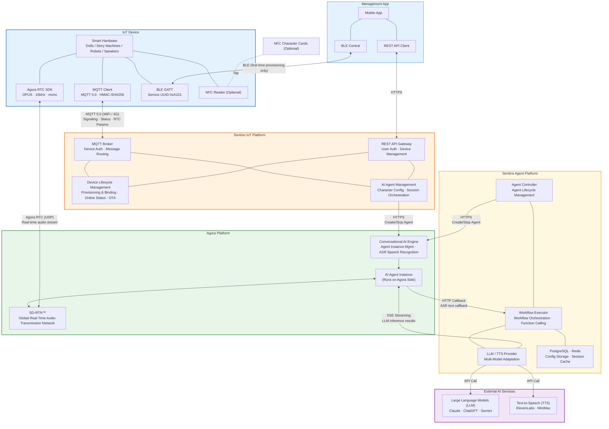
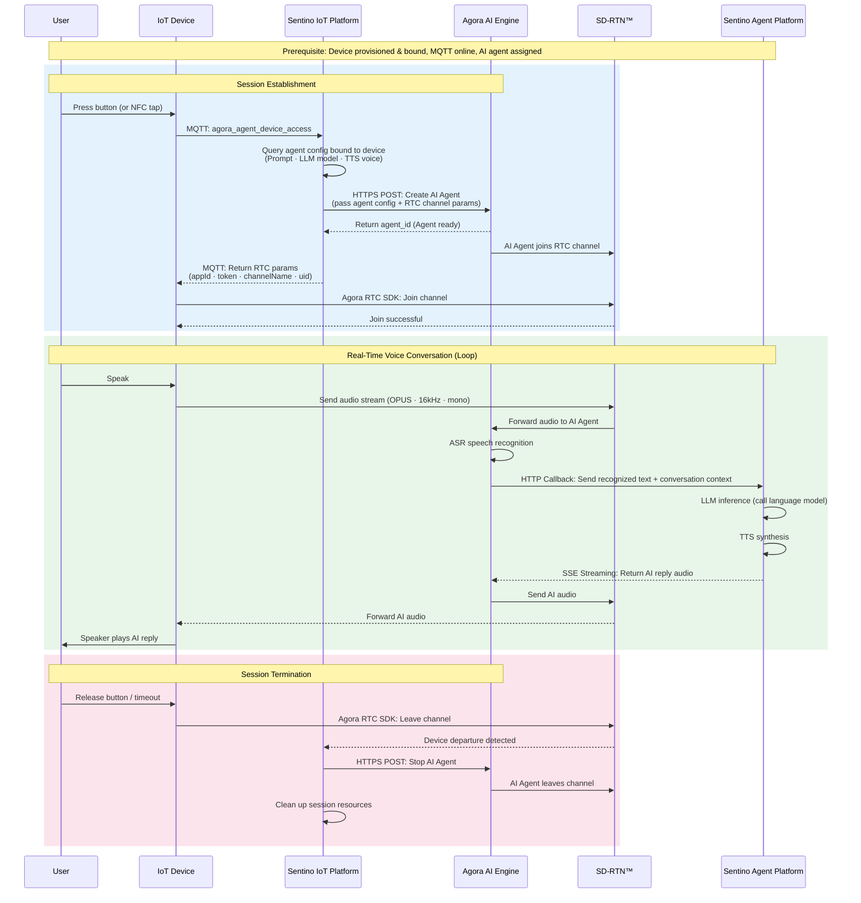

# Sentino IoT x Agora Technical Architecture Deep Dive

> This document is intended for technical evaluators and architects, providing a detailed view of the Sentino IoT platform and Agora's system architecture, communication protocols, and data flows.

---

## 1. System Architecture Overview

---

## 2. IoT Device Voice Conversation — Complete Data Flow

---

## 3. Two Product Paths Compared

The Sentino ecosystem offers two paths to integrate Agora voice AI, sharing the same Agora Conversational AI Engine and SD-RTN:

| Comparison | IoT Device Path | Sentino Agent Platform Web Path |
|------------|----------------|--------------------------------|
| **Access Terminal** | Embedded hardware (dolls, speakers, etc.) | Web browser |
| **Audio Carrier** | Agora RTC C SDK (RTOS) | Agora RTC Web SDK (Browser) |
| **Signaling Channel** | MQTT 5.0 | HTTPS REST API |
| **Agent Creator** | Sentino IoT Platform | Sentino Agent Platform |
| **LLM/TTS Caller** | Sentino Agent Platform (Agora calls back via HTTP Callback) | Sentino Agent Platform (same) |
| **Workflow Capabilities** | Supports Function Calling, memory retrieval, workflow orchestration | Supports Function Calling, memory retrieval, workflow orchestration |
| **IoT-Exclusive Capabilities** | **Device Control** — Function Calling sends commands via RTC channel to control hardware (expressions, actions, LEDs, volume, etc.) | — |
| **Use Cases** | Consumer electronics (dolls, story machines, educational robots) | Enterprise & consumer AI Agent applications (customer service, meeting assistants, smart assistants, etc.) |

**Architectural Commonalities**: Both paths share the same Sentino Agent Platform workflow engine, both supporting Function Calling, memory retrieval, and workflow orchestration. Agora handles audio transmission and ASR; the Sentino Agent Platform handles LLM inference and TTS synthesis. Agora does not call LLM and TTS directly.

**Path Differences**:
- **IoT Path**: Minimal device complexity, triggered via MQTT signaling, supports full workflow capabilities, and can control device hardware via Function Calling through the RTC channel (e.g., expressions, actions, LEDs, volume, etc.)
- **Web Path**: Triggered via HTTPS, supports Function Calling, memory retrieval, and workflow orchestration

---

## 4. Key Design Decisions

| Decision | Rationale |
|----------|-----------|
| **MQTT for Signaling Only** | MQTT handles device authentication, status reporting, and obtaining RTC parameters — it does not carry audio streams. Audio travels via Agora RTC (UDP) for lower latency |
| **Agora Handles Audio Transport and ASR** | Agora provides the real-time audio network, AI Agent runtime, and speech recognition. LLM and TTS are handled by the Sentino Agent Platform via HTTP Callback |
| **Minimal Device Footprint** | The device only needs to: (1) send one MQTT message, (2) join the RTC channel with the returned parameters. AI configuration, Agent creation, and session cleanup all happen in the cloud |
| **AI Agent Ready Before Device** | Sentino cloud creates the Agent on Agora first; the Agent joins the channel and waits, then notifies the device to join. This guarantees the device can start talking immediately upon entry |
| **Automatic Cleanup** | The device only needs to leave the RTC channel; the cloud automatically detects this and cleans up the Agent and session resources — no additional device messages required |
| **NFC Tap-and-Talk** (Optional) | If the device has NFC, a card tap reports the identifier; the cloud automatically matches the character and creates a new Agent — switching + starting a conversation in one step |

---

## 5. Communication Protocol Overview

| Channel | Protocol | Purpose | When Used |
|---------|----------|---------|-----------|
| Device <-> Sentino IoT Platform | **MQTT 5.0** | Device auth, binding, status reporting, command dispatch, obtaining RTC params | Always connected after device powers on |
| App <-> Device | **BLE** (GATT) | First-time provisioning to transfer binding info (WiFi credentials or userId) | First-time provisioning only |
| App <-> Sentino IoT Platform | **HTTPS** (REST API) | User login, device management, agent management | While App is running |
| Device <-> Agora | **RTC** (UDP) | Real-time bidirectional audio transmission | During voice conversations only |
| Sentino IoT Platform <-> Agora | **HTTPS** | Create/Stop AI Agent | At voice conversation start/end |
| Agora <-> Sentino Agent Platform | **HTTPS** + **HTTP Callback** + **SSE** | Agent management + ASR text callback + LLM/TTS result return | During voice conversations |
| Sentino Agent Platform <-> LLM/TTS | **HTTPS** | AI inference, speech synthesis | During voice conversations |

---

**Related Documents**: [Solution Overview](./architecture-overview-en.md) | [Architecture & Concepts](./architecture-en.md) | [Sentino Agent Platform Architecture](./sentino/agent-platform-en.md)
