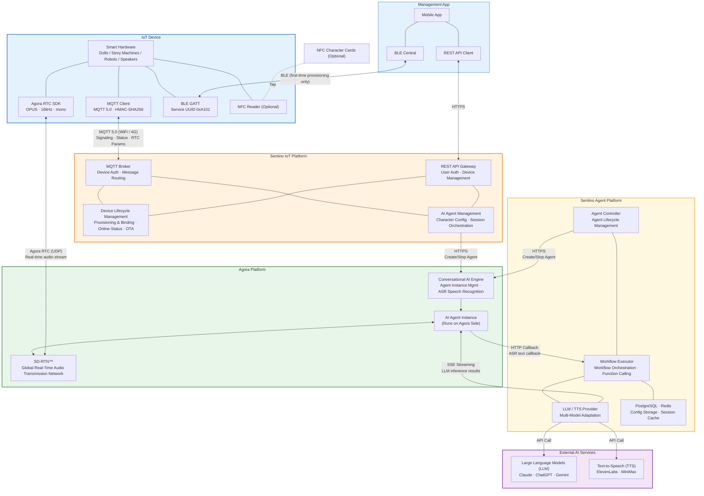
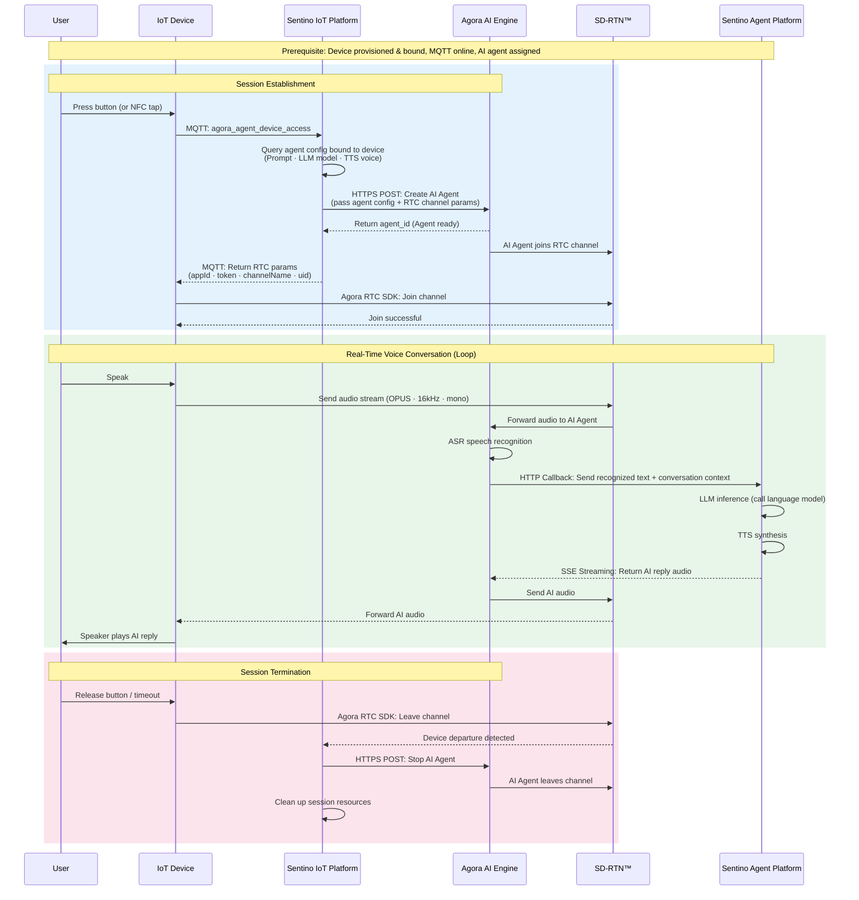

# Sentino IoT × Agora — Technical Architecture Deep Dive

> Intended for technical evaluators and architects. This document focuses on the **detailed system topology** and the **full voice-conversation data flow**.
>
> - Mid-level architecture + protocol overview: see [Architecture & Concepts §2](./architecture-en.md#2-overall-architecture)
> - Two product paths comparison: see [Architecture & Concepts §8](./architecture-en.md#8-two-product-paths)
> - Business view (responsibility layering, simplified conversation flow): see [Solution Overview](./architecture-overview-en.md)

---

## 1. System Architecture Overview

---

## 2. IoT Device Voice Conversation — Complete Data Flow

---

## 3. Key Design Decisions

| Decision | Rationale |
|----------|-----------|
| **MQTT for Signaling Only** | MQTT handles device authentication, status reporting, and obtaining RTC parameters — it does not carry audio streams. Audio travels via Agora RTC (UDP) for lower latency |
| **Agora Handles Audio Transport and ASR** | Agora provides the real-time audio network, AI Agent runtime, and speech recognition. LLM and TTS are handled by the Sentino Agent Platform via HTTP Callback |
| **Minimal Device Footprint** | The device only needs to: (1) send one MQTT message, (2) join the RTC channel with the returned parameters. AI configuration, Agent creation, and session cleanup all happen in the cloud |
| **AI Agent Ready Before Device** | Sentino cloud creates the Agent on Agora first; the Agent joins the channel and waits, then notifies the device to join. This guarantees the device can start talking immediately upon entry |
| **Automatic Cleanup** | The device only needs to leave the RTC channel; the cloud automatically detects this and cleans up the Agent and session resources — no additional device messages required |
| **NFC Tap-and-Talk** (Optional) | If the device has NFC, a card tap reports the identifier; the cloud automatically matches the character and creates a new Agent — switching + starting a conversation in one step |

---

> The full communication protocol overview (every channel between Device / App / Sentino / Agora / Sentino Agent / LLM-TTS) is in [Architecture & Concepts §2 Communication Protocol Overview](./architecture-en.md#communication-protocol-overview).

---

**Related Documents**: [Architecture & Concepts](./architecture-en.md) | [Solution Overview](./architecture-overview-en.md)
