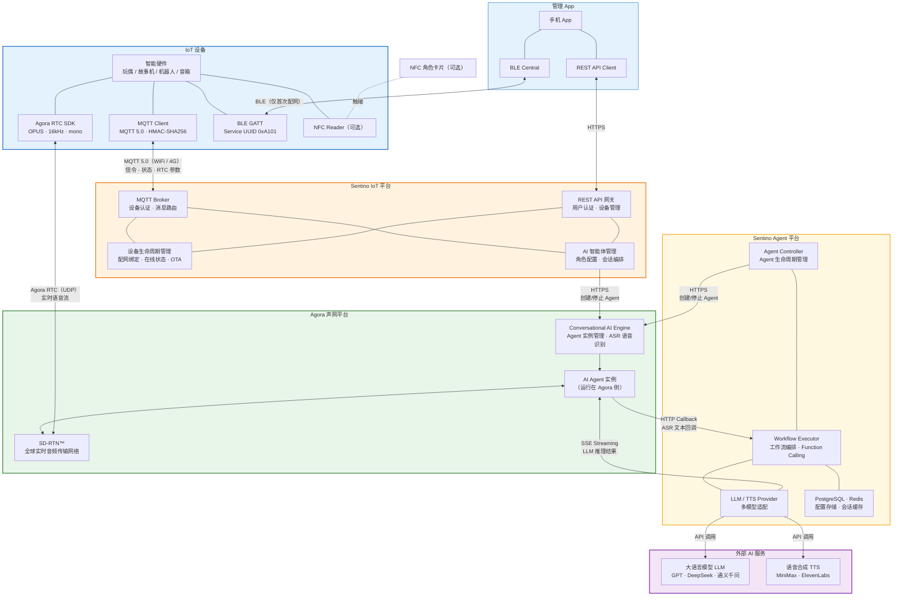
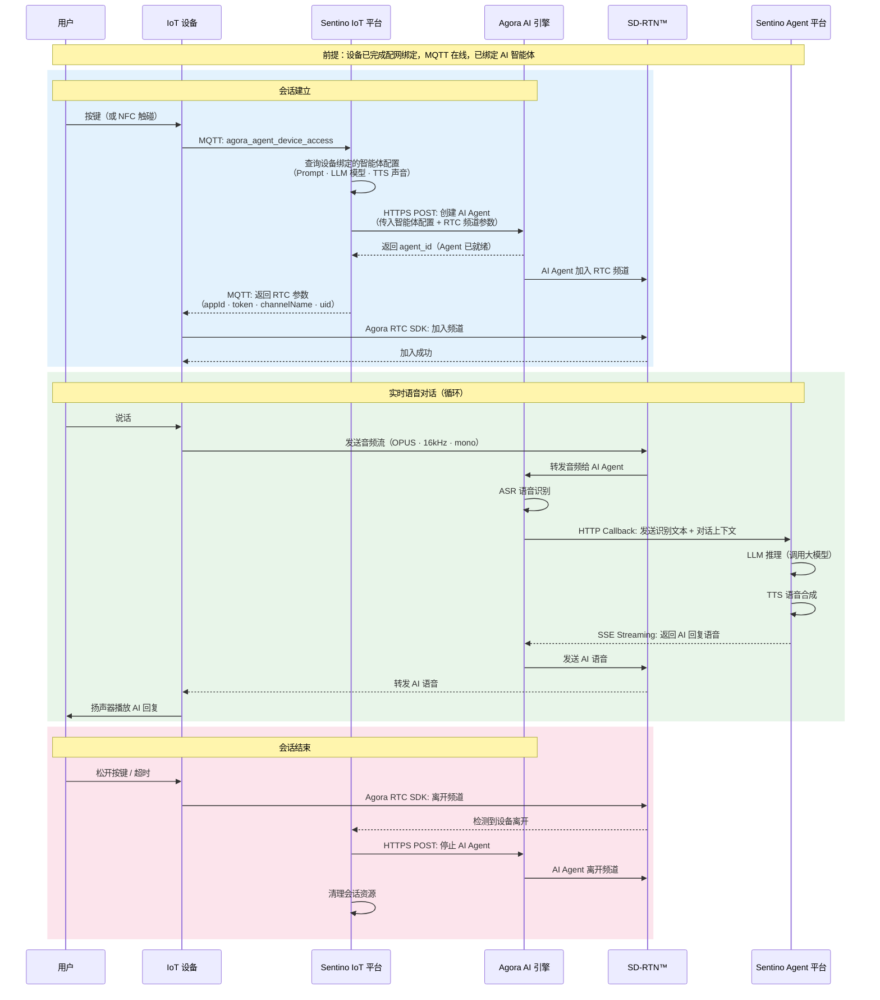

# Sentino IoT × Agora 技术架构详解

> 本文面向技术评估者和架构师，重点呈现**详细系统全景**和**完整数据流时序图**。
>
> - 中等抽象层级架构 + 通信协议总览见 [架构与概念 §2](./architecture.md#2-整体架构)
> - 两条产品路径对比见 [架构与概念 §8](./architecture.md#8-两条产品路径对比)
> - 商务视角的责任分层与简化对话流程见 [方案概览](./architecture-overview.md)

---

## 1. 系统全景架构

---

## 2. IoT 设备语音对话 — 完整数据流

---

## 3. 关键设计决策

| 决策 | 说明 |
|------|------|
| **MQTT 只做信令** | MQTT 负责设备认证、状态上报、获取 RTC 参数，不承载音频流。音频走 Agora RTC（UDP），延迟更低 |
| **Agora 负责音频传输和 ASR** | Agora 提供实时音频网络、AI Agent 运行时和语音识别，LLM 和 TTS 通过 HTTP Callback 回调 Sentino Agent 平台处理 |
| **设备端极简** | 设备只需：(1) 发一条 MQTT 消息 (2) 用返回的参数加入 RTC 频道。AI 配置、Agent 创建、会话清理全部在云端 |
| **AI Agent 先于设备就绪** | Sentino 云先在 Agora 创建 Agent，Agent 加入频道等待，然后才通知设备加入。保证设备进来就能对话 |
| **自动清理** | 设备只需离开 RTC 频道，云端自动检测并清理 Agent 和会话资源，无需设备发额外消息 |
| **NFC 即切即聊**（可选） | 设备如配备 NFC，卡片触碰后上报标识，云端自动匹配角色并创建新 Agent，一步完成切换 + 开始对话 |

---

> 通信协议总览（设备 / App / Sentino / Agora / Sentino Agent / LLM-TTS 之间所有通道）见 [架构与概念 §2 通信协议总览](./architecture.md#通信协议总览)。

---

**相关文档**：[架构与概念](./architecture.md) | [方案概览（销售版）](./architecture-overview.md)
