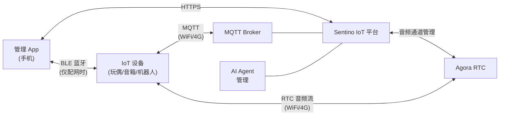
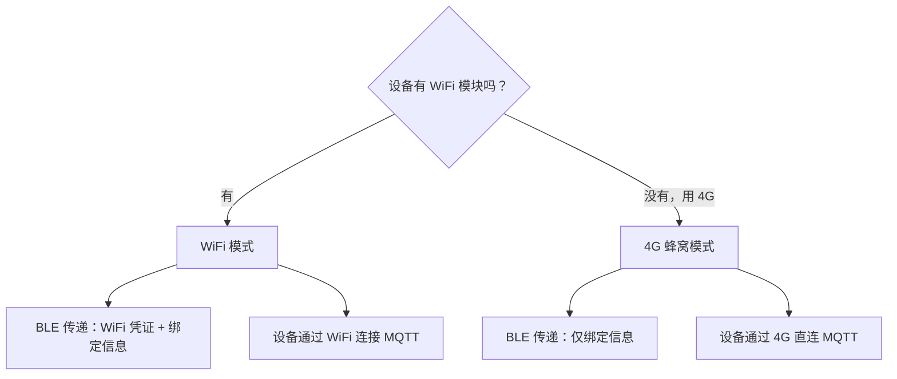
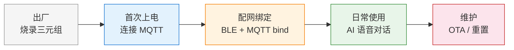
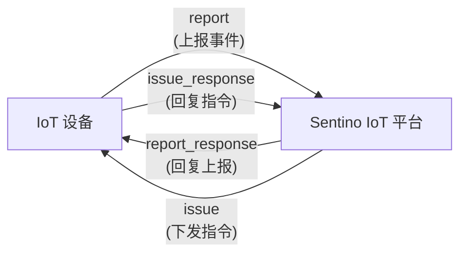
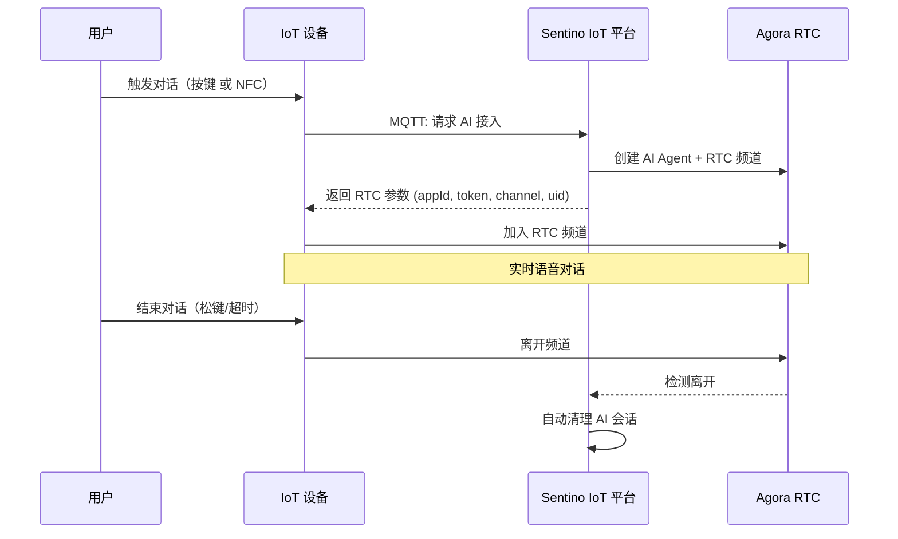

# 架构与概念

本文档帮助你建立对 Sentino IoT 平台的整体认知。建议在阅读其他文档之前先通读本文。

---

## 1. Sentino 是什么

Sentino IoT 是一个**面向 AI 语音交互设备**的物联网平台。它解决的核心问题是：

> 让一台嵌入式设备（比如玩偶、音箱、机器人）能够与云端 AI 进行**实时语音对话**。

平台提供了实现这一目标所需的全部基础设施：

- **设备接入** — 设备通过 MQTT 协议连接云端，上报状态、接收指令
- **设备配网** — 用户首次使用时，通过手机 App 蓝牙 (BLE) 完成设备绑定
- **AI 语音对话** — 设备通过 Agora RTC 与云端 AI Agent 进行低延迟实时语音通话
- **智能体管理** — 为设备配置不同的 AI 角色（人设、声音、行为）

---

## 2. 整体架构



### 各角色职责

| 角色 | 做什么 | 不做什么 |
|---|---|---|
| **IoT 设备** | 连接 MQTT、接收 BLE 配网信息、通过 MQTT 获取 RTC 参数、集成 Agora SDK 进行语音通话 | 不直接调 REST API，不自行生成 Token |
| **管理 App** | BLE 扫描设备、从云端获取绑定信息、通过 BLE 写入设备、管理智能体 | 不参与语音通话 |
| **Sentino IoT 平台** | 管理 MQTT Broker、管理设备生命周期、管理 AI Agent、生成 RTC 鉴权参数 | — |
| **Agora RTC** | 提供设备与 AI Agent 之间的低延迟实时音频通道 | 不处理业务逻辑 |

### 通信协议总览

| 通道 | 协议 | 用途 | 何时使用 |
|---|---|---|---|
| 设备 ↔ 云端 | **MQTT 5.0** | 设备认证、绑定、状态上报、指令下发、获取 RTC 参数 | 设备上电后始终保持 |
| App ↔ 设备 | **BLE** (Bluetooth Low Energy) | 首次配网时传递绑定信息（WiFi 凭证或用户 ID） | 仅首次配网 |
| App ↔ 云端 | **HTTPS** (REST API) | 用户登录、设备管理、智能体管理 | App 运行时 |
| 设备 ↔ Agora | **RTC** (UDP) | 实时音频传输 | 仅语音对话期间 |

---

## 3. 核心概念

### 3.1 设备三元组

Sentino 为每台设备预分配一组唯一的身份凭证，称为**三元组**：

| 字段 | 说明 | 类比 |
|---|---|---|
| **UUID** | 设备唯一标识 | 相当于"用户名" |
| **KEY** | 设备密钥（32 字符） | 相当于"密码" |
| **MAC** | 设备网卡地址 | 相当于"身份证号" |

另外还有一个 **Barcode**（条码），印刷在设备外壳上供用户扫码，用于启动配网流程。

三元组在量产时**烧录到设备的 NVS 分区**（Non-Volatile Storage，非易失性存储 — 即设备断电后数据仍然保留的存储区域），设备每次上电时从 NVS 中读取三元组信息连接云端。

> **安全须知**：KEY 是设备的身份凭证，等同于密码。禁止明文传输、日志打印或硬编码到源代码中。

### 3.2 产品 (Product)

**产品**是同一型号设备的集合，由一个**产品 ID (pid)** 标识。同一产品下的所有设备共享相同的：

- MQTT Topic 前缀
- 物模型定义
- 配网模式
- OTA 升级通道

例如，"小熊玩偶 V2"是一个产品，这个产品下可能有 10000 台设备，每台设备有各自的三元组。

### 3.3 应用 (App)

**应用**是 App 端（手机 App 或 Web App）接入 Sentino 平台时的身份标识。以下配置从 Sentino IoT 平台的**「App 开发」管理页面**获取：

| 配置项 | 用途 | 示例 |
|--------|------|------|
| `app_id` | 业务层应用标识，所有 REST API 请求头必带 | `krfjnsim9vs7yd` |
| 渠道标识符 (`channel_identifier`) | 标识 App 的发布渠道 | `gk6853gq` |
| `package_name` | App 包名（iOS / Android） | `jp.sentino.general` |
| 数据中心 (`data_center_code`) | 服务器区域 | `cn` |

> **注意**：`app_id` 和 `PID` 是不同层级的标识。`app_id` 标识客户端应用，`PID` 标识产品型号。一个 App 可以管理多个产品下的设备，设备固件不需要知道 `app_id`。

### 3.4 身份体系总览

```
Sentino IoT 平台
│
├── 应用 (App) ─── REST API 身份，仅 App 端使用
│   ├── app_id             ← 「App 开发」页面获取
│   ├── client_id/secret   ← OAuth2 认证
│   └── channel_identifier
│
├── 产品 (Product) ─── 设备型号，同型号共享
│   ├── PID                ← 「产品管理」页面获取
│   ├── 三元组分配
│   └── 物模型 / 配网模式 / OTA 通道
│       │
│       └── 设备 (Device) × N ─── 每台唯一
│           ├── UUID        ← 「产品管理」页面获取，烧录到 NVS
│           ├── KEY         ← MQTT HMAC 签名密钥
│           └── MAC
│
└── 用户 (User) ─── App 登录产生
    ├── userId              ← 登录 API 返回
    └── assetId             ← 资产树 API 返回，设备绑定到此节点
```

- **App 端**用 `app_id` + `client_id` 调 REST API（用户登录、设备绑定）
- **设备端**用 `UUID` + `KEY` 连 MQTT broker，`PID` 用于 Topic 路径
- **配网绑定**：App 把 `userId` + `assetId` 通过 BLE 传给设备 → 设备 MQTT 上报 `bind` → 云端关联

### 3.5 物模型 (Thing Model)

**物模型**是设备能力的结构化描述，定义了设备有哪些**属性**（properties），类似于数据库的 Schema。

设备通过 MQTT 上报属性值（如 `{"color": "red", "brightness": 50}`），云端也可以通过 MQTT 下发属性设置指令。物模型的具体定义在 Sentino 后台配置。

### 3.6 智能体 (Agent)

**智能体**是 AI 角色的配置单元，定义了 AI 在语音对话中的行为：

| 组成部分 | 说明 | 示例 |
|---|---|---|
| 人设 (Prompt) | AI 的角色描述和行为指令 | — |
| 声音 (TTS Voice) | AI 说话的声音 | 女声-温柔、男声-活力 |
| 头像 (Avatar) | 在 App 中展示的角色图片 | — |
| 标签 (Tags) | 角色分类 | 故事、教育、陪伴 |

一台设备通过"绑定智能体"来确定它使用哪个 AI 角色进行对话。

### 3.5 账户与设备归属

每个用户在 Sentino 中拥有一个**账户**，设备绑定时关联到该账户下。

设备绑定时需要指定一个 `assetId`（账户 ID），表示该设备属于哪个用户。这个信息由管理 App 从云端获取后通过 BLE 传给设备。

> **开发者提示**：调用 `POST /business-app/v1/asset/assetTree` 获取账户结构后，直接使用根节点的 `assetId` 作为绑定参数即可。API 字段名为历史原因保留为 `assetId`，在 AI 玩偶场景中等同于用户账户 ID。

---

## 4. 两种联网模式

Sentino 支持两种设备联网方式，选择取决于硬件能力：



| 对比项 | WiFi 模式 | 4G 模式 |
|---|---|---|
| 设备联网方式 | 连接用户家中的 WiFi 路由器 | 通过内置 SIM 卡直连蜂窝网络 |
| BLE 配网传递的内容 | WiFi SSID + 密码 + userId + 账户 ID (assetId) + MQTT 地址 | 仅 userId + 账户 ID (assetId) |
| 设备何时能连 MQTT | 收到 WiFi 信息、连上 WiFi 之后 | **上电即可连接**（无需等待配网） |
| 适用场景 | 固定场所使用（家、教室） | 移动场景或无 WiFi 环境 |
| 网络依赖 | 依赖用户的路由器 | 依赖运营商信号 |

---

## 5. 完整生命周期

一台设备从出厂到日常使用经历以下阶段：



| 阶段 | 参与者 | 关键动作 |
|---|---|---|
| **出厂** | 工厂 | 将三元组 (UUID/KEY/MAC) 烧录到 NVS，Barcode 印刷到外壳 |
| **首次上电** | 设备自动 | 从 NVS 读取三元组 → 计算 HMAC 签名 → 连接 MQTT Broker → 订阅 Topic |
| **配网绑定** | 用户 + App | App 扫码 → 获取 userId/账户 ID → BLE 传给设备 → 设备 MQTT 上报 `bind` |
| **日常使用** | 用户 + 设备 | 用户触发对话 → 设备 MQTT 上报 `agora_agent_device_access` → 获取 RTC 参数 → 加入 Agora 频道 → 实时语音 |
| **维护** | 远程 | OTA 固件升级、设备重置、解绑 |

---

## 6. MQTT 通信模型

设备与云端通过 4 个 MQTT Topic 进行双向通信：



**两种通信模式：**

| 模式 | 发起方 | 流程 | 示例 |
|---|---|---|---|
| **上报-回复** | 设备发起 | 设备 → `report` → 云端处理 → `report_response` → 设备 | 设备绑定、请求 AI 接入、属性上报 |
| **下发-回复** | 云端发起 | 云端 → `issue` → 设备处理 → `issue_response` → 云端 | OTA 升级、属性设置、设备重置 |

所有消息均为 JSON 格式，通过 `code` 字段区分协议类型（如 `bind`、`info`、`ota` 等）。详细的协议定义请参考 [MQTT 协议参考](./ref-mqtt.md)。

---

## 7. AI 语音对话模型

AI 语音对话的核心流程分为两步：**获取通道** 和 **实时通话**。



**关键设计决策：**

- **MQTT 只负责"拿票"**（获取 RTC 连接参数），**不承载音频流**
- **Agora RTC 承载实时低延迟音频**
- **AI Agent 已在频道内等待**，设备加入即可开始对话
- **结束时设备只需离开频道**，云端自动检测并清理，无需额外 MQTT 消息
- **工作流与设备控制** — AI 对话支持完整的工作流编排（Function Calling、记忆检索），IoT 设备还可通过 Function Calling 经 RTC 通道下发指令实现硬件控制（如表情、动作、LED、音量）

---

## 8. 术语表

| 术语 | 英文 | 说明 |
|---|---|---|
| 三元组 | Device Credential Triplet | 设备身份凭证，包含 UUID、KEY、MAC |
| NVS | Non-Volatile Storage | 非易失性存储，断电后数据保留的存储区域 |
| 物模型 | Thing Model / TSL | 设备能力的结构化描述（属性、事件） |
| 智能体 | Agent | AI 角色配置（人设、声音、行为） |
| 账户 ID (assetId) | Asset ID | 设备归属标识，绑定时指定设备属于哪个用户账户 |
| 配网 | Provisioning | 首次使用时为设备配置网络和绑定信息的过程 |
| 产品 | Product | 同一型号设备的集合，共享 pid、物模型、配网模式 |
| pid | Product ID | 产品唯一标识，Sentino 分配 |
| BLE | Bluetooth Low Energy | 低功耗蓝牙，用于近距离设备通信 |
| GATT | Generic Attribute Profile | BLE 数据交换的标准协议 |
| STA 模式 | Station Mode | WiFi 客户端模式，连接到路由器 |
| MQTT | Message Queuing Telemetry Transport | 轻量级消息传输协议，IoT 领域广泛使用 |
| QoS | Quality of Service | MQTT 消息质量等级。QoS 0 = 最多一次，QoS 1 = 至少一次 |
| Keep Alive | — | MQTT 心跳间隔，超过此时间未通信则 Broker 认为设备离线 |
| Topic | — | MQTT 消息的"地址"，发布者和订阅者通过 Topic 匹配 |
| RTC | Real-Time Communication | 实时通信，这里指 Agora 的音视频通话服务 |
| OTA | Over-The-Air | 空中升级，通过网络远程更新设备固件 |
| MTU | Maximum Transmission Unit | 最大传输单元，BLE 单次发送的最大数据量 |
| HMAC | Hash-based Message Authentication Code | 基于哈希的消息认证码，用于签名验证 |
| Barcode | — | 设备配网条码，印刷在设备上供 App 扫描 |

---

**下一步**：[快速入门 — 设备端](./quickstart-device.md) | [MQTT 协议参考](./ref-mqtt.md)
