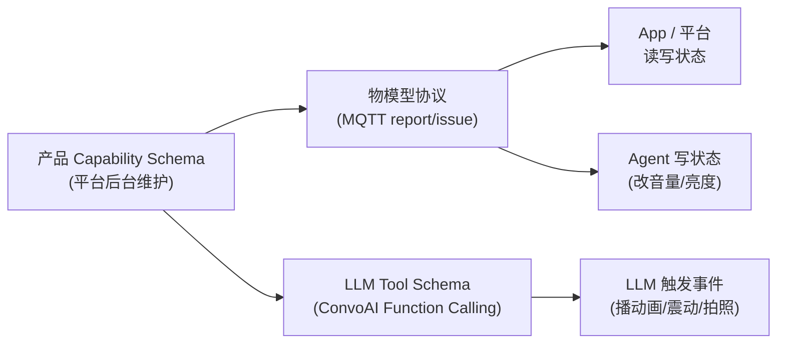
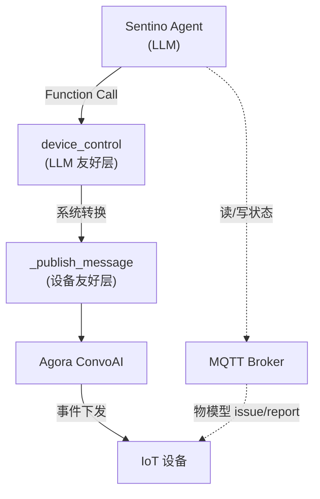
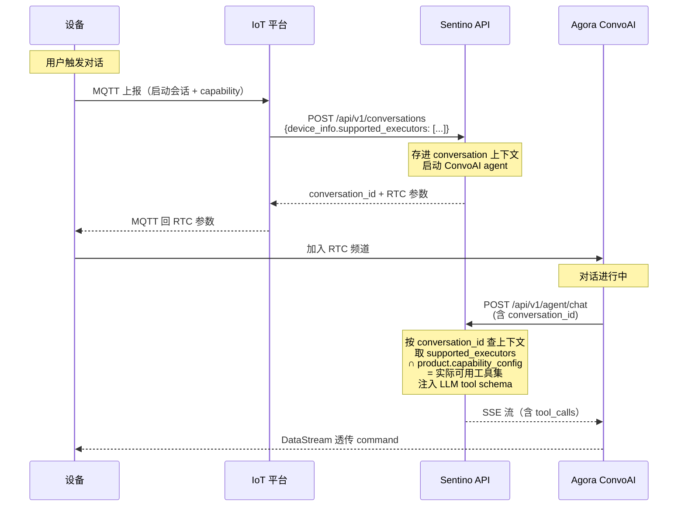

# Sentino 设备控制 — 整体设计

> 本文档定义 Sentino 平台「设备控制」的整体架构、能力管理模型、协议分层、版本兼容机制和反馈机制。是 [`architecture.md`](../architecture.md) §7 的展开。早期 [`Sentino Device Control Doc.md`](./Sentino%20Device%20Control%20Doc.md)（demo 实现笔记）和 [`device-control-protocol.md`](./device-control-protocol.md)（Agora 协议草案，**已废弃 2026-05-15**）作为历史参考保留。当前 SaaS 平台层的实施详见 DragonFlow 上游文档（参见 §7 文档关系表）。

> **跨端定位提示**：本文档以 IoT 视角落地，但其中**核心抽象层**（capability schema、tool schema 生成、Function Call 信封、版本管理、反馈机制）原则上属于 SaaS Agent 平台层（DragonFlow），IoT 仅是其端适配之一。Web / Mobile / Desktop 等端同样需要这套抽象。详见 [§9 跨端定位与归属](#9-跨端定位与归属待跨团队对齐) 和 [附录 A.7](#a7-agent-控制的跨端抽象与归属)。本文档先落地 IoT 部分，跨端统一规划需 IoT + DragonFlow 团队联合推进。

---

## 1. 设计目标与原则

设备控制要解决的核心问题是：**让 AI Agent 能在对话中操控物理设备**——播表情、震动、调音量、拍照、开锁等。

设计原则：

1. **能力定义与协议结构解耦** — capability 是产品业务问题，协议结构是传输问题，两者独立演进
2. **客户自主定义能力** — 客户在 IoT 平台后台维护产品能力清单，无需 Sentino 服务端配合发版
3. **物模型与设备控制共用一套能力管理** — 状态属性和事件动作只是同一份 schema 里两类元素的形态差异
4. **设备 ground truth 优先** — 平台 schema 是声明式期望，设备实际能力是事实，存在分歧以设备为准
5. **per-session 动态适配** — Agent 平台每次对话基于设备实际能力生成 LLM tool schema，避免 LLM 调用不存在的能力
6. **核心抽象端无关** — capability / Function Call / 版本管理 / 反馈机制不依赖具体端形态，IoT 是端适配之一，原则上可复用于 Web / Mobile / Desktop

---

## 2. 核心模型：统一能力管理

### 2.1 能力分两类：状态属性 vs 事件动作

| 维度 | 状态属性 (states) | 事件动作 (events) |
|---|---|---|
| **形态** | 可读写的持久值 | 一次性触发，无持久状态 |
| **典型例子** | 音量、亮度、电量、当前播放曲目、开关 | LCD 动画、震动 pattern、拍照、播一声提示音 |
| **生命周期** | 持久（断电恢复后仍在） | 瞬时 |
| **可读性** | App / 平台 / Agent 都可能要读 | 谁也不读，发出即消费 |
| **离线行为** | 设备本地仍生效 | 无意义 |
| **承载协议** | MQTT (`report` / `issue`) — 即现有物模型 | ConvoAI `_publish_message` |
| **谁触发** | App / 平台 / Agent 都可写 | 主要是 Agent (LLM Function Call) |

**关键判断**：状态属性 vs 事件动作是**数据形态**的差异，不是**两套独立系统**的边界。两类共享同一份 capability schema、同一套版本管理机制、同一个客户后台界面。

### 2.2 统一 Capability Schema 结构

每个产品在 Sentino IoT 平台「产品管理」页面定义一份 capability schema：

```yaml
product_id: starbuddy_v1
capability_schema_version: "1.0"  # schema 结构版本，演进慢

states:
  - name: volume
    type: integer
    range: [0, 100]
    default: 80
    writable: true
  - name: brightness
    type: integer
    range: [0, 100]
    default: 100
    writable: true
  - name: battery
    type: integer
    range: [0, 100]
    writable: false  # 只读

events:
  - name: lcd_animation
    parameters:
      animation_id: { type: enum, values: [happy_stars, blush_shy, sleepy_moon, ...] }
      duration: { type: integer, default: 2000 }
      loop: { type: boolean, default: false }
    response: none  # fire-and-forget
  - name: vibration
    parameters:
      pattern: { type: enum, values: [gentle_shake, excited_bounce, ...] }
      intensity: { type: integer, range: [0, 100] }
      duration: { type: integer }
    response: none
  - name: camera_snap
    parameters:
      resolution: { type: enum, values: [low, medium, high], default: medium }
    response: async  # 异步回灌结果（图片 URL）
```

> Schema 的最终序列化格式（YAML/JSON）和后台 UI 由平台决定，本文档只规定语义。

### 2.3 消费方式



- App 和平台读写**状态属性** → MQTT
- Agent **读** 状态属性、**写** 状态属性、**触发** 事件 → 状态走 MQTT，事件走 ConvoAI
- Agent 写状态等价于 App 写状态，最终落到同一份物模型，避免「两套真相」

---

## 3. 协议分层

### 3.1 整体通道



### 3.2 双层 Function Call（事件路径）

事件动作下发采用 DragonFlow 上游 `device-control-application.md` 已落地的**双层结构**（DragonFlow 实施详情见 `device-control-firmware-integration-guide.md`，本目录下 [`device-control-firmware-implementation-guide.md`](./device-control-firmware-implementation-guide.md) 是 IoT 视角的固件接入指南）：

| 层 | 命名 | 受众 | 形态 |
|---|---|---|---|
| **LLM 友好层** | `device_control` | LLM | 按能力分组的参数（`lcd:{}`, `vibration:{}`），每项可选 |
| **设备友好层** | `_publish_message` | 设备 | 统一动作信封（`command_id`, `protocol_version`, `actions[]`） |

LLM 调 `device_control` → Agent 平台转换为 `_publish_message` → ConvoAI 投递到设备。这一层在 DragonFlow `device-control-firmware-integration-guide.md` 已有完整实施指南（envelope 字段语义、wire 样例、固件解析模板），本设计沿用，不引入 [`device-control-protocol.md`](./device-control-protocol.md)（已废弃）的版本协商字段。

### 3.3 状态读写（已有，复用）

状态属性走现有 MQTT 物模型协议：
- 设备主动上报：`report` topic 推送状态变化
- 平台 / Agent 下发：`issue` topic 写属性

详见 [`reference/ref-mqtt.md`](../reference/ref-mqtt.md)。本设计不修改 MQTT 协议，只是把「物模型属性」纳入统一 capability schema 框架。

---

## 4. 能力版本管理

### 4.1 问题背景

Capability schema 由客户后台维护，但现网设备固件版本不齐。容易出现：
- 平台 schema 已经声明产品支持 `led_rainbow`
- 但 30% 设备还在老固件，没实现 `led_rainbow`
- LLM 误调老设备的 `led_rainbow` → 失败

需要一套机制让 Agent 平台知道「这台具体设备**当前固件**实际能做什么」。

### 4.2 解决方案：两层声明 + Per-Conversation 透传

> **2026-05-15 更新**：本节方案已升版。早前设计走"PID + firmware → capability 矩阵"持久化方案；2026-05-15 capability 协商架构决策（v5）改为 per-conversation 透传。原矩阵方案降级为附录里的"备选方案"（详见本节末尾对比表），新人按本节正文实施即可。完整决策见 obs `raw/notes/2026-05-15-iot-agent-capability-decision-memo-v5-final.md`。

**第一层：能力定义（产品级）**
- 客户在 SaaS 平台后台维护产品的完整 capability schema（落地为 DragonFlow `product.capability_config` JSONB 字段；schema 通用框架详见上游 DragonFlow `device-control-application.md` §4）
- 描述「这个产品理论上能做什么」
- 新增/修改 capability 不需要 Sentino 发版，客户后台保存即生效

**第二层：能力可用性（设备实例级）**
- 设备运行时**实际支持**的 executor 子集（取决于固件版本、硬件配置、当前可用资源等）
- 通过 Sentino API `/api/v1/conversations` 请求体的 `device_info.supported_executors: string[]` 字段在**每次会话启动时透传**（详见 `~/local/memovis/api-gateway/docs/api.md` §2.1）
- Sentino API 把它存进 conversation 上下文（per-conversation lifecycle，无持久化），`/api/v1/agent/chat` 回调时按 `conversation_id` 查回 + 跟产品级 capability_config 取交集 → 注入 LLM tool calling schema
- **老 fleet / 缺字段兼容**：未传 `supported_executors` → Sentino API 默认取 product.capability_config 全集（避免老固件突然失能）

**Per-Conversation 透传 vs 持久化矩阵（决策对比）**：

| 维度 | Per-Conversation 透传（v5 方案） | 持久化矩阵（早前方案） |
|---|---|---|
| 数据生命周期 | 单次会话有效，每次新鲜 | 跨会话持久，需同步维护 |
| 一致性窗口 | 总与设备当前状态一致 | OTA / 灰度发布期间可能漂移 |
| 持久化成本 | 0（仅 conversation 上下文内存缓存） | 需新表 + 上报机制 + 一致性维护 |
| Fleet 可见性 | 不支持（无离线统计） | 支持（"全网 X% 设备支持新能力 Y"） |
| 实施复杂度 | 低（API 字段透传 + 内存缓存） | 中-高 |
| 与现有 device_info 模式 | 一致（battery/wifi 等已是 per-session 透传） | 不一致 |

如果未来需要 fleet 可见性 / 离线分析，可在 v5 主链路基础上叠加独立的"设备 capability 持久化上报"机制（不影响主链路）。早前 fingerprint 方案现作为该叠加机制的可选实现保留。

**IoT 平台内部职责**：设备如何把"我支持哪些 executor"喂给 IoT 平台再转到 `device_info.supported_executors`，是 IoT 平台内部决策。候选方案：

- **方案 X：MQTT-on-start 透传**——设备在 `agora_agent_device_access` MQTT 上报里附加 `capability` 字段，IoT 平台收到后映射到 `device_info.supported_executors`。最简，零持久化
- **方案 Y：MQTT-once + DB-cached**——设备启动 / OTA 后独立上报，IoT 平台 DB 缓存，会话启动时查 DB。适合 fleet 可见性需求
- **方案 Z：X+Y hybrid**——X 主路径 + Y 兜底

详细对比见 v5 决策备忘 §Layer 2。Layer 1 跨团队接口已锁定，Layer 2 选哪条不阻塞 V1 启动。

### 4.3 Per-Session Tool Schema 生成

会话启动到 LLM 收到 tool schema 的完整链路：



这样 LLM 永远不会被告知它做不到的事，从根本上杜绝「调老设备调不存在的能力」。Per-conversation 模型的额外好处：设备 capability 总跟当前 device_info（battery / wifi）一起新鲜传入，不存在缓存过期窗口。

### 4.4 为什么不用协议版本协商

[`device-control-protocol.md`](./device-control-protocol.md) 提出了 device → server 协议版本协商机制。本设计不采用，原因：

| 维度 | 协议版本协商方案 | 本设计 |
|---|---|---|
| 谁维护能力定义 | Sentino 服务端的版本映射表 | 客户后台 |
| 客户加新执行器 | 要 Sentino 升级服务 | 客户自己后台 + 新固件 |
| 设备启动开销 | 每次都要协商 | 复用现有 info 上报 |
| 信封结构和能力清单 | 绑在一个 `protocol_version` 里 | 完全独立 |
| 老设备发新 capability 风险 | 设备拒绝命令 | LLM 根本不知道 |

协议草案的根本问题是把**信封结构演进**和**能力清单演进**绑在一个版本号里，且要求 Sentino 服务端承担客户能力定义的责任。本设计把两者解耦，能力管理回归客户自主权，协议结构可独立演进。

---

## 5. 执行时序与节奏

### 5.1 现状缺口

`device-control-protocol.md` 的 `actions[]` 是无序集合，`priority` 只能仲裁冲突，不能表达：
- 顺序：先震动再 LCD
- 节奏：动作之间留 gap
- 同步点：「震动结束后再说话」

### 5.2 设计：时间偏移 + 模板预设

**协议层加时间偏移字段**：

```json
{
  "command_id": "...",
  "actions": [
    { "executor": "lcd", "parameters": {...}, "start_at_ms": 0,    "priority": 8 },
    { "executor": "vibration", "parameters": {...}, "start_at_ms": 500, "priority": 7 }
  ]
}
```

- 默认 `start_at_ms: 0` → 全部并发（保持向后兼容）
- 需要节奏就加偏移
- 设备端实现时间轴调度器
- 复杂依赖（"等上一个结束"）通过语法糖：`start_at_ms: "after:action_id"`

**编排责任：混合模式**
- 简单场景：LLM 直接给单动作或并发组合
- 复杂场景：调用预设动作模板（如 `excited_celebration`），模板内部用时间轴编排
- 模板由产品的动效设计师维护，避免 LLM 编出无审美的节奏

### 5.3 待确认：固件并发能力

实施前需和固件团队确认 BK7258 是否能真并发执行多个 executor（LCD + LED + audio + 震动）。如果硬件实质单线程，再漂亮的时间轴协议也兜不住，需要在协议层强制串行。

---

## 6. 反馈机制

### 6.1 场景分类

| 类别 | 典型场景 | 数据形态 | 时序要求 |
|---|---|---|---|
| **A. 数据回流** | 拍照、录音让 AI 听、测距 | 大数据 / 小数据 | 可异步（用户能容忍 1-2 秒） |
| **B. 状态查询** | 电量、WiFi 信号、播放状态 | 小数据 | 可异步 → **走物模型** |
| **C. 执行确认** | 开/锁门、云台转向、机械臂抓取 | 小数据 | **强同步**（不知结果没法接话） |
| **D. 用户响应** | 贴 NFC 卡、按确认键、屏幕选择 | 小数据 | **等用户**（超时不可控） |
| **E. 自检诊断** | 执行器测试、陀螺仪校准 | 小数据 | 可异步 |

### 6.2 三种反馈模式

| 模式 | 适用类别 | 实现 |
|---|---|---|
| **fire-and-forget** | 大多数 events（动画、震动） | 当前 `_publish_message` 不需要回 |
| **异步回灌** | A、E | 数据走对象存储 / MQTT 上传 → URL 注入下一轮 LLM 上下文，LLM 自己看图说话 |
| **同步 RPC** | C | 命令带 `correlation_id`，设备执行完通过反向通道回结果，Agent await |
| **多模态事件** | D | **不当 tool_result**！设备主动通过 MQTT 上报"用户输入事件" → 平台合成 user message → 注入 LLM 上下文 |

### 6.3 Capability Schema 标注 response 类型

每个 event 在 schema 里声明 response 类型，Agent 平台据此决定调用方式：

```yaml
events:
  - name: lcd_animation
    response: none           # fire-and-forget
  - name: camera_snap
    response: async          # 异步回灌
  - name: door_unlock
    response: sync           # 同步 RPC，LLM 阻塞等
```

### 6.4 实施优先级

1. **B 类彻底交给物模型** — 不让 Agent 现场问电量，物模型主动上报，Agent 直接读缓存（不需要新机制）
2. **A 类异步回灌** — 拍照高频需求，复用 MQTT 上传通路 + URL 注入下轮 LLM
3. **C 类强同步 RPC** — 商业上不紧迫，最难做对（超时、失败重试），晚做
4. **D 类多模态事件** — 单独设计，不混进 tool_result

### 6.5 待解决：同步 RPC 的承载通道

C 类强同步 RPC 需要设备 → Agent 反向通道。两个候选：
- **Agora ConvoAI 反向消息**（如果支持）：延迟低但绑定 RTC 在线
- **MQTT `report` + IoT 平台桥接 Agent 平台**：复用现有 MQTT 反馈，但跨系统协调复杂

需先确认 Agora 那边的能力边界再定。

---

## 7. 与现有文档的关系

**iot-docs 内部**：

| 文档 | 角色 | 状态 |
|---|---|---|
| [`architecture.md`](../architecture.md) | 顶层架构 | 修改 §7 把「RTC 通道」改为「Agora ConvoAI `_publish_message`」，新增 §3.8「设备能力管理」概念，引用本文档 |
| [`reference/ref-mqtt.md`](../reference/ref-mqtt.md) | MQTT 协议 | 不修改（物模型协议保持不变） |
| [`device-control-firmware-implementation-guide.md`](./device-control-firmware-implementation-guide.md) | 固件接入指南（IoT 视角） | 主用，与 DragonFlow 固件指南互补 |
| [`product-capability-guide.md`](./product-capability-guide.md) | Capability 配置指南（PO / 客户运营视角） | 主用 |
| [`Sentino Device Control Doc.md`](./Sentino%20Device%20Control%20Doc.md) | 早期 demo 实现笔记（英文） | 历史保留，**新人优先看上面三份** |
| [`device-control-protocol.md`](./device-control-protocol.md) | Agora 张鹏协议草案 | **已废弃（DEPRECATED 2026-05-15）**——版本协商机制从未实施且已被 §A.4 否决，仅作历史追溯。新人请勿按本文实现 |
| **本文档** (`design.md`) | 整体设计 + 跨端归属 | 主用，control/ 目录入口 |

**DragonFlow 上游文档**（SaaS 平台层 source of truth，本文档跨端归属 §9 已识别）：

| 文档 | 角色 | 关系 |
|---|---|---|
| `~/local/DragonFlow/docs/device-control-application.md` | Product 抽象 + Capability Schema 通用框架（Phase 1 设计） | 本文档 §2 / §4 的上游设计，本文档以 IoT 视角落地 |
| `~/local/DragonFlow/docs/device-control-firmware-integration-guide.md` | 固件接入指南（DragonFlow 视角） | 与本目录 `device-control-firmware-implementation-guide.md` 同步，envelope spec source of truth |
| `~/local/DragonFlow/docs/device-control-demo.md` | StarBuddy / Lily 双 profile demo 实现 | 现实工程参考 |
| `~/local/DragonFlow/docs/capability-editor-form-design.md` | Capability 编辑器 UI 设计 | 客户后台维护 capability_config 的 UI 形态 |

---

## 8. 实施路线图

| 阶段 | 工作 | 依赖 |
|---|---|---|
| **P0：协议落地** | 用 demo 文档的 `device_control` + `_publish_message` 双层结构跑通基础 events（LCD / 震动 / 音量） | 当前可做 |
| **P1：能力管理基础设施** | IoT 平台后台扩展，让客户能定义统一 capability schema（states + events） | 平台开发 |
| **P2：版本兼容矩阵** | 后台维护 PID + firmware → capability 矩阵；设备 MQTT info 加 fingerprint 上报；Agent 平台 per-session 生成 tool schema | P1 完成 |
| **P3：时序原语** | 协议加 `start_at_ms`；设备端实现时间轴调度器 | 与固件团队对齐并发能力后 |
| **P4：异步回灌** | 拍照场景跑通：MQTT 上传 → 对象存储 → URL 注入 LLM 下一轮 | 业务驱动 |
| **P5：同步 RPC** | C 类场景，设计反向通道 | 商业需求驱动 |
| **P6：多模态事件** | D 类场景，设备事件 → user message 合成 | NFC / 按键交互产品化时 |

---

## 9. 跨端定位与归属（Layer 1 已对齐 / 跨端抽象长期讨论）

### 9.1 现状

DragonFlow（WorkflowD / Sentino Flow）是事实上的 Sentino Agent 平台核心：
- `workflow-engine`：LLM 编排、Function Calling 处理
- `workflow-api`：REST API、对话管理
- `workflow-web`：React 前端，已集成 Agora RTC 实时语音

它当前已经在做"Web 端的 Agent 控制"——只是没有把跨端抽象显式提取出来。

IoT 通过 ConvoAI 接入了同一个 Agent 平台，是它的**端适配之一**。

### 9.2 抽象层级

按"端无关 vs 端特定"重新切分本设计的内容：

| 层 | 内容 | 实际归属 | 当前位置 |
|---|---|---|---|
| **核心抽象层（端无关）** | Capability Schema（§2）、tool schema 生成（§4.3）、Function Call 信封（§3.2）、response 类型（§6.3）、时序原语（§5.2）、版本兼容矩阵机制（§4.2） | DragonFlow（SaaS 平台层） | 当前在本文档，未来应上提到 DragonFlow 文档库 |
| **IoT 端适配层（端特定）** | MQTT 物模型对接（§3.3）、ConvoAI 作为传输通道（§3.1）、固件版本作为端版本标识（§4.2）、PID + firmware 矩阵（§4.2）、设备配网/OTA 生命周期联动 | IoT 团队 | 本文档 |
| **设备实现层** | BK7258 时间轴调度器、各 executor 驱动、capability fingerprint 上报实现 | 固件团队 | 本文档 §5.3 等 |

### 9.3 同一份核心抽象，不同端的形态

| 维度 | IoT 设备 | Web 应用 | Mobile App | Desktop App |
|---|---|---|---|---|
| **states 例** | volume, brightness, battery | 当前路由、登录用户、主题 | 当前页面、推送权限 | 当前文件、连接状态 |
| **events 例** | LCD 动画、震动、拍照 | 跳转路由、高亮 DOM、展示弹窗 | 调起相机、Push 通知、切页 | 系统通知、调起其他 App |
| **事件下发通道** | Agora ConvoAI `_publish_message` | WebSocket / SSE | WebSocket / Push | WebSocket / IPC |
| **状态通道** | MQTT report/issue | HTTPS REST | HTTPS REST | HTTPS REST |
| **端版本标识** | 固件版本 | JS bundle 版本 | App 版本 | App 版本 |
| **谁注册 capability** | IoT 平台「产品管理」 | SaaS 平台「应用管理」 | SaaS 平台「应用管理」 | SaaS 平台「应用管理」 |

### 9.4 后续动作建议

后续推进路径：

1. ~~**短期（不阻塞 IoT 团队推进）**：本文档继续以 IoT 视角落地 P0–P6~~ ✅ **进行中**——P0 demo 已跑通，P2 能力管理基础设施按 v5 路径（per-conversation 透传）落地
2. ~~**中期**：将本节内容整理为「跨团队对齐备忘」，发起与 DragonFlow 团队的架构讨论~~ ✅ **部分完成**——Layer 1 跨团队接口已对齐（详见 §9.5）；DragonFlow 已产出 `device-control-application.md` 作为 SaaS 平台层 source of truth
3. **长期（仍开放）**：核心抽象层是否完全上提到 DragonFlow 文档库 / 本文档的 IoT 适配部分如何与 DragonFlow 上游文档分工——尚无最终结论。当前实践：本文档保留整体设计 + IoT 适配落地，DragonFlow 文档负责 SaaS 平台层 schema/抽象/Phase 1 实施细节，互相 cross-reference
4. **修正提示**（仍未做）：[`architecture.md`](../architecture.md) §8「IoT 独有能力 — 设备控制」的表述不准确——Web/Mobile 同样能让 Agent 触发本地能力，IoT 真正独有的是"通过物理执行器影响真实世界"。该表述待跨团队对齐后修订

### 9.5 v5 (2026-05-15) 跨团队接口对齐进展

2026-05-15 与用户对齐了 capability 协商架构的跨团队接口（Layer 1）。完整决策见 obs `raw/notes/2026-05-15-iot-agent-capability-decision-memo-v5-final.md`。摘要：

| 责任域 | 归属 | 内容 |
|---|---|---|
| Product 级 capability schema 维护 | **DragonFlow / SaaS 平台** | `product.capability_config` JSONB 字段，由产品管理员后台维护 |
| 跨团队接口字段 | **Sentino API** | `/api/v1/conversations` 请求体 `device_info.supported_executors: string[]` |
| Per-conversation 上下文 | **Sentino API** | 启动时存储，`/api/v1/agent/chat` 回调时按 conversation_id 查回 |
| 能力交集 + LLM tool schema 注入 | **Sentino API** | `device_info.supported_executors` ∩ `product.capability_config` |
| 设备如何把"自己支持哪些 executor"喂给 IoT 平台 | **IoT 平台内部** | 候选方案 X（MQTT-on-start）/ Y（DB-cached）/ Z（Hybrid），IoT 团队自决 |
| 固件 dispatch 模式 | **固件团队** | per-product `SUPPORTED_EXECUTORS[]` const + executor switch/case dispatch |

**剩余开放问题**（属于宏观跨端归属，不在 v5 范围）：
- 核心抽象（capability schema、版本管理、反馈机制）是否完全归 DragonFlow 文档库管理？
- Web / Mobile / Desktop 端如果接入 Agent 控制，是复用 DragonFlow 抽象还是各自端有适配层？
- 这些问题留待长期讨论，不阻塞 v5 落地

---

## 附录 A：设计讨论与决策记录

> 本节记录 2026-04-29 围绕设备控制协议展开的讨论过程，留存给后续设计参与者参考。

### A.1 物模型与 Agent 设备控制的边界

**问题提出**：现有架构中物模型（MQTT）和 Agent 设备控制（ConvoAI）是两套并行系统，但音量这种简单值在两边都说得通，存在重叠。

**初步划法**：按「简单 vs 复杂」划分（物模型管简单状态、Agent 控制管复杂动作）。

**最终结论**：按「状态 vs 事件」划分更合理：
- **状态属性**（音量、亮度、电量、开关）：持久、可读、多方写、离线生效 → 走物模型
- **事件动作**（LCD 动画、震动、拍照）：瞬时、不可读、Agent 触发为主 → 走 ConvoAI

**关键洞察**：音量不是「两套系统重叠」，而是物模型有一个写入入口叫 Agent。Agent 通过 Function Calling 改物模型属性，不绕开物模型。这样 App 和 Agent 都从同一份 source of truth 读写。

### A.2 反馈机制的必要性

**问题提出**：当前 `_publish_message` 是 fire-and-forget，但拍照→上传→Agent 分析这种场景必须有结果反馈。

**场景穷举**：除拍照外还有 5 类——A 数据回流 / B 状态查询 / C 执行确认 / D 用户响应 / E 自检诊断。

**关键化简**：B 类大部分可以**用物模型主动上报吃掉**（电量、信号、播放状态都通过物模型缓存到平台，Agent 直接读，不用现场问），这把"反馈通道"问题的范围压缩了一半。

**反馈模式分类**：
- 大多数 events → fire-and-forget
- A、E → 异步回灌（结果作为下一轮 LLM 输入）
- C → 同步 RPC（带 correlation_id）
- D → **不当 tool_result**！按多模态用户事件处理（设备事件 → user message 合成）

**决策**：在 capability schema 里给每个 event 标注 response 类型（none / async / sync），Agent 平台据此决定调用方式。

### A.3 执行时序原语缺失

**问题提出**：协议草案的 `actions[]` 只能并发，不能表达顺序、节奏、同步点。

**候选方案**：
- A. 时间偏移（`start_at_ms`）— 简单、LLM 易理解
- B. 阶段分组（`sequence: [{parallel: [...], wait_after_ms}]`）— 语义清晰但嵌套
- C. DAG 依赖 — 最灵活但复杂度爆炸

**决策**：选 A + 退化默认值（默认 0 = 全部并发，保持向后兼容）。复杂依赖通过语法糖 `start_at_ms: "after:action_id"` 覆盖 80% 场景。

**深层问题**：节奏由 LLM 编排还是模板预设？决策为**混合模式**——简单 LLM 直出，复杂调预设模板，模板由动效设计师维护。

**待确认**：BK7258 实际并发能力。如果硬件单线程，协议要强制串行。

### A.4 协议版本协商机制评估

**问题提出**：评估 [`device-control-protocol.md`](./device-control-protocol.md) 的版本协商机制是否合理。

**核心问题**：
1. **协议版本和设备能力混为一谈** —— 单个 `protocol_version` 同时承担信封结构演进 + 能力清单演进，导致版本爆炸
2. **Sentino 服务端被迫维护客户能力定义** —— 客户加新执行器要 Sentino 升级服务，违背能力归属客户
3. **协商时机和通道未定** —— 走 MQTT 还是 ConvoAI 没说，重连/OTA 后如何处理也没说
4. **设备拒绝不一致版本过于刚性** —— 边缘场景（灰度、错配）会黑屏，应改为「不认识忽略」
5. **向后兼容只是建议不是机制** —— 靠君子协定在实战中会崩
6. **和 demo 实现哲学冲突** —— demo 的 LLM-native（capability 在 tool schema）方式更对

**决策**：放弃协议版本协商。改用「平台 capability schema + PID + firmware 矩阵 + 设备 fingerprint 兜底 + per-session tool schema」组合。

### A.5 Capability 升级与设备覆盖率不齐

**问题提出**：放弃协议版本协商后，平台升级 capability schema 但现网设备固件未升级，怎么办？

**类比传统 IoT 物模型**：阿里云、华为、AWS 物模型也有升级问题，标准做法是：
- 平台定义 schema 全集
- 设备只上报自己有的（implicit declaration）
- 下发时设备宽容忽略不认识的字段
- 平台居中协调

**决策**：本设计借鉴并显式化此机制——
- **PID + firmware → capability 矩阵**（客户后台维护）
- **设备 MQTT info 上报固件版本**（已有协议，复用）
- **设备 fingerprint 兜底**（防后台配错 / 灰度漂移）
- **Agent 平台 per-session 动态生成 tool schema**（LLM 永远不会被告知做不到的事）

### A.6 物模型与 Agent 控制应共用能力管理

**关键升华**：A.1 已经把物模型和 Agent 控制按"状态 vs 事件"分了线，A.5 又发现两边都有同样的版本管理问题。结论：**两类能力应该共享同一套能力管理基础设施**——

- 同一份 capability schema（包含 states + events）
- 同一个 PID + firmware 矩阵
- 同一套设备 fingerprint 兜底
- 同一个客户后台维护界面

不同的只是消费方式：
- App 读写 states → MQTT
- LLM 触发 events → ConvoAI
- Agent 写 states → 走 MQTT，等价于 App 写

**这反过来证明**：张鹏协议草案走错了抽象层级——它在协议结构里做能力管理，应该是在产品定义层做能力管理。本设计把能力管理上提到产品配置层，协议层只负责传输。

### A.7 Agent 控制的跨端抽象与归属

**问题提出**：到这里所有讨论都默认在 IoT 语境下，但 Sentino 的终端不只是 IoT 设备——还有手机 App、桌面 App、网页应用。前面定义的能力管理框架是不是只对 IoT 有效？

**关键观察**：

1. **DragonFlow（WorkflowD）已经是事实上的 Sentino Agent 平台核心**——`workflow-engine` 做 LLM 编排、`workflow-web` 是 React 前端、已集成 Agora RTC。它本身就是一个 SaaS 平台，已经在做"Web 端的 Agent 控制"
2. **IoT 是 DragonFlow 的端适配之一**——通过 ConvoAI 接入同一个 Agent 平台
3. **本设计的核心抽象（capability schema、tool schema 生成、Function Call 信封、版本管理、反馈机制）实际上和"端"是 IoT 还是 Web/Mobile 无关**
4. **真正端特定的只有**：传输通道（IoT: MQTT + ConvoAI / Web: WebSocket + REST / Mobile: Push + REST）、端版本标识（固件 vs JS bundle vs App 版本）、生命周期管理

**逆推到 architecture.md**：§8 表格中「IoT 独有能力 — 设备控制」的表述不准确——Web/Mobile 同样能让 Agent 触发本地能力（页面跳转、调起摄像头、播放音效）。IoT 真正独有的是「**通过物理执行器影响真实世界**」这层，而非"能被 Agent 控制"本身。

**现实约束**：

- IoT 团队（iot-docs）和 DragonFlow 团队是两个独立团队、两套代码库
- 跨端抽象视角是 2026-04-29 讨论中**新形成的观察**，未与 DragonFlow 团队对齐
- 不能 unilaterally 在 iot-docs 里替 DragonFlow 决策

**决策**：

1. **不重写本文档正文**——保持 IoT 视角落地，让 IoT 团队可独立推进 P0–P6
2. **新增 [§9 跨端定位与归属](#9-跨端定位与归属layer-1-已对齐--跨端抽象长期讨论)**——明确标注哪些设计原则上属于 SaaS 平台层（DragonFlow），哪些是 IoT 适配层
3. **architecture.md §8 的修正**留待跨团队对齐后再做，避免 IoT 文档单方面定义跨产品架构
4. **后续可生成「跨团队对齐备忘」**——把 §9 内容整理成可发给 DragonFlow 团队的独立提案，由当前文档作者决定何时发起

---

## 附录 B：未决问题

以下问题留待后续讨论：

1. **同步 RPC 的承载通道** — Agora ConvoAI 是否支持设备 → Agent 反向消息？还是必须经 MQTT + 平台桥接？需先确认 Agora 能力边界
2. **BK7258 多执行器并发能力** — 决定时序原语设计的可行性，需固件团队反馈
3. **预设动作模板的定义机制** — 模板存在哪里？谁维护？是 capability schema 的扩展还是独立配置？
4. ~~**Capability fingerprint 的具体格式**~~ ✅ **已不需要**——v5 采用 per-conversation 透传方案，不再依赖 fingerprint 兜底。如未来叠加持久化方案（方案 Y），fingerprint 才作为可选机制重新评估
5. **跨设备协调** — 同一用户多台设备（玩偶 + 故事机 + 智能灯）的 Agent 控制如何协调？本设计未覆盖
6. **跨团队抽象归属与迁移路径**（部分推进） — Layer 1 接口（`device_info.supported_executors`）已对齐（详见 §9.5）。剩余开放：核心抽象层（schema/版本管理/反馈机制）是否完全归 DragonFlow 文档库？迁移时 IoT 文档如何引用 DragonFlow 上游文档？当前实践：互相 cross-reference，不强行统一归属
7. **architecture.md §8 表述修正时机** — 「IoT 独有能力 — 设备控制」的修正需要跨团队共识，何时推进？（v5 未涉及，仍未做）

---

## 附录 C：相关指南

本文档定位为**架构与跨端归属**讨论。具体落地操作见同目录下两份指南：

- [**Product Capability 配置指南**](./product-capability-guide.md) — 面向 PO / 客户运营，从零配 product 到 Agent Preview 自验证的 SOP
- [**Device Control 固件开发指南**](./firmware-implementation-guide.md) — 面向固件团队，协议契约 + 推荐实现方案（worker / dispatch / executor）+ BK7258 实战避坑
