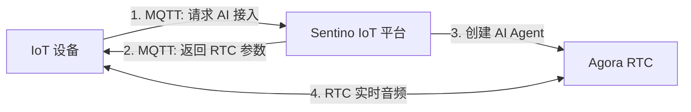
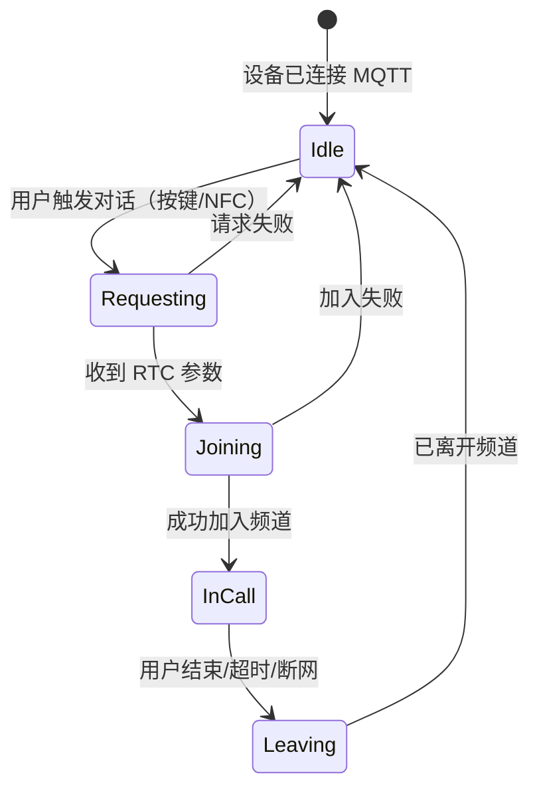
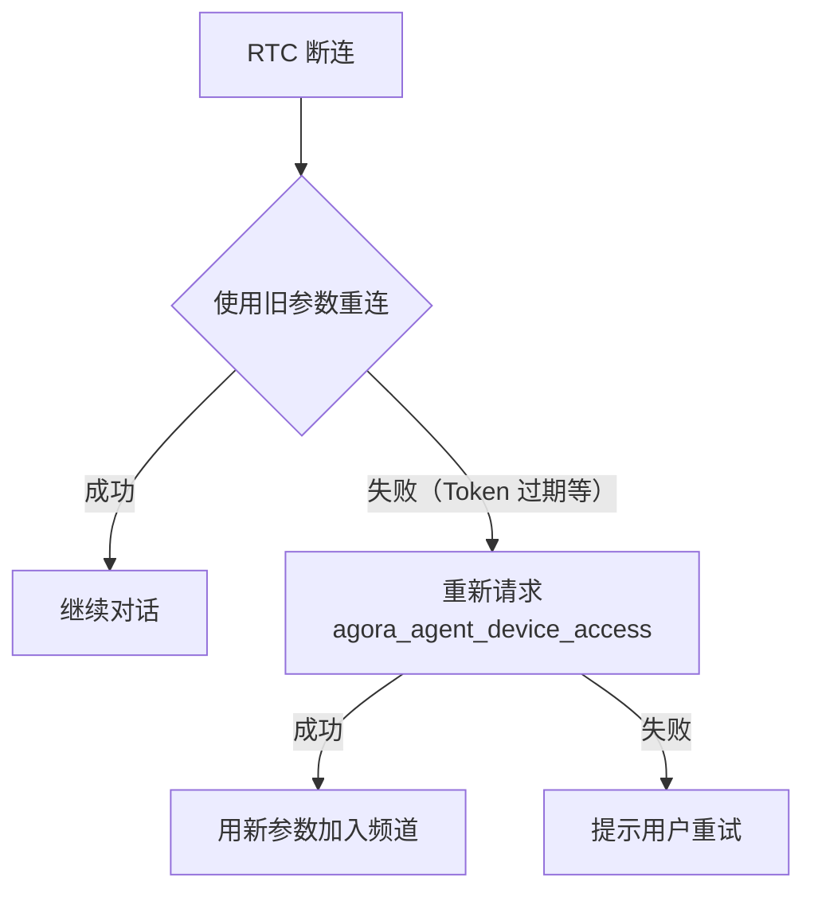
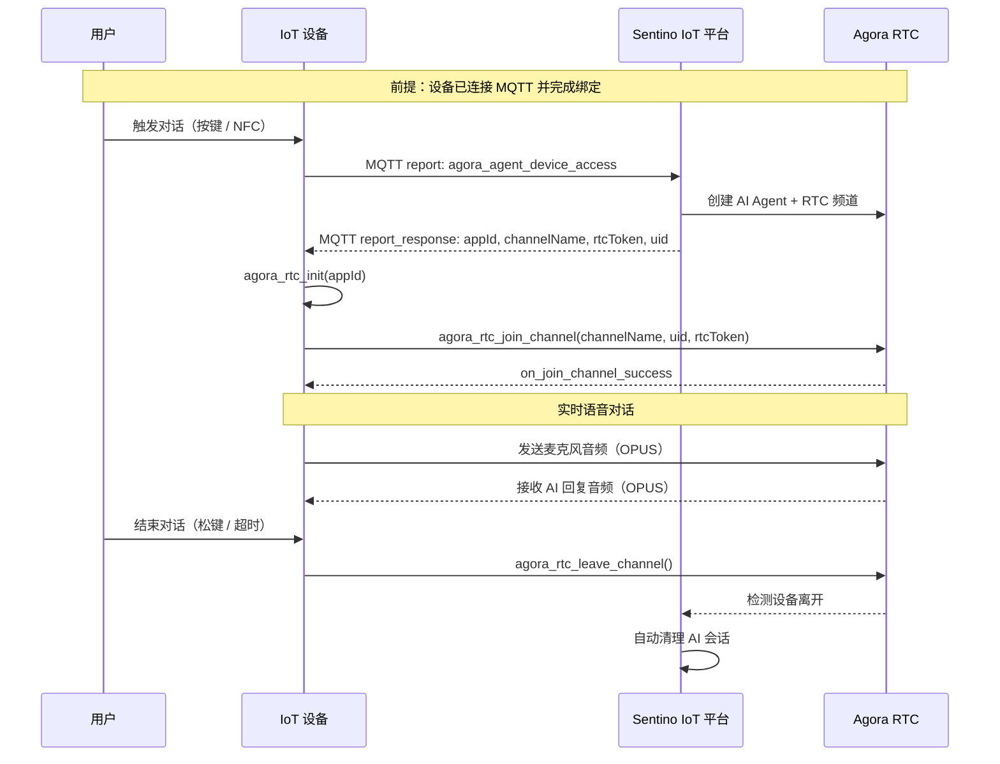

# AI 语音对话集成指南

> **TL;DR**：设备通过 MQTT 获取 Agora RTC 参数，加入频道即可与云端 AI 进行实时语音对话。本文档覆盖完整的对话生命周期、Agora SDK 集成、NFC 切换角色（可选）、异常处理和最佳实践。

> **前置知识**：建议先阅读 [架构与概念](./architecture.md) 和 [MQTT 协议参考](./ref-mqtt.md)。

---

## 1. 对话架构概览

AI 语音对话涉及三个系统的协作：



**核心设计**：

- MQTT 只负责"拿票"（获取 RTC 连接参数），不承载音频流
- Agora RTC 承载实时音频
- AI Agent 在设备加入频道前已在频道内等待，加入即可开始对话
- 结束时设备只需离开频道，云端自动检测并清理

---

## 2. 对话生命周期



### 各阶段详解

| 阶段 | 设备动作 |
|---|---|
| **Idle** | MQTT 在线，等待用户触发 |
| **Requesting** | 发送 `agora_agent_device_access`，等待云端回复 |
| **Joining** | 初始化 Agora SDK，加入 RTC 频道 |
| **InCall** | 采集麦克风音频并发送，播放 AI 回复音频 |
| **Leaving** | 调用 `leave_channel()`，释放资源 |

---

## 3. 完整集成流程

### 3.1 请求 AI 接入

用户触发对话时（按键、NFC 触碰等），设备通过 MQTT 上报 `agora_agent_device_access`。

**上报消息**（Topic: `rlink/v2/${pid}/${uuid}/report`）：

```json
{
  "id": "c3d4e5f6-a7b8-9012-cdef-123456789012",
  "ts": 1742536800,
  "code": "agora_agent_device_access",
  "ack": 1,
  "data": {}
}
```

**云端回复**（Topic: `rlink/v2/${pid}/${uuid}/report_response`）：

```json
{
  "res": 0,
  "msg": "success",
  "id": "c3d4e5f6-a7b8-9012-cdef-123456789012",
  "ts": 1742536800,
  "code": "agora_agent_device_access",
  "data": {
    "appId": "935b8af0c93640b09d614e48f1a8f75a",
    "rtcToken": "007eJxTYBA...",
    "channelName": "convo_stn_TgLI80UukY948M5v",
    "uid": 25532
  }
}
```

**回复字段说明**：

| 字段 | 类型 | 说明 | 对应 Agora API 参数 |
|---|---|---|---|
| `appId` | string | Agora 应用 ID | `agora_rtc_init(appId, ...)` |
| `rtcToken` | string | RTC 通道令牌 | `join_channel(..., rtcToken, ...)` |
| `channelName` | string | RTC 频道名称 | `join_channel(channelName, ...)` |
| `uid` | int | 设备在频道中的成员 ID | `join_channel(..., uid)` |

> **注意**：`res` 非 0 表示请求失败。常见原因：设备未绑定、未配置智能体、服务端异常。

### 3.2 初始化 Agora SDK 并加入频道

收到 RTC 参数后，初始化 Agora SDK 并加入频道：

```c
// 1. 初始化 Agora RTC
agora_rtc_init(appId, &event_handler);

// 2. 配置音频参数
agora_rtc_config_t config = {0};
config.audio_codec    = AUDIO_CODEC_OPUS;
config.pcm_sample_rate = 16000;     // 采样率 16kHz
config.pcm_channel_num = 1;         // 单声道

// 3. 加入频道 — AI Agent 已在频道内等待
agora_rtc_join_channel(channelName, uid, rtcToken, &config);
```

**音频参数要求**：

| 参数 | 值 | 说明 |
|---|---|---|
| 编码格式 | OPUS | 必须使用 OPUS 编码 |
| 采样率 | 16000 Hz | 16kHz |
| 声道数 | 1 | 单声道 |
| PCM 位深 | 16 bit | — |
| 帧长 | 20 ms | — |

### 3.3 处理音频回调

```c
// 成功加入频道
static void on_join_channel_success(const char *channel, uint32_t uid, int elapsed) {
    // 开始采集麦克风音频并发送
    start_audio_capture_and_send();
}

// 收到 AI Agent 的音频数据
static void on_audio_data(const char *channel, uint32_t uid,
                          const void *data, size_t len) {
    // 送入扬声器播放
    audio_play(data, len);
}

```

### 3.4 结束对话

用户结束对话（松开按键、超时等）时，设备离开频道：

```c
agora_rtc_leave_channel();
```

**设备无需发送额外的 MQTT 消息**。Sentino IoT 平台会自动检测到设备离开 RTC 频道，并清理 AI 会话资源。

---

## 4. NFC 切换智能体（可选功能）

> 本节适用于配备 NFC 硬件的设备。未配备 NFC 的设备可跳过本节，通过 App 管理角色切换。

设备支持通过 NFC 卡片切换 AI 角色。每张 NFC 卡片对应一个智能体（角色），用户将卡片放在设备上即可切换。

### 4.1 NFC 上报

设备读取到 NFC 卡片后，通过 MQTT 上报 `agora_agent_nfc_report`。

**上报消息**：

```json
{
  "id": "d4e5f6a7-b8c9-0123-def0-123456789abc",
  "ts": 1742536800,
  "code": "agora_agent_nfc_report",
  "ack": 1,
  "data": {
    "nfcIdentifier": "NFC_CARD_001",
    "onlyReport": 0
  }
}
```

| 字段 | 类型 | 说明 |
|---|---|---|
| `nfcIdentifier` | string | NFC 卡片唯一标识 |
| `onlyReport` | int | `0` = 上报并返回 RTC 参数（切换角色并开始对话）；`1` = 仅上报（不开始对话） |

### 4.2 云端回复

当 `onlyReport = 0` 时，云端回复包含 RTC 参数，设备可直接加入频道开始对话（流程与普通接入相同）：

```json
{
  "res": 0,
  "msg": "success",
  "id": "d4e5f6a7-b8c9-0123-def0-123456789abc",
  "ts": 1742536800,
  "code": "agora_agent_nfc_report",
  "data": {
    "appId": "935b8af0c93640b09d614e48f1a8f75a",
    "rtcToken": "007eJxTYBA...",
    "channelName": "convo_stn_abc123",
    "uid": 25533
  }
}
```

### 4.3 NFC 与普通接入的对比

| 对比项 | 普通接入 (`agora_agent_device_access`) | NFC 接入 (`agora_agent_nfc_report`) |
|---|---|---|
| 触发方式 | 按键 | NFC 卡片触碰 |
| 使用的智能体 | 设备当前绑定的智能体 | NFC 卡片对应的智能体 |
| 是否可仅上报 | 否 | 是（`onlyReport=1`） |
| RTC 回复格式 | 相同 | 相同 |

---

## 5. 异常处理

### 5.1 RTC 断连重连

网络不稳定时，RTC 连接可能中断。



**推荐策略**：

| 策略 | 说明 |
|---|---|
| 首次重连 | 使用原有 RTC 参数（appId / channelName / rtcToken / uid）直接重新加入频道 |
| 参数过期 | 若旧参数重连失败，重新发送 `agora_agent_device_access` 获取新参数 |

### 5.2 会话超时

会话启动后如长时间无人加入或无语音活动，Sentino 会自动关闭会话。

### 5.4 常见错误排查

| 现象 | 可能原因 | 排查方向 |
|---|---|---|
| `agora_agent_device_access` 回复 `res` 非 0 | 设备未绑定；未配置智能体 | 检查 `bind` 是否成功；检查是否已通过 App 绑定智能体 |
| RTC 加入频道失败 | RTC 参数不完整；Token 过期 | 检查 4 个参数是否完整；获取到参数后尽快加入 |
| 加入频道成功但无声音 | 音频参数错误 | 检查 16kHz / 单声道 / 16bit / OPUS；检查麦克风和扬声器硬件 |
| 对话中途突然中断 | 网络波动；会话超时 | 实现 RTC 断连重连（5.1）；检查网络稳定性 |
| NFC 切换角色无响应 | NFC 标识不匹配 | 检查 `nfcIdentifier` 是否在云端注册 |

---

## 6. 完整时序图



---

## 7. Agora RTC SDK 集成要点

### 7.1 SDK 交付物

Sentino 提供适配目标平台的 Agora RTC SDK 嵌入式版（C API），包含：

| 交付物 | 说明 |
|---|---|
| 静态库 / 动态库 | 适配目标 RTOS 平台 |
| 头文件 | API 定义 |
| 集成示例代码 | 参考实现 |

### 7.2 关键 API 一览

```c
// 初始化
int agora_rtc_init(const char *app_id, agora_rtc_event_handler_t *handler);

// 加入频道
int agora_rtc_join_channel(const char *channel, uint32_t uid,
                           const char *token, agora_rtc_config_t *config);

// 离开频道
int agora_rtc_leave_channel(void);
```

### 7.3 资源管理

```c
// 推荐的资源管理模式
void start_voice_session(rtc_params_t *params) {
    agora_rtc_init(params->appId, &event_handler);
    agora_rtc_join_channel(params->channelName, params->uid,
                           params->rtcToken, &audio_config);
}

void stop_voice_session(void) {
    agora_rtc_leave_channel();
}
```

> **建议**：如果设备需要频繁发起对话，可以只初始化一次 Agora SDK（`agora_rtc_init`），每次对话只调用 `join_channel` / `leave_channel`，避免重复初始化的开销。

---

## 8. 最佳实践

### 8.1 对话触发设计

| 触发方式 | 适用场景 | 实现要点 |
|---|---|---|
| 长按按键 | 对讲机模式 | 按下发起，松开结束 |
| 单击按键 | 自由对话模式 | 点击切换对话开/关 |
| NFC 触碰 | 角色切换 | 读取 NFC → 发送 `agora_agent_nfc_report` |

---

**相关文档**：[架构与概念](./architecture.md) | [MQTT 协议参考](./ref-mqtt.md) | [设备端集成指南](./guide-device.md)
