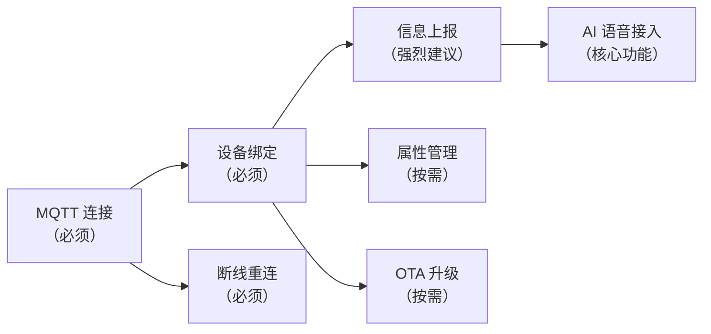
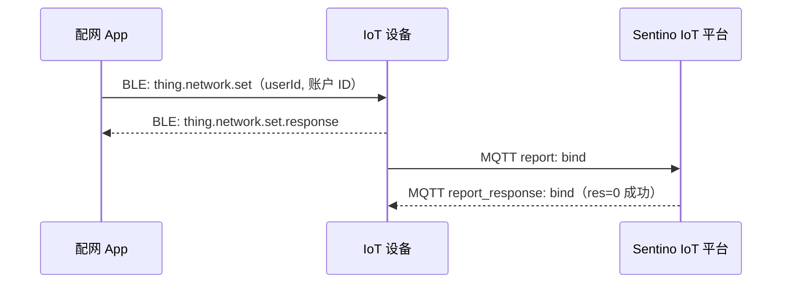

# 设备端集成指南

> **TL;DR**：本文档覆盖设备端 MQTT 接入的完整实现：鉴权连接、设备绑定、信息上报、属性管理、OTA 升级、断线重连。按本文档顺序实现即可完成设备端开发。

> **前置知识**：建议先阅读 [架构与概念](./architecture.md)，协议字段细节请查阅 [MQTT 协议参考](./ref-mqtt.md)。

---

## 1. 集成总览

设备端需要实现的 MQTT 功能按优先级排列：



| 功能 | 优先级 | 说明 |
|---|---|---|
| MQTT 连接 | 必须 | 三元组鉴权、Topic 订阅 |
| 设备绑定 (`bind`) | 必须 | 首次使用时关联用户 |
| 信息上报 (`info`) | 强烈建议 | 不实现则无法收到遗留消息 |
| AI 语音接入 | 核心 | 见 [AI 语音对话集成指南](./guide-ai-voice.md) |
| 属性管理 | 按需 | 设备能力上报和云端控制 |
| OTA 升级 | 按需 | 远程固件更新 |
| 断线重连 | 必须 | 网络不稳定的必要保障 |

---

## 2. MQTT 连接

### 2.1 连接参数

| 参数 | 值 / 格式 | 说明 |
|---|---|---|
| Broker 地址 | `mqtt-iot.sentino.jp` | 测试环境 |
| 端口 | `1883` | 明文连接 |
| 协议版本 | **MQTT 5.0** | 必须使用 5.0 |
| Client ID | `rlink_${uuid}_V2` | 固定格式，`_V2` 后缀 |
| Username | `${uuid}\|signMethod=${signMethod},ts=${ts}` | `\|` 为分隔符 |
| Password | HMAC-SHA256 签名结果 | 见下方签名计算 |
| Keep Alive | 60 秒（建议） | — |
| QoS | QoS 1（发布时） | 确保消息至少送达一次 |

### 2.2 签名计算

Password 通过 HMAC-SHA256 计算：

```
content  = "uuid=${uuid},ts=${ts}"
password = hmacSha256(content, KEY)
```

- `uuid`：三元组中的 UUID
- `ts`：当前时间戳（秒）
- `KEY`：三元组中的设备密钥

**验证用例**：

```
uuid    = ct01wfjSNqGAqUUK
KEY     = 944e53cda6ac4491ad7d453e3d2934bb
ts      = 1742536800
content = "uuid=ct01wfjSNqGAqUUK,ts=1742536800"
password = 894972927a0a6d1a22a89883b9fe187a891a5b5dec4afa374034b703f2455bdd
```

> 也支持 `hmacSha1`，根据硬件能力选择。签名方法在 Username 中通过 `signMethod` 字段声明。

### 2.3 Topic 订阅

连接成功后，**立即**订阅以下两个 Topic：

| Topic | 方向 | 说明 |
|---|---|---|
| `rlink/v2/${pid}/${uuid}/report_response` | 云端 → 设备 | 接收上报消息的回复 |
| `rlink/v2/${pid}/${uuid}/issue` | 云端 → 设备 | 接收云端下发的指令 |

设备发布消息使用的 Topic：

| Topic | 方向 | 说明 |
|---|---|---|
| `rlink/v2/${pid}/${uuid}/report` | 设备 → 云端 | 上报事件 |
| `rlink/v2/${pid}/${uuid}/issue_response` | 设备 → 云端 | 回复云端指令 |

### 2.4 消息通用格式

**上报消息**（设备 → 云端）：

```json
{
  "id": "消息唯一ID（建议 UUID）",
  "ts": 1742536800,
  "code": "事件编码",
  "data": {},
  "ack": 1
}
```

| 字段 | 类型 | 说明 |
|---|---|---|
| `id` | string | 消息唯一 ID，同一设备短时间内不可重复 |
| `ts` | int | 当前时间戳（秒） |
| `code` | string | 事件编码（如 `bind`、`info`、`time` 等） |
| `data` | object | 上报数据 |
| `ack` | int | `0` 不需要回复；`1` 需要回复 |

> **关键**：`id` 必须唯一。重复 `id` 的消息会被云端忽略。

---

## 3. 设备绑定 (`bind`)

设备首次使用时，需要通过 BLE 从配网 App 获取 `userId` 和账户 ID (`assetId`)，然后通过 MQTT 完成绑定。

### 3.1 绑定流程



### 3.2 上报消息

```json
{
  "id": "a1b2c3d4-e5f6-7890-abcd-ef1234567890",
  "ts": 1742536800,
  "code": "bind",
  "data": {
    "userId": "从BLE获取的userId",
    "assetId": "从BLE获取的assetId",
    "version": "1.0.0",
    "mcuVersion": "1.0.0",
    "cleanData": false
  },
  "ack": 1
}
```

| 字段 | 类型 | 必填 | 说明 |
|---|---|---|---|
| `userId` | string | 是 | 用户 ID，由 App 通过 BLE 传入 |
| `assetId` | string | 是 | 账户 ID，由 App 通过 BLE 传入（BLE 消息中的 `bid` 字段） |
| `version` | string | 是 | 固件版本号 |
| `mcuVersion` | string | 否 | MCU 版本号 |
| `cleanData` | boolean | 否 | 是否清除数据，默认 `false` |

### 3.3 云端回复

```json
{
  "res": 0,
  "msg": "success",
  "id": "a1b2c3d4-e5f6-7890-abcd-ef1234567890",
  "ts": 1742536800,
  "code": "bind"
}
```

`res` 为 `0` 表示绑定成功。

### 3.4 BLE 接收绑定信息

App 通过 BLE 发送 `thing.network.set` 消息：

**WiFi 模式**（需要传递网络信息）：

```json
{
  "type": "thing.network.set",
  "data": {
    "sid": "WiFi_SSID",
    "pw": "WiFi_Password",
    "bid": "assetId",
    "userId": "userId",
    "mq": "mqtt-iot.sentino.jp",
    "port": 1883,
    "country": "CN",
    "tz": "Asia/Shanghai"
  }
}
```

**4G 模式**（仅传递绑定信息）：

```json
{
  "type": "thing.network.set",
  "data": {
    "bid": "assetId",
    "userId": "userId"
  }
}
```

设备回复：

```json
{
  "type": "thing.network.set.response",
  "code": 0,
  "ts": 1742536800
}
```

---

## 4. 信息上报 (`info`)

> **强烈建议实现**。如果不对接此协议，设备将无法收到因断电/断网导致云端未送达的重要遗留消息。

### 4.1 何时上报

- 设备每次上电连接 MQTT 后
- 绑定成功后

### 4.2 上报消息

```json
{
  "id": "b2c3d4e5-f6a7-8901-bcde-f12345678901",
  "ts": 1742536800,
  "code": "info",
  "data": {
    "bindStatus": 1,
    "version": "1.0.0",
    "mcuVersion": "1.0.0",
    "iccid": "898600MFSSYYGXXXXXXP"
  },
  "ack": 1
}
```

| 字段 | 类型 | 必填 | 说明 |
|---|---|---|---|
| `bindStatus` | int | 是 | `0` 未绑定；`1` 已绑定 |
| `version` | string | 是 | 固件版本号 |
| `mcuVersion` | string | 否 | MCU 版本号 |
| `iccid` | string | 否 | 4G 流量卡 ICCID 号 |
| `config` | string | 否 | WiFi 设备填写（含 `currentSsid`、`wifiList` 等），4G 设备可不填 |

### 4.3 云端回复

```json
{
  "res": 0,
  "msg": "success",
  "id": "b2c3d4e5-f6a7-8901-bcde-f12345678901",
  "ts": 1742536800,
  "code": "info",
  "data": {
    "bindStatus": 1,
    "isClearData": 0
  }
}
```

| 字段 | 说明 |
|---|---|
| `bindStatus` | 云端记录的绑定状态 |
| `isClearData` | 是否需要清除数据 |


---

## 5. 设备重置 (`reset`)

设备恢复出厂设置时上报：

```json
{
  "id": "msg-uuid",
  "ts": 1742536800,
  "code": "reset",
  "ack": 0,
  "data": {
    "cleanData": false
  }
}
```

设备收到云端下发的重置指令时（Topic: `issue`）：

```json
{
  "id": "msg-uuid",
  "ts": 1742536800,
  "code": "reset",
  "data": {
    "clearData": true
  }
}
```

设备根据 `clearData` 决定是否清除用户数据，然后回复：

```json
{
  "res": 0,
  "id": "msg-uuid",
  "ts": 1742536800,
  "code": "reset"
}
```

---

## 6. 时间同步 (`time`)

设备上电后建议同步云端时间：

```json
{
  "id": "msg-uuid",
  "ts": 1742536800,
  "code": "time",
  "ack": 1
}
```

云端回复包含时区和夏令时信息，具体字段见 [MQTT 协议参考](./ref-mqtt.md#32-获取云端时间-time)。

**时间计算方式**（三选一）：
1. 使用 `ts` + `sys_tz` 计算
2. 使用 `ts` + `zone_offset` 计算
3. 直接使用 `local_date_time`

---

## 7. 属性管理

### 7.1 属性上报（设备 → 云端）

设备主动上报属性值：

```json
{
  "id": "msg-uuid",
  "ts": 1742536800,
  "code": "property_report",
  "data": {
    "properties": {
      "color": "red",
      "brightness": 80
    }
  },
  "ack": 0
}
```

### 7.2 属性设置（云端 → 设备）

云端通过 `issue` Topic 下发属性设置：

```json
{
  "id": "msg-uuid",
  "ts": 1742536800,
  "code": "property_set",
  "data": {
    "properties": {
      "color": "red",
      "brightness": 80
    }
  }
}
```

设备应用属性后回复（Topic: `issue_response`）：

```json
{
  "res": 0,
  "id": "msg-uuid",
  "ts": 1742536800,
  "code": "property_set",
  "data": {
    "properties": {
      "color": "red",
      "brightness": 80
    }
  }
}
```

### 7.3 获取物模型 (`model`)

设备可主动获取产品的物模型定义：

```json
{
  "id": "msg-uuid",
  "ts": 1742536800,
  "code": "model",
  "data": {
    "format": "simple"
  },
  "ack": 1
}
```

`format` 支持三种级别：`complete`（完整）、`simple`（精简）、`mini`（迷你）。

---

## 8. OTA 升级

### 8.1 接收升级指令

云端通过 `issue` Topic 下发 OTA 指令：

```json
{
  "id": "msg-uuid",
  "ts": 1742536800,
  "code": "ota",
  "data": {
    "firmwareType": 2,
    "fileSize": 708482,
    "silence": false,
    "md5sum": "36eb5951179db14a63a37a9322a2",
    "url": "https://ota.example.com/firmware.bin",
    "version": "1.2.0"
  }
}
```

| 字段 | 说明 |
|---|---|
| `firmwareType` | 固件类型：1=工厂固件 2=标准固件 3=MCU 固件 4=MCU 蓝牙固件 5=MCU Zigbee 6=MCU Matter |
| `fileSize` | 固件大小（字节） |
| `silence` | `true`=静默升级 |
| `md5sum` | 文件 MD5 校验值 |
| `url` | 固件下载地址 |
| `version` | 目标版本号 |

### 8.2 上报升级进度

在下载和升级过程中，上报 `ota_progress`：

```json
{
  "id": "msg-uuid",
  "ts": 1742536800,
  "code": "ota_progress",
  "data": {
    "resCode": 0,
    "type": "downloading",
    "percent": 45
  },
  "ack": 0
}
```

| `type` 值 | 说明 |
|---|---|
| `downloading` | 下载中，需附带 `percent`（0-100） |
| `burning` | 烧录中 |
| `report` | 升级完成，上报新版本号 |
| `fail` | 升级失败 |

| `resCode` 值 | 说明 |
|---|---|
| `0` | 成功 |
| `-1` | 下载超时 |
| `-2` | 文件不存在 |
| `-3` | 签名过期 |
| `-4` | MD5 不匹配 |
| `-5` | 更新固件失败 |
| `-6` | 更新超时 |
| `-7` | 正在升级中 |

---

## 9. 断线重连

### 9.1 MQTT 重连策略

| 策略 | 说明 |
|---|---|
| 重连间隔 | 指数退避：1s → 2s → 4s → 8s → ... 最大 60s |
| 重新认证 | 使用相同三元组，重新计算签名（更新 `ts`） |
| 重新订阅 | 重连成功后必须重新订阅 `report_response` 和 `issue` Topic |
| 信息上报 | 重连成功后建议上报 `info` |

---

## 10. 云端下发指令处理

设备需要监听 `issue` Topic 并处理以下指令：

| 指令 `code` | 说明 | 设备需要做什么 |
|---|---|---|
| `reset` | 重置设备 | 清除绑定信息，根据 `clearData` 清除用户数据 |
| `ota` | 固件升级 | 下载固件并升级，上报进度 |
| `ping` | 在线检测 | 回复网络状态信息 |
| `property_set` | 设置属性 | 应用属性值并回复 |

所有指令回复发送到 `issue_response` Topic，格式：

```json
{
  "res": 0,
  "id": "与指令消息ID一致",
  "ts": 1742536800,
  "code": "与指令code一致",
  "data": {}
}
```

---

## 11. 安全注意事项

1. **KEY 保密**：设备密钥禁止明文传输或日志打印
2. **NVS 存储**：三元组存储在 NVS 分区，确保断电后数据保留
3. **消息 ID 唯一**：使用 UUID 生成，避免重复
4. **时间戳合理**：`ts` 不能偏差太大

---

**相关文档**：[架构与概念](./architecture.md) | [快速入门](./quickstart-device.md) | [MQTT 协议参考](./ref-mqtt.md) | [AI 语音对话集成指南](./guide-ai-voice.md)
