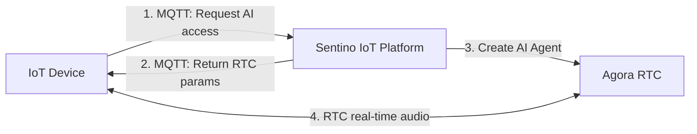
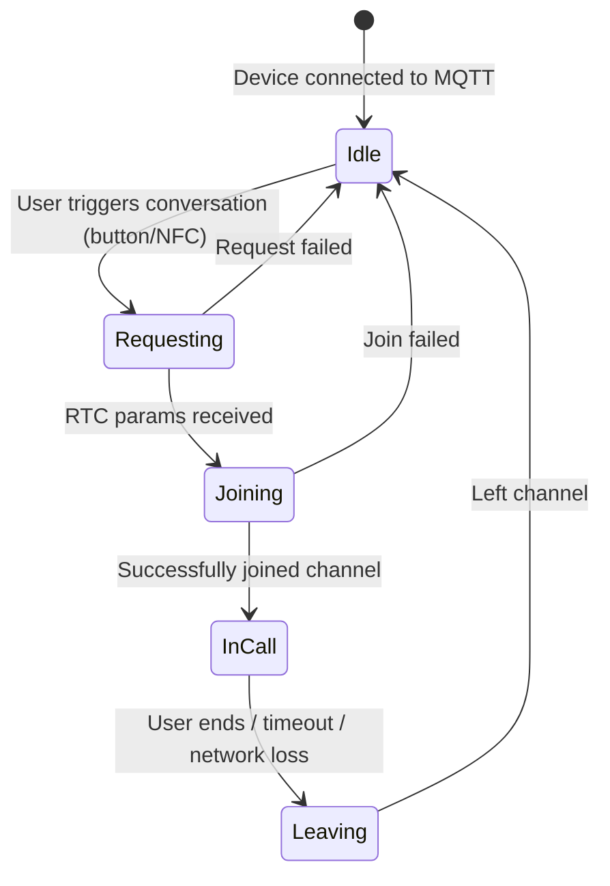
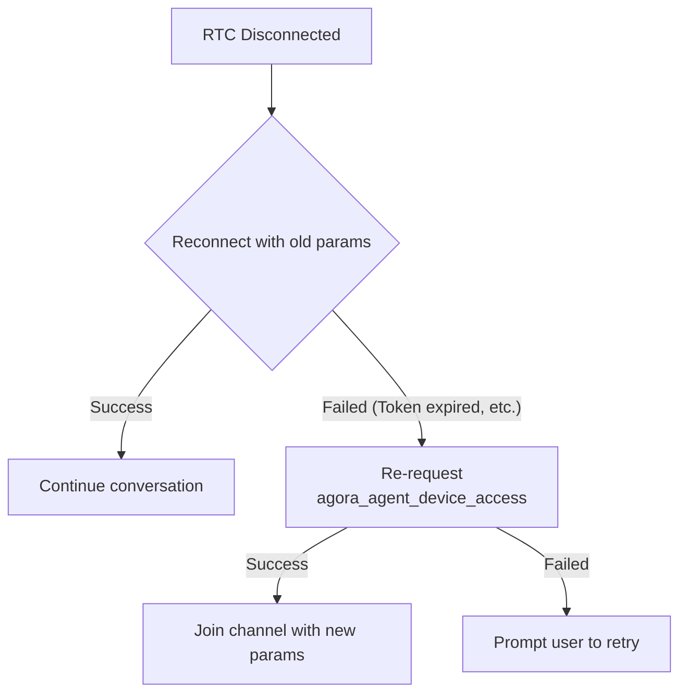
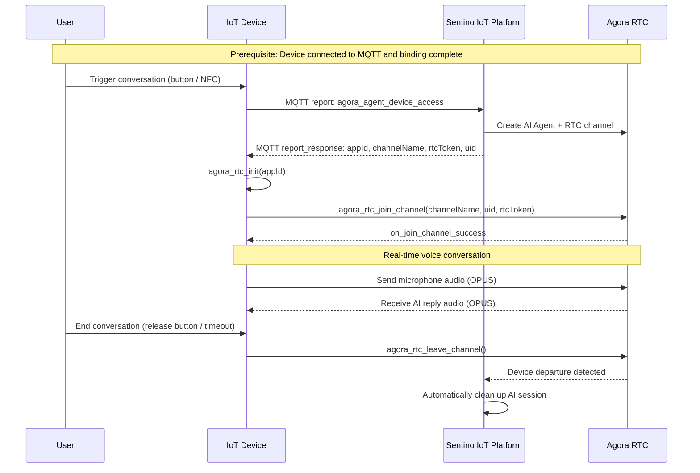

# AI Voice Conversation Integration Guide

> **TL;DR**: Devices obtain Agora RTC parameters via MQTT and join a channel to conduct real-time voice conversations with cloud AI. This document covers the complete conversation lifecycle, Agora SDK integration, NFC character switching (optional), error handling, and best practices.

> **Prerequisites**: We recommend reading [Architecture & Concepts](../architecture-en.md) and [MQTT Protocol Reference](../reference/ref-mqtt.md) first.

---

## 1. Conversation Architecture Overview

AI voice conversations involve the coordination of three systems:



**Core design**:

- MQTT only handles "getting the ticket" (obtaining RTC connection params), does not carry audio streams
- Agora RTC carries real-time audio
- AI Agent is already waiting in the channel before the device joins — conversation starts immediately upon joining
- To end, the device just leaves the channel; cloud automatically detects and cleans up

---

## 2. Conversation Lifecycle



### Stage Details

| Stage | Device Action |
|---|---|
| **Idle** | MQTT online, waiting for user trigger |
| **Requesting** | Send `agora_agent_device_access`, wait for cloud reply |
| **Joining** | Initialize Agora SDK, join RTC channel |
| **InCall** | Capture microphone audio and send, play AI reply audio |
| **Leaving** | Call `leave_channel()`, release resources |

---

## 3. Complete Integration Flow

### 3.1 Request AI Access

When the user triggers a conversation (button press, NFC tap, etc.), the device reports `agora_agent_device_access` via MQTT.

**Report message** (Topic: `rlink/v2/${pid}/${uuid}/report`):

```json
{
  "id": "c3d4e5f6-a7b8-9012-cdef-123456789012",
  "ts": 1742536800,
  "code": "agora_agent_device_access",
  "ack": 1,
  "data": {}
}
```

**Cloud reply** (Topic: `rlink/v2/${pid}/${uuid}/report_response`):

```json
{
  "res": 0,
  "msg": "success",
  "id": "c3d4e5f6-a7b8-9012-cdef-123456789012",
  "ts": 1742536800,
  "code": "agora_agent_device_access",
  "data": {
    "appId": "935b8af0c93640b09d614e48f1a8f75a",
    "rtcToken": "007eJxTYBA...",
    "channelName": "convo_stn_TgLI80UukY948M5v",
    "uid": 25532
  }
}
```

**Reply field descriptions**:

| Field | Type | Description | Corresponding Agora API Parameter |
|---|---|---|---|
| `appId` | string | Agora application ID | `agora_rtc_init(appId, ...)` |
| `rtcToken` | string | RTC channel token | `join_channel(..., rtcToken, ...)` |
| `channelName` | string | RTC channel name | `join_channel(channelName, ...)` |
| `uid` | int | Device member ID in the channel | `join_channel(..., uid)` |

> **Note**: `res` non-zero indicates request failure. Common causes: device not bound, no agent configured, server error.

### 3.2 Initialize Agora SDK and Join Channel

After receiving RTC params, initialize the Agora SDK and join the channel:

```c
// 1. Initialize Agora RTC
agora_rtc_init(appId, &event_handler);

// 2. Configure audio parameters
agora_rtc_config_t config = {0};
config.audio_codec    = AUDIO_CODEC_OPUS;
config.pcm_sample_rate = 16000;     // Sample rate 16kHz
config.pcm_channel_num = 1;         // Mono

// 3. Join channel — AI Agent is already waiting in the channel
agora_rtc_join_channel(channelName, uid, rtcToken, &config);
```

**Audio parameter requirements**:

| Parameter | Value | Description |
|---|---|---|
| Encoding format | OPUS | Must use OPUS encoding |
| Sample rate | 16000 Hz | 16kHz |
| Channels | 1 | Mono |
| PCM bit depth | 16 bit | — |
| Frame length | 20 ms | — |

### 3.3 Handle Audio Callbacks

```c
// Successfully joined channel
static void on_join_channel_success(const char *channel, uint32_t uid, int elapsed) {
    // Start capturing microphone audio and sending
    start_audio_capture_and_send();
}

// Received audio data from AI Agent
static void on_audio_data(const char *channel, uint32_t uid,
                          const void *data, size_t len) {
    // Send to speaker for playback
    audio_play(data, len);
}

```

### 3.4 End Conversation

When the user ends the conversation (releases button, timeout, etc.), the device leaves the channel:

```c
agora_rtc_leave_channel();
```

**The device does not need to send any additional MQTT messages**. The Sentino IoT platform automatically detects the device leaving the RTC channel and cleans up AI session resources.

---

## 4. NFC Agent Switching (Optional)

> This section applies to devices equipped with NFC hardware. Devices without NFC can skip this section and manage character switching via the App.

Devices support switching AI characters via NFC cards. Each NFC card corresponds to an agent (character); users place the card on the device to switch.

### 4.1 NFC Report

After reading an NFC card, the device reports `agora_agent_nfc_report` via MQTT.

**Report message**:

```json
{
  "id": "d4e5f6a7-b8c9-0123-def0-123456789abc",
  "ts": 1742536800,
  "code": "agora_agent_nfc_report",
  "ack": 1,
  "data": {
    "nfcIdentifier": "NFC_CARD_001",
    "onlyReport": 0
  }
}
```

| Field | Type | Description |
|---|---|---|
| `nfcIdentifier` | string | NFC card unique identifier |
| `onlyReport` | int | `0` = report and return RTC params (switch character and start conversation); `1` = report only (don't start conversation) |

### 4.2 Cloud Reply

When `onlyReport = 0`, the cloud reply includes RTC params, and the device can directly join the channel to start a conversation (same flow as standard access):

```json
{
  "res": 0,
  "msg": "success",
  "id": "d4e5f6a7-b8c9-0123-def0-123456789abc",
  "ts": 1742536800,
  "code": "agora_agent_nfc_report",
  "data": {
    "appId": "935b8af0c93640b09d614e48f1a8f75a",
    "rtcToken": "007eJxTYBA...",
    "channelName": "convo_stn_abc123",
    "uid": 25533
  }
}
```

### 4.3 NFC vs Standard Access Comparison

| Comparison | Standard Access (`agora_agent_device_access`) | NFC Access (`agora_agent_nfc_report`) |
|---|---|---|
| Trigger method | Button press | NFC card tap |
| Agent used | Device's currently bound agent | Agent corresponding to NFC card |
| Report-only option | No | Yes (`onlyReport=1`) |
| RTC reply format | Same | Same |

---

## 5. Error Handling

### 5.1 RTC Disconnection Recovery

When the network is unstable, the RTC connection may be interrupted.



**Recommended strategy**:

| Strategy | Description |
|---|---|
| First reconnect | Use original RTC params (appId / channelName / rtcToken / uid) to rejoin the channel directly |
| Params expired | If old params reconnection fails, re-send `agora_agent_device_access` to obtain new params |

### 5.2 Session Timeout

If no one joins or there is no voice activity for an extended period after session startup, Sentino automatically closes the session.

### 5.4 Common Troubleshooting

| Symptom | Possible Cause | Investigation |
|---|---|---|
| `agora_agent_device_access` reply `res` non-zero | Device not bound; no agent configured | Check if `bind` was successful; check if agent bound via App |
| RTC channel join failure | Incomplete RTC params; token expired | Check all 4 params are complete; join promptly after obtaining params |
| Joined channel but no audio | Wrong audio params | Check 16kHz / mono / 16bit / OPUS; check microphone and speaker hardware |
| Conversation interrupted mid-session | Network fluctuation; session timeout | Implement RTC disconnection recovery (5.1); check network stability |
| NFC character switch no response | NFC identifier mismatch | Check if `nfcIdentifier` is registered in the cloud |

---

## 6. Complete Sequence Diagram



---

## 7. Agora RTC SDK Integration Notes

### 7.1 SDK Deliverables

Sentino provides the Agora RTC SDK embedded edition (C API) adapted for the target platform, including:

| Deliverable | Description |
|---|---|
| Static/Dynamic library | Adapted for target RTOS platform |
| Header files | API definitions |
| Integration sample code | Reference implementation |

### 7.2 Key API Overview

```c
// Initialize
int agora_rtc_init(const char *app_id, agora_rtc_event_handler_t *handler);

// Join channel
int agora_rtc_join_channel(const char *channel, uint32_t uid,
                           const char *token, agora_rtc_config_t *config);

// Leave channel
int agora_rtc_leave_channel(void);
```

### 7.3 Resource Management

```c
// Recommended resource management pattern
void start_voice_session(rtc_params_t *params) {
    agora_rtc_init(params->appId, &event_handler);
    agora_rtc_join_channel(params->channelName, params->uid,
                           params->rtcToken, &audio_config);
}

void stop_voice_session(void) {
    agora_rtc_leave_channel();
}
```

> **Tip**: If the device needs to initiate conversations frequently, consider initializing the Agora SDK once (`agora_rtc_init`), and only calling `join_channel` / `leave_channel` for each conversation to avoid repeated initialization overhead.

### 7.4 Integration Notes

| Note | Description |
|---|---|
| **`datastream_queue` must be initialized first** | When Agora RTC receives a stream message from the AI Agent (e.g., expression / motion Function Call), it pushes to `datastream_queue`. If the queue has not been created (NULL) before `agora_rtc_init`, `xQueueGenericSend` will trigger an assert and reboot the device |
| **`uid` must not be hardcoded** | See the warning in §3.2 |
| **OPUS / 16kHz / mono** | Any mismatch causes silent audio or unrecognizable speech; full parameter list in §3.2 |

> **Reference implementation**:
> - Agora RTC integration code: [`sentino-iot-sample/device/projects/common_components/network_transfer/agora_rtc/agora_rtc_main.c`](https://github.com/sentino-jp/sentino-iot-sample/blob/main/device/projects/common_components/network_transfer/agora_rtc/agora_rtc_main.c)
> - Detailed pitfall notes: [`sentino-iot-sample/device/BUILD_GUIDE.md` §3.2](https://github.com/sentino-jp/sentino-iot-sample/blob/main/device/BUILD_GUIDE.md#32-sentino-iot-模式)

---

## 8. Best Practices

### 8.1 Conversation Trigger Design

| Trigger Method | Use Case | Implementation Notes |
|---|---|---|
| Long press button | Walkie-talkie mode | Press to start, release to end |
| Single click button | Free conversation mode | Click to toggle conversation on/off |
| NFC tap | Character switching | Read NFC -> send `agora_agent_nfc_report` |

---

**Related Documents**: [Architecture & Concepts](../architecture-en.md) | [MQTT Protocol Reference](../reference/ref-mqtt.md) | [Device Integration Guide](./guide-device-en.md)
