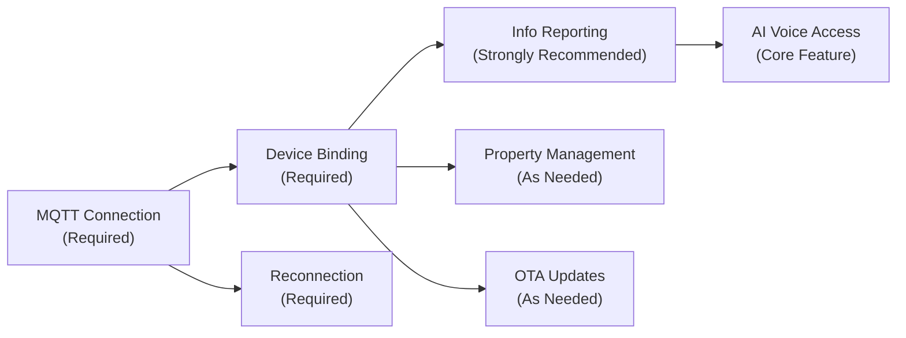
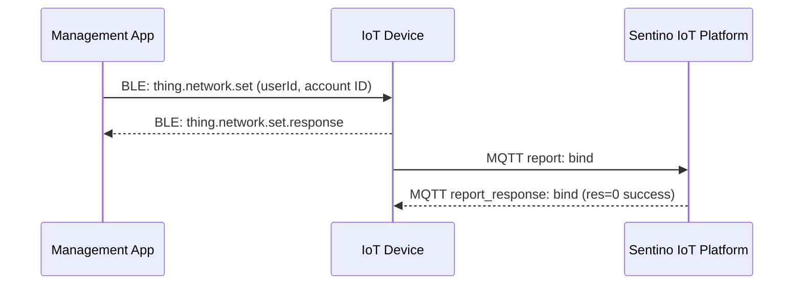

# Device Integration Guide

> **TL;DR**: This document covers the complete device-side MQTT integration: authentication, device binding, info reporting, property management, OTA updates, and disconnection recovery. Follow this document sequentially to complete device-side development.

> **Prerequisites**: We recommend reading [Architecture & Concepts](../architecture-en.md) first. For protocol field details, refer to [MQTT Protocol Reference](../reference/ref-mqtt.md).

---

## 1. Integration Overview

Device-side MQTT features listed by priority:



| Feature | Priority | Description |
|---|---|---|
| MQTT Connection | Required | Triplet authentication, Topic subscription |
| Device Binding (`bind`) | Required | Associate user on first use |
| Info Reporting (`info`) | Strongly Recommended | Without this, device cannot receive pending messages |
| AI Voice Access | Core | See [AI Voice Conversation Integration Guide](./guide-ai-voice-en.md) |
| Property Management | As Needed | Device capability reporting and cloud control |
| OTA Updates | As Needed | Remote firmware updates |
| Reconnection | Required | Essential for unstable networks |

---

## 2. MQTT Connection

### 2.1 Connection Parameters

| Parameter | Value / Format | Description |
|---|---|---|
| Broker Address | `mqtt-iot.sentino.jp` | Test environment |
| Port | `1883` | Plaintext connection |
| Protocol Version | **MQTT 5.0** | Must use 5.0 |
| Client ID | `rlink_${uuid}_V2` | Fixed format, `_V2` suffix |
| Username | `${uuid}\|signMethod=${signMethod},ts=${ts}` | `\|` is the delimiter |
| Password | HMAC-SHA256 signature result | See signature calculation below |
| Keep Alive | 60 seconds (recommended) | — |
| QoS | QoS 1 (when publishing) | Ensures at-least-once delivery |

### 2.2 Signature Calculation

Password is computed via HMAC-SHA256:

```
content  = "uuid=${uuid},ts=${ts}"
password = hmacSha256(content, KEY)
```

- `uuid`: UUID from the triplet
- `ts`: Current timestamp (seconds)
- `KEY`: Device secret key from the triplet

**Verification example**:

```
uuid    = ct01wfjSNqGAqUUK
KEY     = 944e53cda6ac4491ad7d453e3d2934bb
ts      = 1742536800
content = "uuid=ct01wfjSNqGAqUUK,ts=1742536800"
password = 894972927a0a6d1a22a89883b9fe187a891a5b5dec4afa374034b703f2455bdd
```

> `hmacSha1` is also supported — choose based on hardware capabilities. The signing method is declared via the `signMethod` field in the Username.

### 2.3 Topic Subscription

After successful connection, **immediately** subscribe to these two Topics:

| Topic | Direction | Description |
|---|---|---|
| `rlink/v2/${pid}/${uuid}/report_response` | Cloud -> Device | Receive replies to reported messages |
| `rlink/v2/${pid}/${uuid}/issue` | Cloud -> Device | Receive commands dispatched by cloud |

Topics used for device publishing:

| Topic | Direction | Description |
|---|---|---|
| `rlink/v2/${pid}/${uuid}/report` | Device -> Cloud | Report events |
| `rlink/v2/${pid}/${uuid}/issue_response` | Device -> Cloud | Reply to cloud commands |

### 2.4 General Message Format

**Report messages** (Device -> Cloud):

```json
{
  "id": "unique message ID (UUID recommended)",
  "ts": 1742536800,
  "code": "event code",
  "data": {},
  "ack": 1
}
```

| Field | Type | Description |
|---|---|---|
| `id` | string | Unique message ID; must not repeat within short intervals for the same device |
| `ts` | int | Current timestamp (seconds) |
| `code` | string | Event code (e.g., `bind`, `info`, `time`, etc.) |
| `data` | object | Report data |
| `ack` | int | `0` no reply needed; `1` reply needed |

> **Critical**: `id` must be unique. Messages with duplicate `id` values will be ignored by the cloud.

---

## 3. Device Binding (`bind`)

On first use, the device must obtain `userId` and account ID (`assetId`) from the Management App via BLE, then complete binding via MQTT.

### 3.1 Binding Flow



### 3.2 Report Message

```json
{
  "id": "a1b2c3d4-e5f6-7890-abcd-ef1234567890",
  "ts": 1742536800,
  "code": "bind",
  "data": {
    "userId": "userId obtained from BLE",
    "assetId": "assetId obtained from BLE",
    "version": "1.0.0",
    "mcuVersion": "1.0.0",
    "cleanData": false
  },
  "ack": 1
}
```

| Field | Type | Required | Description |
|---|---|---|---|
| `userId` | string | Yes | User ID, passed from App via BLE |
| `assetId` | string | Yes | Account ID, passed from App via BLE (the `bid` field in BLE messages) |
| `version` | string | Yes | Firmware version |
| `mcuVersion` | string | No | MCU version |
| `cleanData` | boolean | No | Whether to clear data, defaults to `false` |

### 3.3 Cloud Reply

```json
{
  "res": 0,
  "msg": "success",
  "id": "a1b2c3d4-e5f6-7890-abcd-ef1234567890",
  "ts": 1742536800,
  "code": "bind"
}
```

`res` of `0` indicates successful binding.

### 3.4 Receiving Binding Info via BLE

The App sends a `thing.network.set` message via BLE:

**WiFi Mode** (network info required):

```json
{
  "type": "thing.network.set",
  "data": {
    "sid": "WiFi_SSID",
    "pw": "WiFi_Password",
    "bid": "assetId",
    "userId": "userId",
    "mq": "mqtt-iot.sentino.jp",
    "port": 1883,
    "country": "CN",
    "tz": "Asia/Shanghai"
  }
}
```

**4G Mode** (binding info only):

```json
{
  "type": "thing.network.set",
  "data": {
    "bid": "assetId",
    "userId": "userId"
  }
}
```

Device reply:

```json
{
  "type": "thing.network.set.response",
  "code": 0,
  "ts": 1742536800
}
```

---

## 4. Info Reporting (`info`)

> **Strongly recommended to implement**. Without this protocol, the device will be unable to receive important pending messages that were undelivered due to power-off or network disconnection.

### 4.1 When to Report

- After each device power-up and MQTT connection
- After successful binding

### 4.2 Report Message

```json
{
  "id": "b2c3d4e5-f6a7-8901-bcde-f12345678901",
  "ts": 1742536800,
  "code": "info",
  "data": {
    "bindStatus": 1,
    "version": "1.0.0",
    "mcuVersion": "1.0.0",
    "iccid": "898600MFSSYYGXXXXXXP"
  },
  "ack": 1
}
```

| Field | Type | Required | Description |
|---|---|---|---|
| `bindStatus` | int | Yes | `0` not bound; `1` bound |
| `version` | string | Yes | Firmware version |
| `mcuVersion` | string | No | MCU version |
| `iccid` | string | No | 4G SIM card ICCID |
| `config` | string | No | WiFi devices fill in (includes `currentSsid`, `wifiList`, etc.); 4G devices may omit |

### 4.3 Cloud Reply

```json
{
  "res": 0,
  "msg": "success",
  "id": "b2c3d4e5-f6a7-8901-bcde-f12345678901",
  "ts": 1742536800,
  "code": "info",
  "data": {
    "bindStatus": 1,
    "isClearData": 0
  }
}
```

| Field | Description |
|---|---|
| `bindStatus` | Binding status recorded by cloud |
| `isClearData` | Whether data needs to be cleared |

---

## 5. Device Reset (`reset`)

Report when device is factory reset:

```json
{
  "id": "msg-uuid",
  "ts": 1742536800,
  "code": "reset",
  "ack": 0,
  "data": {
    "cleanData": false
  }
}
```

When receiving a reset command from the cloud (Topic: `issue`):

```json
{
  "id": "msg-uuid",
  "ts": 1742536800,
  "code": "reset",
  "data": {
    "clearData": true
  }
}
```

The device decides whether to clear user data based on `clearData`, then replies:

```json
{
  "res": 0,
  "id": "msg-uuid",
  "ts": 1742536800,
  "code": "reset"
}
```

---

## 6. Time Sync (`time`)

Recommended to sync cloud time after device power-up:

```json
{
  "id": "msg-uuid",
  "ts": 1742536800,
  "code": "time",
  "ack": 1
}
```

The cloud reply includes timezone and DST information. See [MQTT Protocol Reference](../reference/ref-mqtt.md#32-获取云端时间-time) for specific fields.

**Time calculation methods** (choose one):
1. Use `ts` + `sys_tz` to calculate
2. Use `ts` + `zone_offset` to calculate
3. Use `local_date_time` directly

---

## 7. Property Management

### 7.1 Property Reporting (Device -> Cloud)

Device proactively reports property values:

```json
{
  "id": "msg-uuid",
  "ts": 1742536800,
  "code": "property_report",
  "data": {
    "properties": {
      "color": "red",
      "brightness": 80
    }
  },
  "ack": 0
}
```

### 7.2 Property Setting (Cloud -> Device)

Cloud dispatches property setting via `issue` Topic:

```json
{
  "id": "msg-uuid",
  "ts": 1742536800,
  "code": "property_set",
  "data": {
    "properties": {
      "color": "red",
      "brightness": 80
    }
  }
}
```

Device applies properties and replies (Topic: `issue_response`):

```json
{
  "res": 0,
  "id": "msg-uuid",
  "ts": 1742536800,
  "code": "property_set",
  "data": {
    "properties": {
      "color": "red",
      "brightness": 80
    }
  }
}
```

### 7.3 Get Thing Model (`model`)

Device can proactively request the product's Thing Model definition:

```json
{
  "id": "msg-uuid",
  "ts": 1742536800,
  "code": "model",
  "data": {
    "format": "simple"
  },
  "ack": 1
}
```

`format` supports three levels: `complete` (full), `simple` (compact), `mini` (minimal).

---

## 8. OTA Updates

### 8.1 Receiving Update Commands

Cloud dispatches OTA commands via `issue` Topic:

```json
{
  "id": "msg-uuid",
  "ts": 1742536800,
  "code": "ota",
  "data": {
    "firmwareType": 2,
    "fileSize": 708482,
    "silence": false,
    "md5sum": "36eb5951179db14a63a37a9322a2",
    "url": "https://ota.example.com/firmware.bin",
    "version": "1.2.0"
  }
}
```

| Field | Description |
|---|---|
| `firmwareType` | Firmware type: 1=Factory 2=Standard 3=MCU 4=MCU Bluetooth 5=MCU Zigbee 6=MCU Matter |
| `fileSize` | Firmware size (bytes) |
| `silence` | `true`=silent update |
| `md5sum` | File MD5 checksum |
| `url` | Firmware download URL |
| `version` | Target version |

### 8.2 Reporting Update Progress

During download and update, report `ota_progress`:

```json
{
  "id": "msg-uuid",
  "ts": 1742536800,
  "code": "ota_progress",
  "data": {
    "resCode": 0,
    "type": "downloading",
    "percent": 45
  },
  "ack": 0
}
```

| `type` Value | Description |
|---|---|
| `downloading` | Downloading, include `percent` (0-100) |
| `burning` | Flashing |
| `report` | Update complete, report new version |
| `fail` | Update failed |

| `resCode` Value | Description |
|---|---|
| `0` | Success |
| `-1` | Download timeout |
| `-2` | File not found |
| `-3` | Signature expired |
| `-4` | MD5 mismatch |
| `-5` | Firmware update failed |
| `-6` | Update timeout |
| `-7` | Update in progress |

---

## 9. Disconnection Recovery

### 9.1 MQTT Reconnection Strategy

| Strategy | Description |
|---|---|
| Reconnection interval | Exponential backoff: 1s -> 2s -> 4s -> 8s -> ... max 60s |
| Re-authentication | Use same triplet, recalculate signature (update `ts`) |
| Re-subscription | Must re-subscribe to `report_response` and `issue` Topics after reconnection |
| Info reporting | Recommend reporting `info` after reconnection |

---

## 10. Cloud Command Handling

Devices must listen to the `issue` Topic and handle the following commands:

| Command `code` | Description | Device Action Required |
|---|---|---|
| `reset` | Reset device | Clear binding info, clear user data based on `clearData` |
| `ota` | Firmware update | Download firmware and update, report progress |
| `ping` | Online check | Reply with network status info |
| `property_set` | Set properties | Apply property values and reply |

All command replies are sent to the `issue_response` Topic, format:

```json
{
  "res": 0,
  "id": "same as command message ID",
  "ts": 1742536800,
  "code": "same as command code",
  "data": {}
}
```

---

## 11. Security Considerations

1. **KEY confidentiality**: Device secret key must never be transmitted in plaintext or printed in logs
2. **NVS storage**: Triplet stored in NVS partition, ensure data retention after power-off
3. **Unique message IDs**: Use UUID generation, avoid duplicates
4. **Reasonable timestamps**: `ts` must not deviate significantly

---

**Related Documents**: [Architecture & Concepts](../architecture-en.md) | [Quick Start](../tutorials/quickstart-device.md) | [MQTT Protocol Reference](../reference/ref-mqtt.md) | [AI Voice Conversation Integration Guide](./guide-ai-voice-en.md)
