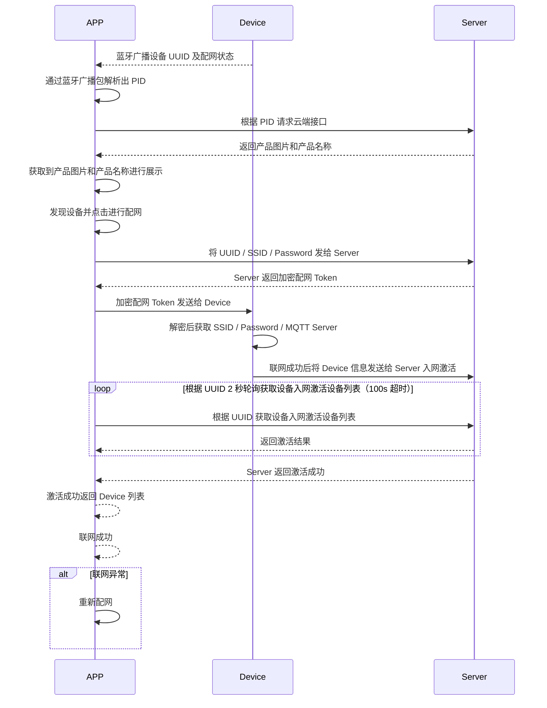

# 蓝牙双模配网说明

## 概述

本文档描述了 APP 端通过蓝牙双模（BLE + WiFi）方式对设备进行配网绑定的完整流程。配网过程涉及蓝牙扫描、广播包解析、云端交互、WiFi 信息下发、设备连网状态回调以及绑定结果确认等环节。

---

## 配网流程图



---

## 一、蓝牙扫描设备

1. 过滤蓝牙名称为 `RY` 的设备
2. 获取设备的蓝牙广播包数据

---

## 二、解析蓝牙广播包

### 广播包结构

| 广播数据段 | 类型 | 说明 |
|---|---|---|
| Complete Local Name | `0x09` | 长度：`0x03`，类型：`0x09`，数据：`0x52, 0x59`（即 `RY`） |
| Service Data | `0x16` | 长度：`0x0C` 或 `0x14`，类型：`0x16`，数据：从第三位开始截取至末尾，对应 PID |
| 厂商自定义数据 | `0xFF` | 长度：`0x19`，类型：`0xFF`，包含 COMPANY ID、FLAG、协议版本、加密方式、通信能力、ID 字段等 |

广播内容示例（未绑定）：

```
03 09 52 59 19 0A 16 12 12 00 00 00 00 00 00 FF
D0 07 00 03 00 00 00 00 00 00 00 00 00 00 00 00
00 00 00 00 00 00 00 00
```

### 字段详解

#### PID

从 Service Data（`0x16`）中获取，从第三位开始截取至末尾。上述示例中解析出的 PID 为：`00 00 00 00 00 00`。

#### FLAG（1 字节）

| Bit | 含义 | 值说明 |
|---|---|---|
| bit7 | 配网标志 | `1`：不在配网状态；`0`：在配网状态 |
| bit6 | 绑定标志（v2） | `1`：已绑定；`0`：未绑定。绑定成功后 bit7 置 1 |
| bit5 | WiFi 联网状态 | `1`：在网；`0`：不在网 |
| bit4 | 是否通用固件 | `1`：通用固件；`0`：非通用固件 |
| bit1 | 是否使用聚合协议 | `1`：是（聚合获取设备属性 + OTA版本 + 时区）；`0`：否（单独发送获取设备属性） |
| bit0 | 请求连接标志 | `1`：请求连接；`0`：未请求连接（用于按需连接设备） |
| 其他位 | 保留 | — |

默认值示例：`0000 0000`

#### 协议版本（1 字节）

| 值 | 含义 |
|---|---|
| `0x03` | 双模配网 |
| `0x04` | 单蓝牙配网 |
| `0x10` | 双模配网 + 支持动态 MTU |
| `0x11` | 单蓝牙配网 + 支持动态 MTU |
| `0x15` | 支持动态 MTU 的临时蓝牙 V1.5 协议（OTA 按 V2.0，其他按现有协议） |

如果没有该标识，默认版本号为 `1`。

#### 加密方式（1 字节）

| 值 | 含义 |
|---|---|
| `0x00` | 基于 auth key 和 device id 的加密 |
| `0x01` | 基于 ECB 算法加密 |
| `0x02` | 不加密透传通道 |

#### 通信能力（2 字节，大端格式，高字节在前）

| Bit | 含义 |
|---|---|
| bit0 | 是否通过 BLE 注册绑定（`1`：是，`0`：其他通道） |
| bit1 | 是否支持 MESH（`1`：支持） |
| bit2 | 是否具有 WiFi 2.4G 能力（`1`：有） |
| bit3 | 是否具有 WiFi 5G 能力（`1`：有） |
| bit4 | 是否具有 Zigbee 能力（`1`：有） |
| bit5 | 是否具有 NB-IoT 能力（`1`：有） |
| 其他位 | 保留 |

示例：`00000000 00000100`（表示具有 WiFi 2.4G 通信能力）

#### ID 字段

| 加密方式 | ID 字段内容 |
|---|---|
| `0x00` | 16 字节 DEVICE UUID（AES-CBC 加密，key 由 Service Data 的 Elements 做 MD5 生成） |
| `0x01` | 6 字节 MAC 地址（明文） |

---

## 三、从云端获取产品信息

通过蓝牙广播包解析出的 PID，调用云端接口获取产品信息（产品名称、产品图片等），用于展示可配网设备列表。

### 接口：获取产品信息

- 请求方式：`POST`
- 请求路径：`/business-app/v1/product/getByProductId`
- Content-Type：`application/json`
- 接口说明：根据产品 ID 获取产品详细信息

#### 请求参数

| 参数名 | 位置 | 类型 | 必填 | 说明 |
|---|---|---|---|---|
| productId | query | string | 是 | 产品 ID（从蓝牙广播包中解析的 PID） |

#### 响应结果

| 字段 | 类型 | 示例 | 说明 |
|---|---|---|---|
| code | int | `200` | 响应状态码 |
| message | string | `"success"` | 响应消息 |
| reqId | string | `"4a0ede228f9f6fac"` | 请求 ID |
| time | long | `1620641786` | 请求时间戳（10 位） |
| data | ProductVO | — | 产品信息对象 |

#### ProductVO 主要字段

| 字段 | 类型 | 说明 |
|---|---|---|
| id | string | 产品 ID |
| name | string | 产品名称 |
| productName | string | 产品名称 |
| imageUrl | string | 产品图片 URL |
| model | string | 产品型号 |
| typeName | string | 产品类型名称 |
| typeId | string | 产品类型 ID |
| typeImage | string | 产品类型图标 |
| distributionNetMode | string | 配网模式（`1`=WiFi+BLE，`2`=WiFi，`3`=BLE） |
| bindMode | int | 绑定模式（`1`：强绑，`2`：弱绑） |
| nodeType | int | 节点类型（`1`：普通设备，`2`：网关，`3`：边缘网关，`4`：子设备） |
| protocolType | string | 通讯协议 |
| protocolName | string | 通讯协议名称 |
| internetType | string | 网络连接方式（wifi / wired / 4G） |
| panelType | int | 面板类型（`1`：标准面板，`2`：自定义面板） |
| panelId | string | 标准面板 ID（自定义面板时无效） |
| secret | string | 秘钥 |
| authId | string | 授权 ID |
| accessMethod | int | 接入方式（`1`：免开发，`2`：自定义） |
| connectCloudType | int | 连接云类型（`1`：自有云，`2`：第三方云） |
| capacity | string | 产品能力 JSON（`{能力类型: 能力值}`） |
| status | int | 状态（`0`：禁用，`1`：启用） |
| publishStatus | int | 发布状态（`1`：开发中，`2`：开发完成） |
| deviceShare | int | 是否设备共享（`0`：否，`1`：是） |
| deviceUpgrade | int | 是否设备升级（`0`：否，`1`：是） |
| groupCtrlOpen | int | 群组控制（`0`：否，`1`：是） |
| cloudTimingFlag | int | 是否开启云定时（`0`：禁用，`1`：启用） |
| offlineRemind | int | 是否开启离线提醒（`0`：否，`1`：是） |
| isIpc | boolean | 是否 IPC 设备 |
| isLowPower | boolean | 是否低功耗设备 |
| lowPowerOnline | int | 是否低功耗永久在线（`0`：否，`1`：是） |
| clickWakeup | int | 是否首页点击唤醒（`0`：否，`1`：是） |
| mainScreen | int | 是否添加主屏幕（`0`：否，`1`：是） |
| callSwitch | int | 是否开启门铃提醒悬浮开关（`0`：否，`1`：是） |
| dynamicRegisterOpen | int | 开放动态注册（`0`：否，`1`：是） |
| showAvailableNetwork | int | 是否显示可用网络（`0`：否，`1`：是） |
| remoteConfigFlag | int | 是否开启远程配置（`0`：禁用，`1`：启用） |
| localLinkageOpen | int | 是否支持本地场景（`0`：否，`1`：是） |
| localOneKeyExecuteOpen | int | 是否支持本地一键执行（`0`：否，`1`：是） |
| localTimeOpen | int | 是否支持本地定时延时（`0`：否，`1`：是） |
| subLinkage | int | 是否关联解绑子设备（`0`：否，`1`：是） |
| ipcCloudEncrypt | int | 是否开启 IPC 云存加密（`0`：否，`1`：是） |
| groupImg | string | 群组图标 |
| groupImgSwitch | int | 是否开启群组图标（`0`：否，`1`：是） |
| groupTslHash | string | 群组物模型 Hash |
| productMark | string | 产品标识 |
| productPlanId | string | 产品方案 ID |
| tenantId | string | 租户 ID |

#### 响应示例

```json
{
  "code": 200,
  "message": "success",
  "reqId": "4a0ede228f9f6fac",
  "time": 1620641786,
  "data": {
    "id": "product_001",
    "name": "智能灯泡",
    "productName": "智能灯泡",
    "imageUrl": "https://example.com/product.png",
    "model": "RY-BULB-01",
    "distributionNetMode": "1",
    "bindMode": 1,
    "nodeType": 1,
    "status": 1
  }
}
```

---

## 四、将 WiFi 信息发送给云端

收集用户填写的 WiFi 信息（SSID 和密码），通过云端接口进行加密后，再通过蓝牙发送给设备。

### 接口：配网数据加密

- 请求方式：`POST`
- 请求路径：`/business-app/v1/distributionNet/dataEncrypt`
- Content-Type：`application/json`
- 接口说明：将配网数据进行加密处理，返回加密后的字符串

#### 请求参数

| 参数名 | 类型 | 必填 | 说明 |
|---|---|---|---|
| content | string | 是 | 待加密内容（JSON 格式字符串，详见下方 content 字段说明） |
| encryptType | int | 是 | 加密类型：`0`=authkey + device，`1`=ECC，`2`=不加密 |
| protocol | string | 是 | 协议（`1` 表示双模配网） |
| type | string | 是 | 配网类型（固定值：`thing.network.set`） |

#### content 字段说明

`content` 为 JSON 格式字符串，包含以下字段：

| 字段 | 类型 | 必填 | 说明 | 来源 |
|---|---|---|---|---|
| sid | string | 是 | WiFi 名称（SSID） | 用户输入 |
| pw | string | 是 | WiFi 密码 | 用户输入 |
| force_bind | boolean | 是 | 是否强制绑定 | 业务逻辑 |
| mq | string | 是 | MQTT Host | 数据中心接口的 `mqttUrl` 字段 |
| port | int | 是 | MQTT 端口 | 数据中心接口的 `mqttPort` 字段 |
| mqttSslPort | string | 是 | MQTT SSL 端口 | 数据中心接口的 `mqttSslPort` 字段 |
| tz | string | 是 | 时区 | APP 当前时区 |
| country | string | 是 | 国家代码 | 数据中心接口的 `dataCenterCode` 字段 |
| bid | string | 是 | 当前家庭 ID | 业务上下文 |
| userId | string | 是 | 用户 ID | 用户信息的 `userId` 字段 |
| areaCode | string | 是 | 地区代码 | 用户信息的 `countryCode` 字段 |

#### content 示例

```json
{
  "force_bind": true,
  "sid": "XXsmart-2.4G",
  "pw": "31415926",
  "mq": "web.tlyzn.com",
  "areaCode": "US",
  "mqttSslPort": "8883",
  "bid": "ssssss321345e",
  "port": 1883,
  "country": "CN",
  "userId": "user_001",
  "tz": "Asia/Shanghai"
}
```

#### 响应结果

| 字段 | 类型 | 示例 | 说明 |
|---|---|---|---|
| code | int | `200` | 响应状态码 |
| message | string | `"success"` | 响应消息 |
| reqId | string | `"4a0ede228f9f6fac"` | 请求 ID |
| time | long | `1620641786` | 请求时间戳（10 位） |
| data | string | — | 加密后的配网数据字符串 |

#### 响应示例

```json
{
  "code": 200,
  "message": "success",
  "reqId": "4a0ede228f9f6fac",
  "time": 1620641786,
  "data": "encrypted_data_string_here"
}
```

---

## 五、设备通知 APP 端连网状态

将云端返回的加密数据通过蓝牙转发给之前扫描到的设备（通过 UUID 标识）。设备收到数据后会回复连网状态。

### 设备回复格式

```json
{
  "type": "thing.network.set.response",
  "msgId": "45lkj3551234001",
  "ts": 1626197189638,
  "code": 0
}
```

### 状态码说明

#### WiFi 连接相关

| 状态码 | 说明 |
|---|---|
| 1006 | WiFi 连接成功 |
| 1007 | 配网失败：用户名或密码不正确 |
| 1008 | 配网失败：未发现附近路由器（信号或 WiFi 设备问题） |

#### BLE 数据传输相关

| 状态码 | 说明 |
|---|---|
| 1500 | BLE 收到一包数据（暂不使用） |
| 1501 | BLE 数据解析：包头异常 |
| 1502 | BLE 数据解析：SN 异常 |
| 1503 | BLE 数据解析：CRC 异常 |
| 1504 | BLE 数据解析：设备缓存 1 异常 |
| 1505 | BLE 数据解析：设备缓存 2 异常 |
| 1506 | BLE 数据解析：总数据长度异常 |
| 1507 | 请发下一包数据（暂不使用） |

#### JSON 解析与服务器连接

| 状态码 | 说明 |
|---|---|
| 1700 | JSON 解析失败 |
| 1701 | JSON 解析成功，开始联网 |
| 1702 | 服务器连接失败 |
| 1703 | 服务器连接成功 |
| 1704 | BLE bind response |

#### 绑定与初始化

| 状态码 | 说明 |
|---|---|
| 1801 | 绑定（bind）成功 |
| 1802 | 绑定（bind）失败 |
| 1803 | 解绑（unbind）成功 |
| 1804 | 解绑（unbind）失败 |
| 1805 | 初始化（init）成功 |
| 1806 | 初始化（init）失败 |

#### 物模型相关

| 状态码 | 说明 |
|---|---|
| 2000 | 物模型解析成功 |
| 2001 | 物模型解析失败 |

---

## 六、获取绑定结果

设备连网操作完成后，通过以下两种方式之一获取最终的绑定结果。

### 方式一：监听 MQTT 消息

监听 MQTT 消息通道，接收设备绑定结果推送。

#### MQTT 消息格式

```json
{
  "id": "45lkj3551234001",
  "ts": 1626197189,
  "code": "bind_result",
  "data": {
    "devices": [
      {
        "deviceId": "设备ID",
        "uuid": "设备UUID",
        "gatewayId": "网关设备ID",
        "type": "add",
        "result": "success",
        "msg": "绑定成功"
      }
    ]
  }
}
```

#### MQTT 消息字段说明

| 字段 | 类型 | 说明 |
|---|---|---|
| id | string | 消息 ID |
| ts | long | 时间戳（10 位） |
| code | string | 消息类型（`bind_result` 表示绑定结果） |
| data.devices | array | 设备绑定结果列表 |
| data.devices[].deviceId | string | 设备 ID |
| data.devices[].uuid | string | 设备 UUID |
| data.devices[].gatewayId | string | 网关设备 ID |
| data.devices[].type | string | 操作类型（`add` 表示添加） |
| data.devices[].result | string | 结果（`success` / `fail`） |
| data.devices[].msg | string | 结果描述 |

### 方式二：轮询云端接口

通过轮询云端接口检查绑定状态。

### 接口：检测绑定结果

- 请求方式：`POST`
- 请求路径：`/business-app/v1/device/bind/checkBindResult/{uuid}`
- Content-Type：`application/json`
- 接口说明：根据设备 UUID 检测绑定是否完成

#### 请求参数

| 参数名 | 位置 | 类型 | 必填 | 说明 |
|---|---|---|---|---|
| uuid | path | string | 是 | 设备 UUID |

#### 响应结果

| 字段 | 类型 | 示例 | 说明 |
|---|---|---|---|
| code | int | `200` | 响应状态码 |
| message | string | `"success"` | 响应消息 |
| reqId | string | `"4a0ede228f9f6fac"` | 请求 ID |
| time | long | `1620641786` | 请求时间戳（10 位） |
| data | int | — | 绑定状态结果 |

#### 响应示例

```json
{
  "code": 200,
  "message": "success",
  "reqId": "4a0ede228f9f6fac",
  "time": 1620641786,
  "data": 1
}
```