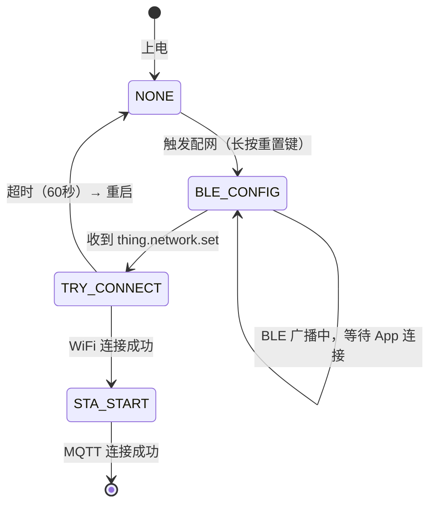

# BLE 协议参考

> **TL;DR**：本文档定义 BLE 配网的完整协议：广播格式、GATT 服务、V1 分包传输协议、应用层消息和状态码。适用于设备端固件和 App 端 BLE 集成开发。

---

## 1. 协议分层

```
┌─────────────────────────────────────────┐
│  应用层 (JSON 消息)                      │
│  thing.network.set / device.information │
├─────────────────────────────────────────┤
│  传输协议层 (V1 分包协议)                │
│  128 字节分包 / CRC 校验                 │
├─────────────────────────────────────────┤
│  GATT 层                                │
│  Service UUID: 0xA101 / Notify + Write  │
├─────────────────────────────────────────┤
│  BLE 物理层                             │
│  BLE 4.2+ / GATT Profile               │
└─────────────────────────────────────────┘
```

---

## 2. BLE 广播

设备进入配网模式后启动 BLE 广播，App 通过广播数据发现和识别设备。

### 2.1 广播数据

广播数据包含 3 个段：

| 段 | 类型 | 内容 |
|---|---|---|
| FLAGS | `0x01` | `0x06`（General Discoverable + BR/EDR Not Supported） |
| Service UUID | `0x02` (UUID16) | `0xA101` — 用于筛选 Sentino 设备 |
| Service Data | `0x16` | UUID `0xA101` + 标志位 `0x00` + PID 字符串 |

**Service Data 结构**：

```
+--------+--------+------+------------------+
| UUID   | UUID   | Flag | PID String       |
| 0xA101 (LE)     | 0x00 | "sEF4ljjdH8mo"   |
| 2 bytes         | 1 B  | N bytes          |
+--------+--------+------+------------------+
```

### 2.2 扫描应答数据

| 段 | 类型 | 内容 |
|---|---|---|
| 完整名称 | `0x09` | `"RY"` |
| 厂商数据 | `0xFF` | 见下方结构 |

**厂商数据结构**：

```
+----------+----------+---------+---------+----------+----------+-----------+
| Company  | Company  | Config  | Proto   | Encrypt  | Comm     | ID Type   |
| ID Low   | ID High  | FLAG    | Version | Method   | Ability  |           |
| 1 byte   | 1 byte   | 1 byte  | 1 byte  | 1 byte   | 2 bytes  | 1 byte    |
+----------+----------+---------+---------+----------+----------+-----------+
| UUID or MAC (max 19 bytes)                                                |
+---------------------------------------------------------------------------+
```

| 字段 | 大小 | 说明 |
|---|---|---|
| Company ID | 2 字节 | `0x0000` |
| Config FLAG | 1 字节 | 配网状态标志位，见下方定义 |
| Proto Version | 1 字节 | `0x03` = 双模配网 |
| Encrypt Method | 1 字节 | `0x00` = 不加密，`0x01` = 加密 |
| Comm Ability | 2 字节 | 通信能力，bit2 = WiFi 2.4G |
| ID Type | 1 字节 | `0` = UUID，`1` = MAC |
| UUID/MAC | 最多 19 字节 | 设备标识 |

### 2.3 配网标志位 (Config FLAG)

| 位 | 掩码 | 值=1 | 值=0 |
|---|---|---|---|
| bit7 | `0x80` | 不在配网状态 | 在配网状态 |
| bit6 | `0x40` | 已绑定 | 未绑定 |
| bit5 | `0x20` | WiFi 已联网 | WiFi 未联网 |
| bit4 | `0x10` | 通用固件 | 非通用固件 |
| bit1 | `0x02` | 使用聚合协议 | 不使用 |
| bit0 | `0x01` | 请求连接 | 未请求连接 |

**App 筛选逻辑**：
- 扫描 Service UUID 为 `0xA101` 的设备
- 检查 Config FLAG 的 bit7 = 0（在配网状态）
- 检查 bit6 = 0（未绑定）

---

## 3. GATT 服务

| 属性 | UUID | 说明 |
|---|---|---|
| Service | `0xA101` | Sentino 配网服务 |
| Characteristic (Write) | — | App → 设备，写入数据 |
| Characteristic (Notify) | — | 设备 → App，通知数据 |

**数据交互方式**：
- App 向设备发送数据：通过 Write Characteristic 写入
- 设备向 App 发送数据：通过 Notify Characteristic 通知
- 连接建立后，App 需要先使能 Notify（Enable Notification）

---

## 4. V1 分包传输协议

BLE 单次传输数据量有限（MTU 限制），大于 118 字节的 JSON 消息需要分包传输。

### 4.1 协议帧格式

每个数据包最大 **128 字节**，协议头占用 **10 字节**，有效数据最大 **118 字节**。

```
+------+------+------+------+------+------+------+------+------+--------+------+
| HEAD | TYPE |  SN  |  SN  |TOTAL |TOTAL | LEN  | LEN  |C_LEN |  DATA  | CRC  |
|  1B  |  1B  |  1B  |  1B  |  1B  |  1B  |  1B  |  1B  |  1B  |  N B   |  1B  |
+------+------+------+------+------+------+------+------+------+--------+------+
  0xFF   0x01   MSB    LSB    MSB    LSB    MSB    LSB
```

### 4.2 字段说明

| 字段 | 大小 | 说明 |
|---|---|---|
| **HEAD** | 1 字节 | 固定值 `0xFF` |
| **TYPE** | 1 字节 | 数据类型，固定值 `0x01` |
| **SN** | 2 字节 | 当前包序号（大端序），从 0 开始 |
| **TOTAL** | 2 字节 | 总包数（大端序） |
| **LEN** | 2 字节 | 有效数据总长度（大端序），所有包中此值相同 |
| **C_LEN** | 1 字节 | 当前包有效数据长度 |
| **DATA** | N 字节 | 有效数据（当前包） |
| **CRC** | 1 字节 | 校验和：从 TYPE 到 DATA 所有字节的累加和（取低 8 位） |

### 4.3 分包计算

```
每包有效数据量 = 118 字节
总包数 = ceil(数据总长度 / 118)
```

**示例**：一条 300 字节的 JSON 消息

| 包序号 (SN) | 有效数据长度 (C_LEN) | 说明 |
|---|---|---|
| 0 | 118 | 第 1 包 |
| 1 | 118 | 第 2 包 |
| 2 | 64 | 第 3 包（剩余数据） |

总包数 (TOTAL) = 3，数据总长度 (LEN) = 300。

### 4.4 发送端处理流程

```
1. 计算总包数: total = ceil(data_len / 118)
2. 对每个包:
   a. 填充协议头（HEAD=0xFF, TYPE=0x01, SN, TOTAL, LEN, C_LEN）
   b. 拷贝有效数据
   c. 计算 CRC（从 TYPE 到 DATA 的累加和）
   d. 通过 BLE Write/Notify 发送
   e. 等待 20ms（包间延迟）
```

### 4.5 接收端处理流程

```
1. 验证 HEAD 是否为 0xFF
2. 检查 SN 是否连续（从 0 开始递增）
3. 验证 CRC 校验和
4. 第一包（SN=0）时：分配接收缓冲区（大小 = LEN）
5. 拷贝有效数据到缓冲区
6. 最后一包（SN = TOTAL-1）时：
   a. 验证接收总长度 == LEN
   b. 将完整数据回调给应用层
   c. 释放接收缓冲区
```

### 4.6 CRC 计算

```c
uint8_t calc_crc(uint8_t *data, uint16_t len) {
    uint8_t crc = 0;
    // 从 TYPE 字段开始（跳过 HEAD），到 DATA 结束（不含 CRC 本身）
    for (uint16_t i = 1; i < len - 1; i++) {
        crc += data[i];
    }
    return crc;
}
```

---

## 5. 应用层消息

应用层消息采用 JSON 格式，通过 V1 分包协议传输。

### 5.1 通用格式

```json
{
  "type": "消息类型",
  "ts": 1742536800,
  "msgId": "消息ID（可选）",
  "code": 0,
  "data": {}
}
```

### 5.2 下行消息（App → 设备）

#### 5.2.1 获取设备信息

```json
{
  "type": "device.information.get",
  "ts": 1742536800
}
```

设备回复：

```json
{
  "type": "device.information.get.response",
  "ts": 1742536800,
  "data": {
    "version": "1.0.0",
    "msgType": "poweron",
    "pid": "sEF4ljjdH8mo",
    "bind": false,
    "gateway": 0,
    "wifi_mac": "aa:bb:cc:dd:ee:ff",
    "ble_mac": "11:22:33:44:55:66"
  }
}
```

| 字段 | 说明 |
|---|---|
| `version` | 固件版本 |
| `pid` | 产品 ID |
| `bind` | 是否已绑定 |
| `gateway` | 是否是网关设备（0=否） |
| `wifi_mac` | WiFi MAC 地址 |
| `ble_mac` | BLE MAC 地址 |

#### 5.2.2 设置网络配置（配网）

**WiFi 模式**：

```json
{
  "type": "thing.network.set",
  "data": {
    "sid": "MyWiFi",
    "pw": "password123",
    "bid": "assetId",
    "userId": "userId",
    "mq": "mqtt-iot.sentino.jp",
    "port": 1883,
    "country": "CN",
    "tz": "Asia/Shanghai",
    "force_bind": false
  }
}
```

| 字段 | 必填 | 说明 |
|---|---|---|
| `sid` | WiFi 模式必填 | WiFi SSID |
| `pw` | WiFi 模式必填 | WiFi 密码 |
| `bid` | 是 | 资产 ID（assetId） |
| `userId` | 是 | 用户 ID |
| `mq` | WiFi 模式必填 | MQTT Broker 地址 |
| `port` | WiFi 模式必填 | MQTT 端口 |
| `country` | 否 | 国家代码 |
| `tz` | 否 | 时区 |
| `force_bind` | 否 | 是否强制绑定 |

**4G 模式**：

```json
{
  "type": "thing.network.set",
  "data": {
    "bid": "assetId",
    "userId": "userId"
  }
}
```

设备回复：

```json
{
  "type": "thing.network.set.response",
  "code": 0,
  "msgId": "abc123",
  "ts": 1742536800
}
```

#### 5.2.3 获取 WiFi 列表

```json
{
  "type": "thing.network.getwifis",
  "scan": 1
}
```

设备回复：

```json
{
  "type": "thing.network.getwifis.response",
  "msgId": "abc123",
  "code": 0,
  "ts": 1742536800,
  "data": {
    "wifis": [
      {"ssid": "MyWiFi", "rssi": -45, "security": true},
      {"ssid": "Office_5G", "rssi": -72, "security": true}
    ]
  }
}
```

| 字段 | 说明 |
|---|---|
| `ssid` | WiFi 名称 |
| `rssi` | 信号强度（dBm），越大越好 |
| `security` | 是否加密 |

#### 5.2.4 设置设备属性

```json
{
  "type": "thing.property.set",
  "data": {
    "volume": 50
  }
}
```

回复：

```json
{
  "type": "thing.property.set.response",
  "code": 0,
  "ts": 1742536800
}
```

#### 5.2.5 获取设备属性

```json
{
  "type": "thing.property.get"
}
```

回复：

```json
{
  "type": "thing.property.get.response",
  "code": 0,
  "ts": 1742536800,
  "data": {
    "volume": 50
  }
}
```

#### 5.2.6 清除设备数据

```json
{
  "type": "device.data.clear"
}
```

回复：

```json
{
  "type": "device.data.clear.response",
  "code": 0,
  "ts": 1742536800
}
```

### 5.3 上行消息（设备 → App）

#### 5.3.1 属性上报

设备主动上报属性变化：

```json
{
  "type": "thing.property.report",
  "data": {
    "battery": 85,
    "volume": 50
  }
}
```

#### 5.3.2 时间请求

设备请求 App 同步时间：

```json
{
  "type": "time"
}
```

App 回复：

```json
{
  "type": "time.response",
  "data": {
    "ts": 1742536800
  }
}
```

### 5.4 完整消息类型一览

| 方向 | 消息类型 | 说明 |
|---|---|---|
| App → 设备 | `device.information.get` | 获取设备信息 |
| App → 设备 | `thing.network.set` | 配网（核心） |
| App → 设备 | `thing.network.getwifis` | 获取 WiFi 列表 |
| App → 设备 | `thing.property.set` | 设置属性 |
| App → 设备 | `thing.property.get` | 获取属性 |
| App → 设备 | `thing.model.get.response` | 物模型响应 |
| App → 设备 | `time.response` | 时间响应 |
| App → 设备 | `device.data.clear` | 清除设备数据 |
| App → 设备 | `ota.upgrade.initiate` | OTA 初始化 |
| App → 设备 | `ota.file.info` | OTA 文件信息 |
| App → 设备 | `ota.file.offset` | OTA 文件偏移 |
| App → 设备 | `ota.file.data` | OTA 文件数据 |
| App → 设备 | `ota.complete` | OTA 完成 |
| 设备 → App | `device.information.get.response` | 设备信息响应 |
| 设备 → App | `thing.network.set.response` | 配网响应 |
| 设备 → App | `thing.network.getwifis.response` | WiFi 列表响应 |
| 设备 → App | `thing.property.set.response` | 设置属性响应 |
| 设备 → App | `thing.property.get.response` | 获取属性响应 |
| 设备 → App | `thing.property.report` | 属性上报 |
| 设备 → App | `time` | 时间请求 |

---

## 6. 状态码

### 6.1 应用层状态码

| code 值 | 说明 |
|---|---|
| `0` | 成功 |
| 非 `0` | 失败（具体含义视消息类型） |

### 6.2 传输层错误码

| 错误码 | 说明 |
|---|---|
| 1501 | 包头异常（HEAD 不是 0xFF） |
| 1502 | 包序号异常（SN 不连续） |
| 1503 | CRC 校验失败 |
| 1504 | 设备缓存 1 异常 |
| 1505 | 设备缓存 2 异常 |
| 1506 | 总数据长度异常 |

### 6.3 配网状态码

| 错误码 | 说明 |
|---|---|
| 1700 | JSON 解析失败 |
| 1701 | JSON 解析成功，开始联网 |
| 1702 | 服务器连接失败 |
| 1703 | 服务器连接成功 |

---

## 7. 配网状态机

设备端配网状态流转：



| 状态 | 说明 |
|---|---|
| `NONE` | 待机，未配网 |
| `BLE_CONFIG` | 蓝牙配网模式，广播中 |
| `TRY_CONNECT` | 尝试连接 WiFi（WiFi 模式）或等待 MQTT 绑定（4G 模式） |
| `STA_START` | WiFi STA 模式已连接 |

### 7.1 配网超时

| 参数 | 值 |
|---|---|
| 超时时间 | 60 秒 |
| 触发条件 | 收到配网信息但未成功连接 MQTT |
| 超时动作 | 断开 WiFi → 清除配网信息 → 重启设备 |

---

## 8. 平台适配

### 8.1 设备端需实现的回调

```c
typedef struct {
    void (*Ble_Init)(void);
    int  (*Ble_Gatt_Notify_Send)(uint8_t conn_index, uint8_t *data, uint16_t len);
    int  (*Ble_Set_Adv_Data)(uint8_t *adv_data, uint8_t adv_len);
    int  (*Ble_Set_Scan_Rsp_Data)(uint8_t *scan_rsp_data, uint8_t scan_rsp_len);
    int  (*Ble_Adv_Start)(void);
    int  (*Ble_Adv_Stop)(void);
    void (*Ble_Get_Local_Addr)(uint8_t *mac_addr);
    int  (*Ble_Disconnect)(uint8_t conn_index);
} Rlink_Ble_Cbs_t;
```

### 8.2 适配步骤

1. 实现 `Rlink_Ble_Cbs_t` 中的所有回调函数
2. 调用 `Rlink_Ble_Cbs_Init()` 注册回调
3. 在 BLE 连接事件中调用 `Rlink_Ble_Connect_Envent_Callback()`
4. 在 BLE 数据接收中调用 `Rlink_Ble_Gatt_Data_In_Callback()`

---

**相关文档**：[App 端集成指南](./guide-app.md) | [设备端集成指南](./guide-device.md) | [架构与概念](./architecture.md)
