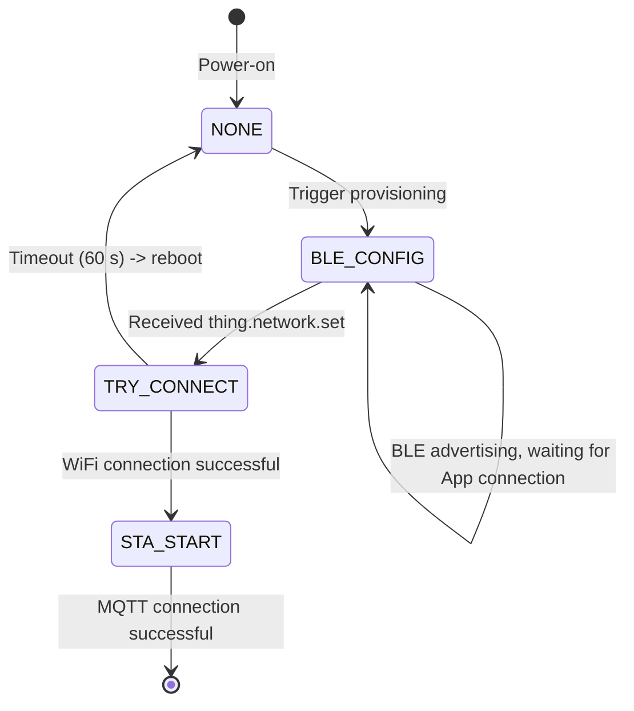

# BLE Protocol Reference

> **TL;DR**: This document defines the complete BLE provisioning protocol: advertising format, GATT services, V1 fragmentation transport protocol, application-layer messages, and status codes. It applies to both device-side firmware and App-side BLE integration development.

---

## 1. Protocol Layering

```
┌─────────────────────────────────────────┐
│  Application Layer (JSON messages)      │
│  thing.network.set / device.information │
├─────────────────────────────────────────┤
│  Transport Protocol Layer (V1 fragment) │
│  128-byte fragments / CRC verification  │
├─────────────────────────────────────────┤
│  GATT Layer                             │
│  Service: 0x1910 / Write: 0x2B11        │
│  Notify: 0x2B10                         │
├─────────────────────────────────────────┤
│  BLE Physical Layer                     │
│  GATT Profile                           │
└─────────────────────────────────────────┘
```

---

## 2. BLE Advertising

After entering provisioning mode, the device starts BLE advertising. The App discovers and identifies devices through the advertising data.

> **Space limit**: BLE 4.x Legacy Advertising has a **31-byte** cap on both the Advertising Data (ADV Data) and the Scan Response packet (Bluetooth Core Spec Vol 6, Part B, §2.3.1: total Legacy ADV PDU length is 37 B, minus 6 B header = 31 B of effective data). BLE 5.0 Extended Advertising can reach 254 bytes, but the Web Bluetooth API and most phones default to scanning in Legacy mode. When designing advertising data, note that the length of the PID string directly affects the total size of the advertising packet.

### 2.1 Advertising Data

The advertising data contains 3 sections:

| Section | Type | Content |
|---|---|---|
| FLAGS | `0x01` | `0x06` |
| Service UUID | `0x02` (UUID16) | `0xA101` — used to filter Sentino devices |
| Service Data | `0x16` | UUID `0xA101` + flag byte `0x00` + PID string |

**Service Data structure**:

```
+--------+--------+------+------------------+
| UUID   | UUID   | Flag | PID String       |
| 0xA101 (LE)     | 0x00 | "sEF4ljjdH8mo"   |
| 2 bytes         | 1 B  | N bytes          |
+--------+--------+------+------------------+
```

### 2.2 Scan Response Data

| Section | Type | Content |
|---|---|---|
| Complete Local Name | `0x09` | `"RY"` |
| Manufacturer Data | `0xFF` | See structure below |

**Manufacturer Data structure**:

```
+----------+----------+---------+---------+----------+----------+-----------+
| Company  | Company  | Config  | Proto   | Encrypt  | Comm     | ID Type   |
| ID Low   | ID High  | FLAG    | Version | Method   | Ability  |           |
| 1 byte   | 1 byte   | 1 byte  | 1 byte  | 1 byte   | 2 bytes  | 1 byte    |
+----------+----------+---------+---------+----------+----------+-----------+
| UUID or MAC (max 19 bytes)                                                |
+---------------------------------------------------------------------------+
```

| Field | Size | Description |
|---|---|---|
| Company ID | 2 bytes | `0x0000` |
| Config FLAG | 1 byte | Provisioning state flags, see definition below |
| Proto Version | 1 byte | Protocol version, see definition below |
| Encrypt Method | 1 byte | Encryption method, see definition below |
| Comm Ability | 2 bytes | Communication capability (big-endian), see definition below |
| ID Type | 1 byte | `0` = UUID, `1` = MAC |
| UUID/MAC | up to 19 bytes | Device identifier; content depends on the encryption method (see notes below) |

**Proto Version**:

| Value | Meaning |
|---|---|
| `0x03` | Dual-mode provisioning (BLE + WiFi) |
| `0x04` | BLE-only provisioning |
| `0x10` | Dual-mode provisioning + dynamic MTU support |
| `0x11` | BLE-only provisioning + dynamic MTU support |
| `0x15` | Temporary BLE V1.5 protocol with dynamic MTU support (OTA follows V2.0, others follow the existing protocol) |

> If this field is absent from the advertising data, the protocol version defaults to `1`.

**Encrypt Method**:

| Value | Meaning |
|---|---|
| `0x00` | Encryption based on auth key and device id |
| `0x01` | Encryption based on the ECB algorithm |
| `0x02` | No encryption (transparent channel) |

> **Note**: The definition of the encryption method follows the *Bluetooth Dual-Mode Provisioning Specification*.

**Comm Ability**:

2 bytes, big-endian (high byte first):

| Bit | Meaning |
|---|---|
| bit0 | Whether the device registers and binds via BLE (`1` = yes) |
| bit1 | Whether MESH is supported (`1` = supported) |
| bit2 | Whether WiFi 2.4G capability is present (`1` = yes) |
| bit3 | Whether WiFi 5G capability is present (`1` = yes) |
| bit4 | Whether Zigbee capability is present (`1` = yes) |
| bit5 | Whether NB-IoT capability is present (`1` = yes) |

**Relationship between the ID field and the encryption method**:

| Encrypt Method | ID Field Content |
|---|---|
| `0x00` | 16-byte DEVICE UUID (AES-CBC encrypted; the key is the MD5 of the Service Data Elements) |
| `0x01` | 6-byte MAC address (plaintext) |

### 2.3 Provisioning Flags (Config FLAG)

| Bit | Mask | Value = 1 | Value = 0 |
|---|---|---|---|
| bit7 | `0x80` | Not in provisioning state | In provisioning state |
| bit6 | `0x40` | Bound | Not bound |
| bit5 | `0x20` | WiFi connected | WiFi not connected |
| bit4 | `0x10` | Generic firmware | Non-generic firmware |
| bit1 | `0x02` | Uses aggregation protocol | Does not use |
| bit0 | `0x01` | Connection requested | Connection not requested |

---

## 3. GATT Service

> **Note**: The App filters devices by advertising name when scanning (default `"RY"`, customizable per product). The Service UUID (`0xA101`) in the advertisement is used to identify Sentino devices and to carry the product ID. The actual GATT data communication uses a different Service and Characteristic UUID.

| Item | UUID | Description |
|---|---|---|
| GATT Service | `0x1910` | Data transmission service |
| Write Characteristic | `0x2B11` | App → Device (write / write-without-response) |
| Notify Characteristic | `0x2B10` | Device → App (notify / indicate) |

After connecting to the device, the App must:
1. Discover Service `0x1910`
2. Obtain the Write Characteristic `0x2B11` (for sending data)
3. Enable notifications on the Notify Characteristic `0x2B10` (for receiving data)

---

## 4. V1 Fragmentation Transport Protocol

The amount of data that can be transferred in a single BLE transmission is limited (ATT MTU constraint). JSON messages larger than 118 bytes must be fragmented before transmission.

### 4.1 Protocol Frame Format

Each packet is at most **128 bytes**. The protocol header occupies **10 bytes**, leaving up to **118 bytes** for the payload.

```
+------+------+------+------+------+------+------+------+------+--------+------+
| HEAD | TYPE |  SN  |  SN  |TOTAL |TOTAL | LEN  | LEN  |C_LEN |  DATA  | CRC  |
|  1B  |  1B  |  1B  |  1B  |  1B  |  1B  |  1B  |  1B  |  1B  |  N B   |  1B  |
+------+------+------+------+------+------+------+------+------+--------+------+
  0xFF   0x01   MSB    LSB    MSB    LSB    MSB    LSB
```

### 4.2 Field Descriptions

| Field | Size | Description |
|---|---|---|
| **HEAD** | 1 byte | Fixed value `0xFF` |
| **TYPE** | 1 byte | Data type, fixed value `0x01` |
| **SN** | 2 bytes | Current packet sequence number (big-endian), starts from 0 |
| **TOTAL** | 2 bytes | Total number of packets (big-endian) |
| **LEN** | 2 bytes | Total length of the payload (big-endian); identical across all packets |
| **C_LEN** | 1 byte | Payload length in the current packet |
| **DATA** | N bytes | Payload (current packet) |
| **CRC** | 1 byte | Checksum: low 8 bits of the sum of all bytes from TYPE through DATA |

### 4.3 Fragmentation Calculation

```
Payload per packet = 118 bytes
Total packets = ceil(total data length / 118)
```

**Example**: a 300-byte JSON message

| Packet Sequence (SN) | Payload Length (C_LEN) | Description |
|---|---|---|
| 0 | 118 | 1st packet |
| 1 | 118 | 2nd packet |
| 2 | 64 | 3rd packet (remaining data) |

Total packets (TOTAL) = 3, total data length (LEN) = 300.

### 4.4 Sender Processing Flow

```
1. Compute total packets: total = ceil(data_len / 118)
2. For each packet:
   a. Fill in the protocol header (HEAD=0xFF, TYPE=0x01, SN, TOTAL, LEN, C_LEN)
   b. Copy the payload
   c. Compute the CRC (sum of bytes from TYPE through DATA)
   d. Send via BLE Write/Notify
   e. Wait 10 ms (inter-packet delay)
```

### 4.5 Receiver Processing Flow

```
1. Verify that HEAD equals 0xFF
2. Check that SN is contiguous (incrementing from 0)
3. Verify the CRC checksum
4. On the first packet (SN=0): allocate a receive buffer (size = LEN)
5. Copy the payload into the buffer
6. On the last packet (SN = TOTAL-1):
   a. Verify that the total received length equals LEN
   b. Hand the assembled data back to the application layer
   c. Release the receive buffer
```

### 4.6 CRC Calculation

Checksum: the low 8 bits of the sum of all bytes from TYPE through DATA.

---

## 5. Application-Layer Messages

Application-layer messages use JSON format and are transported via the V1 fragmentation protocol.

### 5.1 Common Format

```json
{
  "type": "message type",
  "ts": 1742536800,
  "msgId": "message ID (optional)",
  "code": 0,
  "data": {}
}
```

### 5.2 Downlink Messages (App → Device)

#### 5.2.1 Get Device Information

```json
{
  "type": "device.information.get",
  "ts": 1742536800
}
```

Device reply:

```json
{
  "type": "device.information.get.response",
  "ts": 1742536800,
  "data": {
    "version": "1.0.0",
    "msgType": "poweron",
    "pid": "sEF4ljjdH8mo",
    "bind": false,
    "gateway": 0,
    "wifi_mac": "aa:bb:cc:dd:ee:ff",
    "ble_mac": "11:22:33:44:55:66"
  }
}
```

| Field | Description |
|---|---|
| `version` | Firmware version |
| `pid` | Product ID |
| `bind` | Whether the device is bound |
| `gateway` | Whether the device is a gateway (0 = no) |
| `wifi_mac` | WiFi MAC address |
| `ble_mac` | BLE MAC address |

#### 5.2.2 Set Network Configuration (Provisioning)

**WiFi mode**:

```json
{
  "type": "thing.network.set",
  "data": {
    "sid": "MyWiFi",
    "pw": "password123",
    "bid": "assetId",
    "userId": "userId",
    "mq": "mqtt-iot.sentino.jp",
    "port": 1883,
    "country": "CN",
    "tz": "Asia/Shanghai",
    "force_bind": false
  }
}
```

| Field | Required | Description |
|---|---|---|
| `sid` | Yes (WiFi mode) | WiFi SSID |
| `pw` | Yes (WiFi mode) | WiFi password |
| `bid` | Yes | Account ID (assetId) |
| `userId` | Yes | User ID |
| `mq` | Yes (WiFi mode) | MQTT broker address |
| `port` | Yes (WiFi mode) | MQTT port |
| `mqttSslPort` | Yes | MQTT SSL port |
| `areaCode` | Yes | Area code, e.g., US, CN |
| `country` | Yes | Country code |
| `tz` | Yes | Time zone |
| `force_bind` | Yes | Whether to force binding |

**4G mode** (Quectel module integration — contact the Sentino team for the dedicated guide):

```json
{
  "type": "thing.network.set",
  "data": {
    "bid": "assetId",
    "userId": "userId"
  }
}
```

Device reply:

```json
{
  "type": "thing.network.set.response",
  "code": 0,
  "msgId": "abc123",
  "ts": 1742536800
}
```

#### 5.2.3 Get WiFi List

```json
{
  "type": "thing.network.getwifis",
  "scan": 1
}
```

Device reply:

```json
{
  "type": "thing.network.getwifis.response",
  "msgId": "abc123",
  "code": 0,
  "ts": 1742536800,
  "data": {
    "wifis": [
      {"ssid": "MyWiFi", "rssi": -45, "security": true},
      {"ssid": "Office_5G", "rssi": -72, "security": true}
    ]
  }
}
```

| Field | Description |
|---|---|
| `ssid` | WiFi name |
| `rssi` | Signal strength |
| `security` | Whether encryption is enabled |

#### 5.2.4 Set Device Property

```json
{
  "type": "thing.property.set",
  "data": {
    "volume": 50
  }
}
```

Reply:

```json
{
  "type": "thing.property.set.response",
  "code": 0,
  "ts": 1742536800
}
```

#### 5.2.5 Get Device Property

```json
{
  "type": "thing.property.get"
}
```

Reply:

```json
{
  "type": "thing.property.get.response",
  "code": 0,
  "ts": 1742536800,
  "data": {
    "volume": 50
  }
}
```

#### 5.2.6 Clear Device Data

```json
{
  "type": "device.data.clear"
}
```

Reply:

```json
{
  "type": "device.data.clear.response",
  "code": 0,
  "ts": 1742536800
}
```

### 5.3 Uplink Messages (Device → App)

#### 5.3.1 Property Report

The device proactively reports property changes:

```json
{
  "type": "thing.property.report",
  "data": {
    "battery": 85,
    "volume": 50
  }
}
```

#### 5.3.2 Time Request

The device requests the App to synchronize time:

```json
{
  "type": "time"
}
```

App reply:

```json
{
  "type": "time.response",
  "data": {
    "ts": 1742536800
  }
}
```

### 5.4 Complete Message Type List

| Direction | Message Type | Description |
|---|---|---|
| App → Device | `device.information.get` | Get device information |
| App → Device | `thing.network.set` | Provisioning (core) |
| App → Device | `thing.network.getwifis` | Get WiFi list |
| App → Device | `thing.property.set` | Set property |
| App → Device | `thing.property.get` | Get property |
| App → Device | `thing.model.get.response` | Thing Model response |
| App → Device | `time.response` | Time response |
| App → Device | `device.data.clear` | Clear device data |
| App → Device | `ota.upgrade.initiate` | OTA initialization |
| App → Device | `ota.file.info` | OTA file information |
| App → Device | `ota.file.offset` | OTA file offset |
| App → Device | `ota.file.data` | OTA file data |
| App → Device | `ota.complete` | OTA completion |
| Device → App | `device.information.get.response` | Device information response |
| Device → App | `thing.network.set.response` | Provisioning response |
| Device → App | `thing.network.getwifis.response` | WiFi list response |
| Device → App | `thing.property.set.response` | Set property response |
| Device → App | `thing.property.get.response` | Get property response |
| Device → App | `thing.property.report` | Property report |
| Device → App | `time` | Time request |
| Device → App | `device.data.clear.response` | Clear data response |
| Device → App | `ota.upgrade.initiate.response` | OTA initialization response |
| Device → App | `ota.file.info.response` | OTA file information response |
| Device → App | `ota.file.offset.response` | OTA offset response |
| Device → App | `ota.file.data.response` | OTA data response |
| Device → App | `ota.complete.response` | OTA completion response |

---

## 6. Status Codes

### 6.1 Application-Layer Status Codes

| code Value | Description |
|---|---|
| `0` | Success |
| Non-`0` | Failure (specific meaning depends on the message type) |

### 6.2 WiFi Connection Status Codes

| Status Code | Description |
|---|---|
| 1006 | WiFi connection successful |
| 1007 | Provisioning failed: incorrect username or password |
| 1008 | Provisioning failed: no nearby router found (signal or WiFi device issue) |

### 6.3 BLE Data Transmission Error Codes

| Error Code | Description |
|---|---|
| 1500 | BLE received one packet of data (not currently used) |
| 1501 | Packet header anomaly |
| 1502 | Packet sequence number anomaly |
| 1503 | CRC verification failed |
| 1504 | Device buffer 1 anomaly |
| 1505 | Device buffer 2 anomaly |
| 1506 | Total data length anomaly |
| 1507 | Please send the next packet of data (not currently used) |

### 6.4 JSON Parsing and Server Connection Status Codes

| Status Code | Description |
|---|---|
| 1700 | JSON parsing failed |
| 1701 | JSON parsing succeeded; starting network connection |
| 1702 | Server connection failed |
| 1703 | Server connection succeeded |
| 1704 | BLE bind response |

### 6.5 Binding and Initialization Status Codes

| Status Code | Description |
|---|---|
| 1801 | Binding (bind) successful |
| 1802 | Binding (bind) failed |
| 1803 | Unbinding (unbind) successful |
| 1804 | Unbinding (unbind) failed |
| 1805 | Initialization (init) successful |
| 1806 | Initialization (init) failed |

### 6.6 Thing Model Status Codes

| Status Code | Description |
|---|---|
| 2000 | Thing Model parsing succeeded |
| 2001 | Thing Model parsing failed |

---

## 7. Provisioning State Machine

Device-side provisioning state transitions:



| State | Description |
|---|---|
| `NONE` | Idle, not provisioned |
| `BLE_CONFIG` | BLE provisioning mode, advertising |
| `TRY_CONNECT` | Attempting to connect to WiFi |
| `STA_START` | WiFi STA mode connected |

### 7.1 Provisioning Timeout

| Parameter | Value |
|---|---|
| Timeout | 60 seconds |
| Trigger condition | Provisioning info received but MQTT connection not established |
| Timeout action | Disconnect WiFi -> clear provisioning info -> reboot device |

---

## 8. Platform Adaptation

### 8.1 Callbacks the Device Side Must Implement

```c
typedef struct {
    void (*Ble_Init)(void);
    int (*Ble_Gatt_Notify_Send)(unsigned char conn_index,
                                unsigned char *send_data,
                                unsigned short len);
    int (*Ble_Gatt_Indicate_Send)(unsigned char conn_index,
                                  unsigned char *send_data,
                                  unsigned short len);
    int (*Ble_Set_Adv_Data)(unsigned char *adv_data, unsigned char adv_len);
    int (*Ble_Set_Scan_Rsp_Data)(unsigned char *scan_rsp_data,
                                 unsigned char scan_rsp_len);
    int (*Ble_Adv_Start)(void);
    int (*Ble_Adv_Stop)(void);
    void (*Ble_Get_Local_Addr)(unsigned char *mac_addr);
    int (*Ble_Disconnect)(unsigned char conn_index);
    int (*Ble_Parser_Data)(unsigned char* data, unsigned short len);
} Rlink_Ble_Cbs_t;
```

### 8.2 Adaptation Steps

1. Implement all callback functions in `Rlink_Ble_Cbs_t`
2. Call `Rlink_Ble_Cbs_Init()` to register the callbacks
3. Call `Rlink_Ble_Connect_Envent_Callback()` in the BLE connection event
4. Call `Rlink_Ble_Gatt_Data_In_Callback()` when BLE data is received
5. Register the application-layer message handler callback

---

**Related documents**: [App Integration Guide](../guides/guide-app-en.md) | [Device Integration Guide](../guides/guide-device-en.md) | [Architecture & Concepts](../architecture-en.md)
