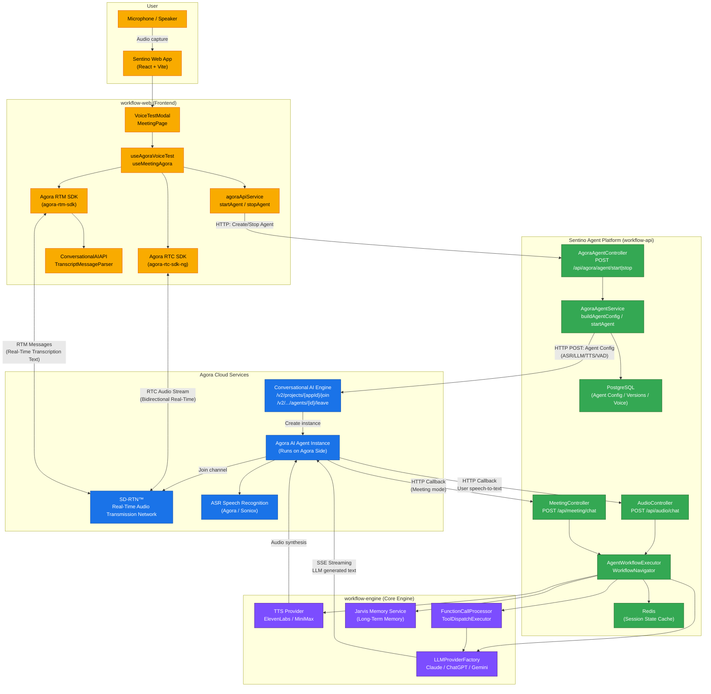

# Agora x Sentino Agent Platform Architecture

## Key Interaction Descriptions

| Stage | Flow |
|------|------|
| **1. Create Agent** | Frontend -> Sentino Agent Platform -> Agora ConvoAI API (`/join`) -> Agent instance joins RTC channel |
| **2. Real-Time Voice** | User microphone -> RTC SDK -> SD-RTN™ <-> Agora Agent (bidirectional audio stream) |
| **3. LLM Callback** | Agora Agent sends ASR text to Sentino Agent Platform via HTTP callback (`/api/audio/chat`) |
| **4. Workflow Execution** | Sentino Agent Platform executes Agent workflow: LLM inference -> Function Calling -> Memory retrieval |
| **5. Response Flow** | LLM streaming text -> Agora Agent -> TTS synthesis -> RTC audio sent back to user |
| **6. Real-Time Transcription** | Agora Agent pushes ASR/TTS text to frontend via RTM channel (real-time captions) |
| **7. Stop Agent** | Frontend -> Sentino Agent Platform -> Agora ConvoAI API (`/leave`) -> Agent leaves channel |

**Core Design**: The Sentino Agent Platform does not handle audio directly. Instead, it exposes LLM inference capabilities as an HTTP callback service for Agora Agents. Agora handles all audio transmission and ASR; the Sentino Agent Platform handles Agent configuration management, workflow orchestration, and LLM invocation.
