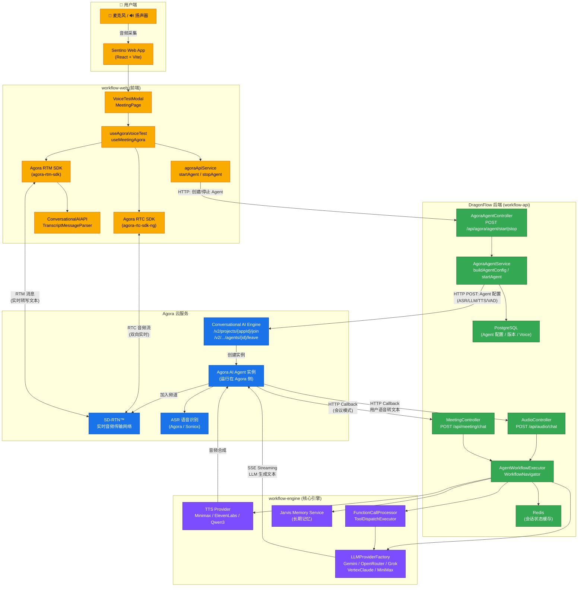

# Agora × DragonFlow (Sentino) 架构图

## 关键交互说明

| 阶段 | 流程 |
|------|------|
| **1. 创建 Agent** | 前端 → DragonFlow 后端 → Agora ConvoAI API (`/join`) → Agent 实例加入 RTC 频道 |
| **2. 实时语音** | 用户麦克风 → RTC SDK → SD-RTN™ ↔ Agora Agent（双向音频流） |
| **3. LLM 回调** | Agora Agent 将 ASR 文本通过 HTTP 回调发送到 DragonFlow 后端 (`/api/audio/chat`) |
| **4. 工作流执行** | DragonFlow 后端执行 Agent 工作流：LLM 推理 → Function Calling → 记忆检索 |
| **5. 响应回流** | LLM 流式文本 → Agora Agent → TTS 合成 → RTC 音频回传给用户 |
| **6. 实时转写** | Agora Agent 通过 RTM 通道将 ASR/TTS 文本推送到前端（实时字幕） |
| **7. 停止 Agent** | 前端 → DragonFlow 后端 → Agora ConvoAI API (`/leave`) → Agent 离开频道 |

**核心设计**: DragonFlow 不直接处理音频，而是将 LLM 推理能力作为 HTTP 回调服务暴露给 Agora Agent。Agora 负责所有音频传输、ASR 和 TTS，DragonFlow 负责 Agent 配置管理、工作流编排和 LLM 调用。