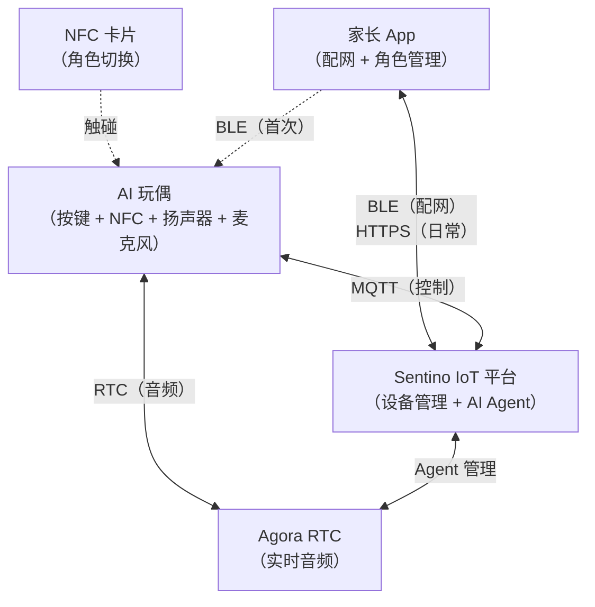
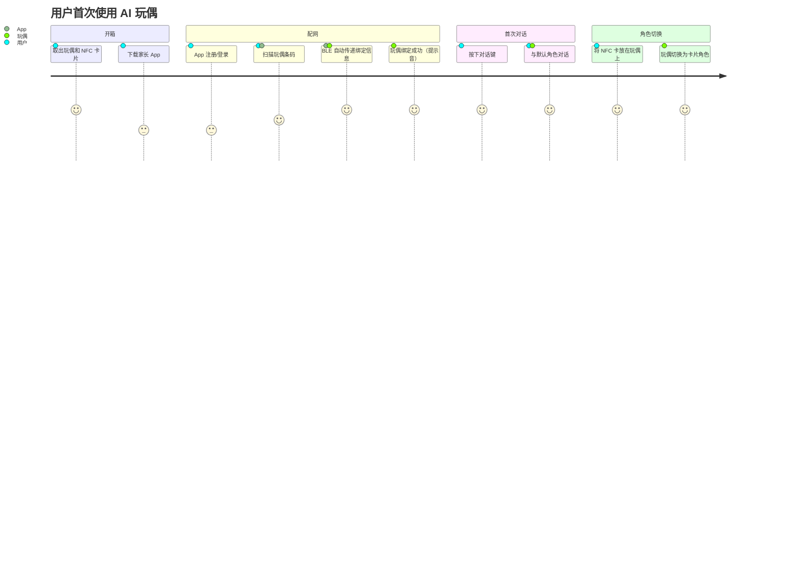
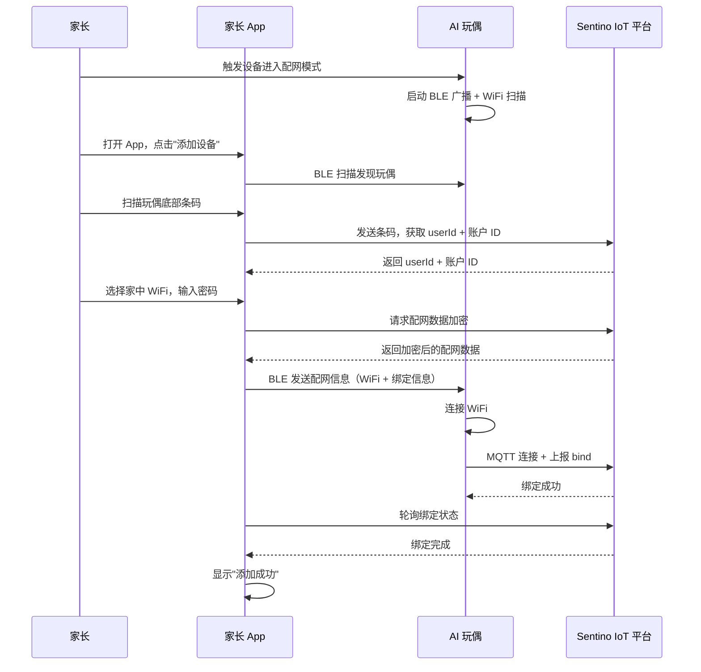
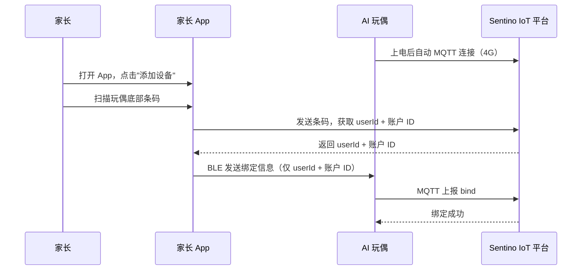
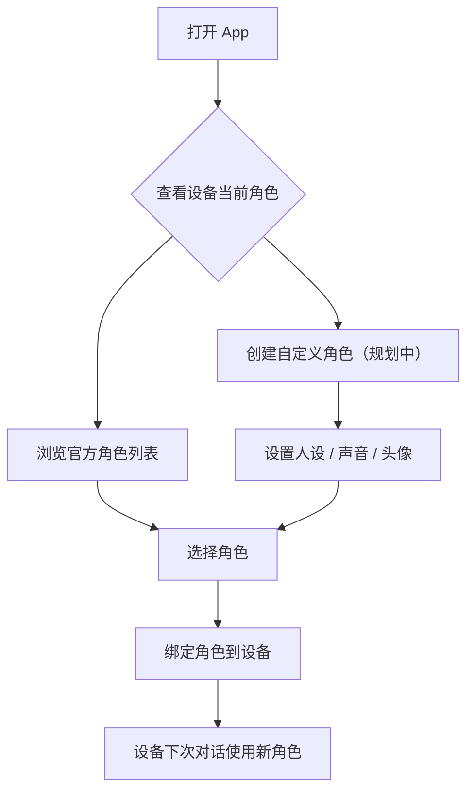
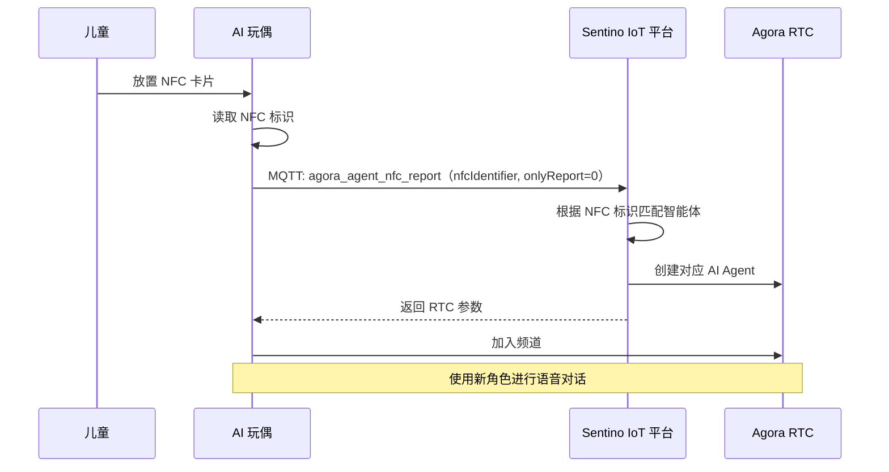
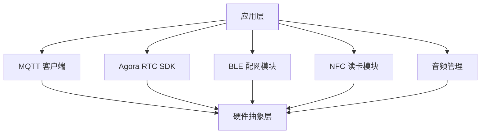

# AI 玩偶接入方案

> **TL;DR**：本文档面向产品经理和技术负责人，描述基于 Sentino IoT 平台的 AI 语音对话玩偶（如毛绒玩偶、故事机、教育机器人）的完整接入方案。涵盖用户旅程、智能体管理、NFC 角色切换和产品设计建议。

---

## 1. 产品概述

AI 语音对话玩偶是一种融合了 IoT 连接和 AI 语音交互的消费电子产品。用户（通常是儿童）通过按键或 NFC 触碰与玩偶进行实时语音对话，玩偶背后由云端 AI 智能体驱动，可以扮演不同的角色（如小熊伙伴、故事大王、英语老师等）。

### 1.1 核心能力

| 能力 | 说明 |
|---|---|
| **实时语音对话** | 儿童与 AI 角色自然对话，低延迟实时音频 |
| **多角色切换** | 通过 NFC 卡片或 App 操作切换不同 AI 角色 |
| **角色自定义** | 家长通过 App 自定义 AI 角色的人设、声音 |
| **设备管理** | 家长通过 App 管理设备绑定、解绑、OTA 升级 |

### 1.2 系统组成

---

## 2. 用户旅程（建议方案）

> 以下为建议的用户旅程设计，具体实现可根据产品需求调整。

### 2.1 开箱到首次对话

### 2.2 日常使用

| 场景 | 用户操作 | 系统行为 |
|---|---|---|
| 开机对话 | 按下对话键 | 玩偶通过 MQTT 获取 RTC 参数 → 加入频道 → 开始对话 |
| 切换角色 | 放置 NFC 卡 | 玩偶上报 NFC 标识 → 云端切换智能体 → 返回新角色的 RTC 参数 |
| 结束对话 | 松开按键 / 超时 | 玩偶离开 RTC 频道 → 云端自动清理 |
| 更换角色 | App 操作 | 家长在 App 中为设备选择/创建新角色 |
| 固件升级 | App 操作 / 自动 | 云端下发 OTA 指令 → 设备下载并升级 |

---

## 3. 配网流程

AI 玩偶支持两种联网方式，选择取决于硬件方案：

### 3.1 WiFi 模式

适用于内置 WiFi 模块的设备，需要通过 BLE 传递 WiFi 凭证。

### 3.2 4G 模式

适用于内置 4G 模组的设备，上电即可联网，BLE 仅传递绑定信息。

**两种模式对比**：

| 对比项 | WiFi 模式 | 4G 模式 |
|---|---|---|
| 联网方式 | 连接家中 WiFi | 内置 SIM 卡直连 |
| 配网传递内容 | WiFi 凭证 + 绑定信息 | 仅绑定信息 |
| 首次配网体验 | 需选择 WiFi + 输入密码 | 扫码即完成 |
| 使用场景 | 固定场所（家中） | 移动场景 |
| 网络依赖 | 用户路由器 | 运营商信号 |
| 流量成本 | 无 | 需要流量卡 |

---

## 4. 智能体（AI 角色）管理

### 4.1 智能体的组成

每个智能体定义了 AI 在对话中的完整行为：

| 组成部分 | 说明 | 示例 |
|---|---|---|
| **人设 (Prompt)** | AI 的角色描述、性格、行为规则 | "你是一只可爱的小熊，名叫贝贝，喜欢讲故事，说话温柔有趣" |
| **声音 (TTS Voice)** | AI 回复的语音风格 | 女声-温柔、男声-活力、童声 |
| **头像 (Avatar)** | 在 App 中展示的角色图片 | 小熊、小兔子、机器人 |
| **标签 (Tags)** | 角色分类标签 | 故事、教育、陪伴、英语 |

### 4.2 智能体类型

| 类型 | 来源 | 管理方式 |
|---|---|---|
| **官方智能体** | Sentino 预置 | 从推荐列表中选择绑定到设备 |
| **自定义智能体** | 家长创建 | 通过 App 自定义人设、声音等（规划中） |

### 4.3 App 端智能体管理流程

**相关 API**：

| 操作 | API | 说明 |
|---|---|---|
| 获取推荐角色列表 | `POST /business-app/v1/agents/recommend/agents-list` | 返回官方推荐智能体 |
| 查看角色详情 | `POST /business-app/v1/agents/detail` | 获取智能体配置详情 |
| 绑定角色到设备 | `POST /business-app/v1/agents/device/bind-agent` | 将智能体绑定到指定设备 |

---

## 5. NFC 角色切换

NFC 是 AI 玩偶的重要交互方式，让儿童通过实体卡片与设备互动。

### 5.1 产品形态

- 每张 NFC 卡片对应一个 AI 角色
- 卡片通常设计为角色形象的实体卡（如小熊卡、故事王卡）
- 儿童将卡片放在玩偶的 NFC 感应区域即可切换

### 5.2 技术流程

### 5.3 NFC 行为模式

| `onlyReport` | 行为 | 使用场景 |
|---|---|---|
| `0` | 切换角色 **并** 开始对话 | 放卡即聊 |
| `1` | 仅切换角色，不开始对话 | 先换角色，稍后按键开始 |

### 5.4 产品设计建议

> 以下为 Sentino 建议，非强制要求。

- **反馈设计**：放置卡片后通过提示音 + LED 指示切换成功
- **默认角色**：设备应有一个默认角色，无卡片时使用
- **卡片管理**：家长可通过 App 查看已有的 NFC 卡片和对应角色

---

## 6. 产品设计建议

> 以下为 Sentino 建议，供产品设计参考，非强制规范。

### 6.1 交互设计

| 交互元素 | 建议方案 |
|---|---|
| **对话触发** | 主按键（正面/顶部），大尺寸易操作 |
| **NFC 感应区** | 玩偶底座或腹部，标注感应位置 |
| **音量控制** | 侧面旋钮或 +/- 按键 |
| **状态指示** | LED 指示灯：区分对话中、在线、配网中、离线等状态（具体颜色由产品定义） |
| **提示音** | 开机/关机/绑定成功/网络异常/电量低 各有不同提示音 |

### 6.2 语音对话体验

| 设计点 | 建议 |
|---|---|
| **对话模式** | 推荐"按住说话"模式（对讲机式），体验最可控 |
| **响应速度** | 从按键到 AI 开始回复，应尽可能快速 |
| **打断处理** | 支持用户随时按键打断 AI 回复 |
| **超时处理** | 长时间无语音活动，云端自动结束对话，设备应播放提示 |
| **音频质量** | 采用降噪麦克风，扬声器音量适中（儿童听力保护） |

### 6.3 安全与合规

| 关注点 | 建议 |
|---|---|
| **儿童隐私** | 不存储对话音频到本地，音频仅在 RTC 通道内实时传输 |
| **内容安全** | AI 角色的人设 Prompt 需包含内容安全约束（如禁止讨论暴力/不当话题） |
| **音量限制** | 硬件层面限制最大输出音量，保护儿童听力 |
| **使用时长** | 建议通过 App 设置每日对话时长上限 |
| **数据安全** | 设备密钥存储在 NVS 加密分区，不可被外部读取 |

### 6.4 离线体验

| 场景 | 建议处理方式 |
|---|---|
| 无网络 | 播放预置离线内容（故事、音乐），并提示"网络未连接" |
| 网络恢复 | 自动重连 MQTT，无需用户干预 |
| 配网失败 | 语音提示"配网失败，请重试"，自动回到配网模式 |

---

## 7. 技术架构选型

### 7.1 硬件参考配置

| 组件 | 要求 |
|---|---|
| 主控 SoC | 支持 WiFi 或 4G，运行 RTOS |
| 音频 Codec | 支持 16kHz / 16bit 采样（Agora SDK 要求） |
| 麦克风 | — |
| 扬声器 | — |
| NFC 读卡器 | 用于角色卡片切换 |
| BLE | 支持 GATT，Service UUID 0xA101 |
| 存储 | NVS 分区用于三元组和配置存储 |

### 7.2 固件架构

### 7.3 关键技术文档

| 文档 | 角色 | 内容 |
|---|---|---|
| [架构与概念](./architecture.md) | 所有人 | 整体架构、核心概念 |
| [快速入门 — 设备端](./quickstart-device.md) | 固件工程师 | 10 分钟验证 MQTT 连通性 |
| [设备端集成指南](./guide-device.md) | 固件工程师 | MQTT 完整集成 |
| [AI 语音对话集成指南](./guide-ai-voice.md) | 固件工程师 | Agora RTC 集成 |
| [MQTT 协议参考](./ref-mqtt.md) | 固件工程师 | 协议字段查阅 |

---

## 8. 量产准备

### 8.1 三元组管理

| 环节 | 说明 |
|---|---|
| **申请** | 向 Sentino 申请设备三元组，按预计产量批次申请 |
| **交付** | Sentino 以 CSV 文件批量交付（含 UUID、KEY、MAC、Barcode） |
| **烧录** | 产线将三元组烧录到每台设备的 NVS 分区 |
| **条码印刷** | Barcode 印刷在设备外壳或包装上，供 App 扫码配网 |

### 8.2 上线清单

| 检查项 | 状态 |
|---|---|
| 三元组烧录验证 | ☐ |
| MQTT 连接和绑定流程验证 | ☐ |
| AI 语音对话端到端验证 | ☐ |
| NFC 角色切换验证 | ☐ |
| BLE 配网流程验证（WiFi/4G） | ☐ |
| OTA 升级流程验证 | ☐ |
| 断线重连验证 | ☐ |
| App 端完整流程验证 | ☐ |
| 音量和内容安全合规 | ☐ |

---

**相关文档**：[架构与概念](./architecture.md) | [设备端集成指南](./guide-device.md) | [AI 语音对话集成指南](./guide-ai-voice.md)
