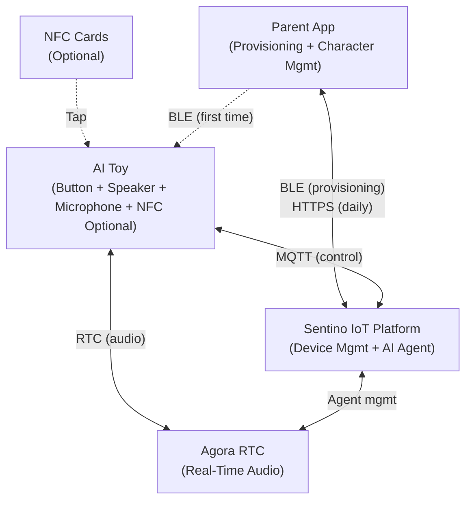
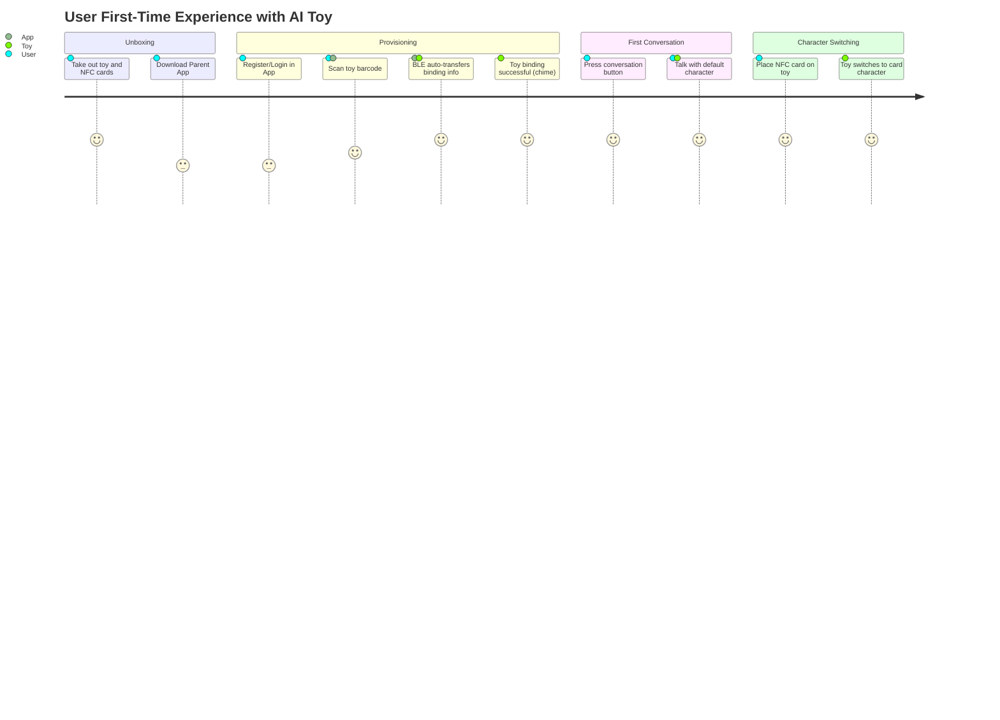
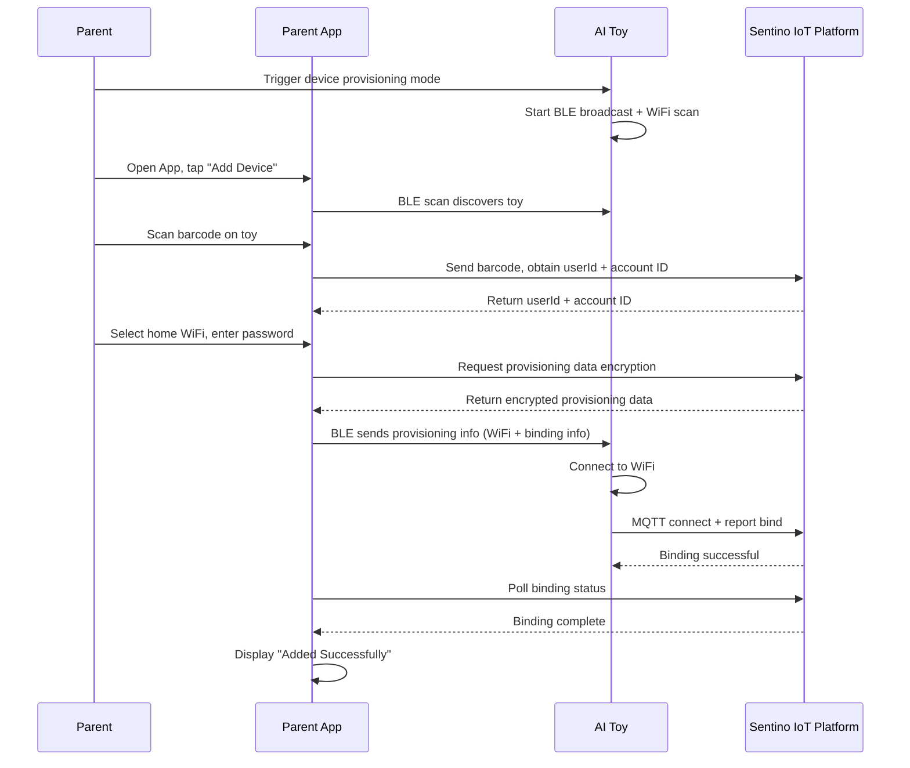
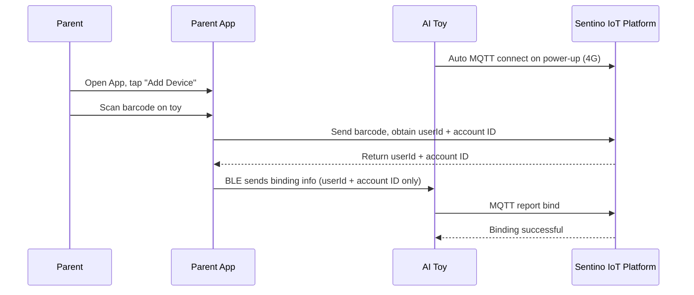
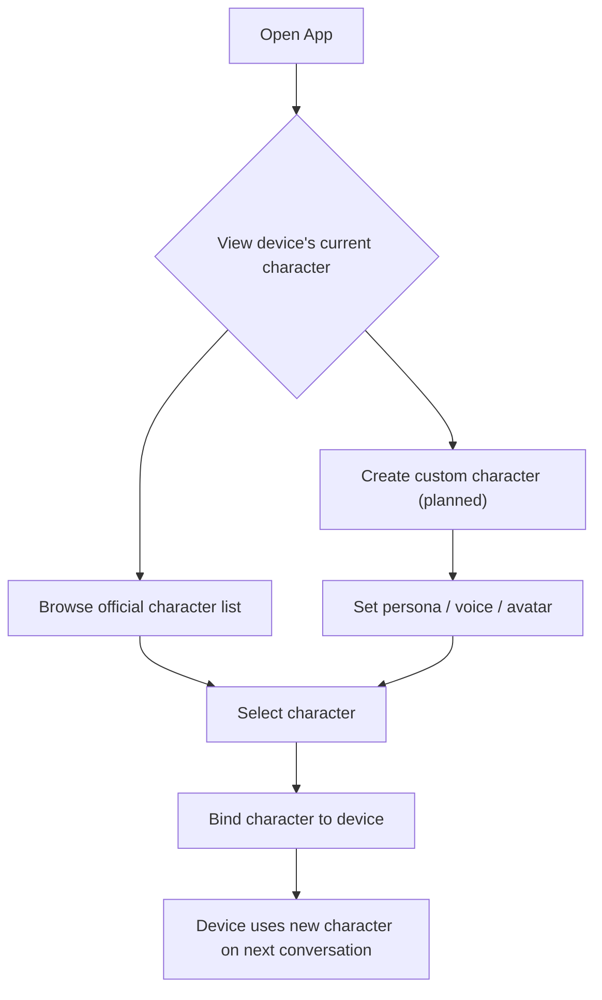
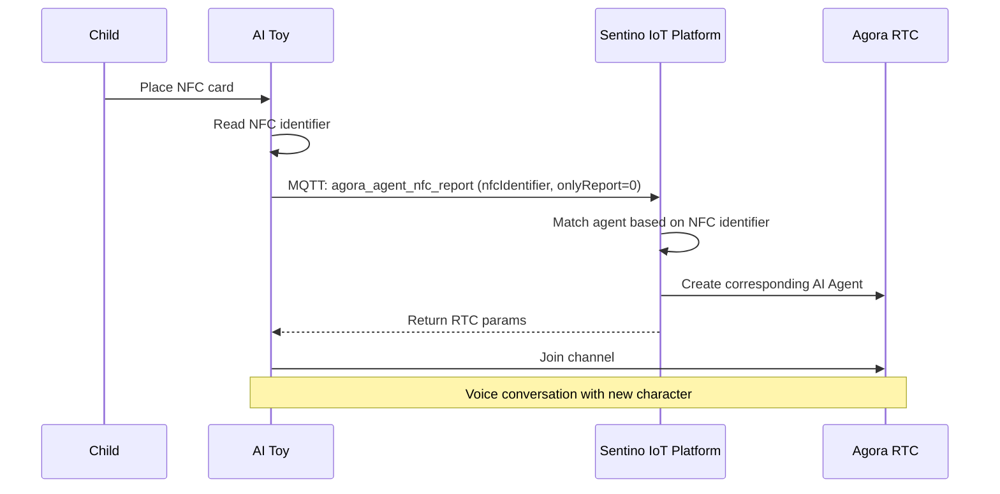
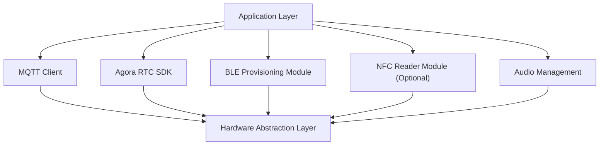

# AI Toy Integration Solution

> **TL;DR**: This document is intended for product managers and technical leads, describing the complete integration solution for AI voice conversation toys (such as plush dolls, story machines, educational robots) based on the Sentino IoT platform. It covers user journeys, agent management, NFC character switching, and product design recommendations.

---

## 1. Product Overview

An AI voice conversation toy is a consumer electronics product that combines IoT connectivity with AI voice interaction. Users (typically children) engage in real-time voice conversations with the toy via button press or NFC tap. The toy is powered by a cloud-based AI agent that can play different characters (e.g., Bear Buddy, Storyteller, English Tutor, etc.).

### 1.1 Core Capabilities

| Capability | Description |
|---|---|
| **Real-Time Voice Conversation** | Children converse naturally with AI characters, with low-latency real-time audio |
| **Multi-Character Switching** | Switch AI characters via App or NFC cards (optional) |
| **Character Customization** | Parents customize AI character persona and voice via App |
| **AI Device Control** | Voice commands during conversation control toy hardware (e.g., expressions, actions, LED lights, volume) |
| **Device Management** | Parents manage device binding, unbinding, and OTA updates via App |

### 1.2 System Components

---

## 2. User Journey (Recommended Design)

> The following is a recommended user journey design. Actual implementation can be adjusted based on product requirements.

### 2.1 Unboxing to First Conversation

### 2.2 Daily Use

| Scenario | User Action | System Behavior |
|---|---|---|
| Start conversation | Press conversation button | Toy obtains RTC params via MQTT -> joins channel -> starts conversation |
| Switch character | Place NFC card | Toy reports NFC identifier -> cloud switches agent -> returns new character's RTC params |
| End conversation | Release button / timeout | Toy leaves RTC channel -> cloud auto-cleans up |
| Change character | App operation | Parent selects/creates new character for device in App |
| Firmware update | App operation / automatic | Cloud dispatches OTA command -> device downloads and upgrades |

---

## 3. Provisioning Flow

AI toys support two connectivity modes. The choice depends on the hardware solution:

### 3.1 WiFi Mode

For devices with built-in WiFi modules. WiFi credentials need to be transferred via BLE.

### 3.2 4G Mode

For devices with built-in 4G modules. Device connects immediately on power-up; BLE only transfers binding info.

**Mode Comparison**:

| Comparison | WiFi Mode | 4G Mode |
|---|---|---|
| Connectivity | Connects to home WiFi | Direct via built-in SIM card |
| Provisioning content | WiFi credentials + binding info | Binding info only |
| First-time experience | Must select WiFi + enter password | Scan and done |
| Use case | Fixed locations (home) | Mobile scenarios |
| Network dependency | User's router | Carrier signal |
| Data cost | None | Requires data plan |

---

## 4. Agent (AI Character) Management

### 4.1 Agent Components

Each agent defines the AI's complete behavior during conversations:

| Component | Description | Example |
|---|---|---|
| **Persona (Prompt)** | AI character description, personality, behavior rules | "You are a cute little bear named BaoBao, who loves telling stories and speaks warmly and playfully" |
| **Voice (TTS Voice)** | Voice style for AI responses | Female-Gentle, Male-Energetic, Child |
| **Avatar** | Character image displayed in App | Bear, Bunny, Robot |
| **Tags** | Character category labels | Story, Education, Companion, English |

### 4.2 Agent Types

| Type | Source | Management |
|---|---|---|
| **Official Agents** | Pre-built by Sentino | Select from recommended list and bind to device |
| **Custom Agents** | Created by parents | Customize persona, voice, etc. via App (planned) |

### 4.3 App-Side Agent Management Flow

**Related APIs**:

| Operation | API | Description |
|---|---|---|
| Get recommended character list | `POST /business-app/v1/agents/recommend/agents-list` | Returns officially recommended agents |
| View character details | `POST /business-app/v1/agents/detail` | Get agent configuration details |
| Bind character to device | `POST /business-app/v1/agents/device/bind-agent` | Bind an agent to a specified device |

---

## 5. NFC Character Switching (Optional)

> NFC character switching is an optional enhancement for devices equipped with NFC hardware. Devices without NFC can manage character switching via the App without affecting core voice conversation capabilities.

NFC enables children to interact with the device through physical cards — an intuitive interaction method.

### 5.1 Product Form

- Each NFC card corresponds to one AI character
- Cards are typically designed as physical character cards (e.g., Bear Card, Storyteller Card)
- Children place the card on the toy's NFC sensing area to switch

### 5.2 Technical Flow

### 5.3 NFC Behavior Modes

| `onlyReport` | Behavior | Use Case |
|---|---|---|
| `0` | Switch character **and** start conversation | Tap and talk |
| `1` | Switch character only, don't start conversation | Switch first, press button to start later |

### 5.4 Product Design Recommendations

> The following are Sentino's recommendations, not mandatory requirements.

- **Feedback Design**: Provide chime + LED indicator upon successful card placement
- **Default Character**: Device should have a default character when no card is present
- **Card Management**: Parents can view existing NFC cards and corresponding characters via App

---

## 6. Product Design Recommendations

> The following are Sentino's recommendations for product design reference, not mandatory specifications.

### 6.1 Interaction Design

| Interaction Element | Recommended Approach |
|---|---|
| **Conversation Trigger** | Main button (front/top), large and easy to operate |
| **NFC Sensing Area** | Toy base or belly, with marked sensing position |
| **Volume Control** | Side knob or +/- buttons |
| **Status Indicator** | LED indicator: distinguish between in-conversation, online, provisioning, offline states (specific colors defined by product) |
| **Chimes** | Distinct chimes for power on/off, binding success, network error, low battery |

### 6.2 Voice Conversation Experience

| Design Point | Recommendation |
|---|---|
| **Conversation Mode** | Recommend "press-to-talk" mode (walkie-talkie style) for most controllable experience |
| **Response Speed** | From button press to AI response should be as fast as possible |
| **Interruption** | Support user interrupting AI reply at any time via button press |
| **Timeout Handling** | Cloud auto-ends conversation after prolonged voice inactivity; device should play a notification |
| **Audio Quality** | Use noise-cancelling microphone; keep speaker volume moderate (child hearing protection) |

### 6.3 Safety & Compliance

| Concern | Recommendation |
|---|---|
| **Child Privacy** | Do not store conversation audio locally; audio only transmits in real-time within the RTC channel |
| **Content Safety** | AI character prompts must include content safety constraints (e.g., prohibit discussing violence/inappropriate topics) |
| **Volume Limits** | Hardware-level maximum output volume limit to protect children's hearing |
| **Usage Duration** | Recommend setting daily conversation time limits via App |
| **Data Security** | Device keys stored in encrypted NVS partition, not externally readable |

### 6.4 Offline Experience

| Scenario | Recommended Handling |
|---|---|
| No network | Play pre-loaded offline content (stories, music) and prompt "Network not connected" |
| Network recovery | Auto-reconnect MQTT without user intervention |
| Provisioning failure | Voice prompt "Provisioning failed, please retry," auto-return to provisioning mode |

---

## 7. Technical Architecture Selection

### 7.1 Hardware Reference Configuration

| Component | Requirements |
|---|---|
| Main SoC | Supports WiFi or 4G, runs RTOS |
| Audio Codec | Supports 16kHz / 16bit sampling (Agora SDK requirement) |
| Microphone | — |
| Speaker | — |
| NFC Reader (Optional) | For character card switching |
| BLE | Supports GATT, Service UUID 0xA101 |
| Storage | NVS partition for triplet and configuration storage |

### 7.2 Firmware Architecture

### 7.3 Key Technical Documents

| Document | Audience | Content |
|---|---|---|
| [Architecture & Concepts](../architecture-en.md) | Everyone | Overall architecture, core concepts |
| [Quick Start — Device](../tutorials/quickstart-device.md) | Firmware Engineers | Verify MQTT connectivity in 10 minutes |
| [Device Integration Guide](../guides/guide-device-en.md) | Firmware Engineers | Complete MQTT integration |
| [AI Voice Conversation Integration Guide](../guides/guide-ai-voice-en.md) | Firmware Engineers | Agora RTC integration |
| [MQTT Protocol Reference](../reference/ref-mqtt.md) | Firmware Engineers | Protocol field reference |

---

## 8. Mass Production Readiness

### 8.1 Triplet Management

| Step | Description |
|---|---|
| **Request** | Request device triplets from Sentino, ordered by expected production volume |
| **Delivery** | Sentino delivers in bulk via CSV file (including UUID, KEY, MAC, Barcode) |
| **Flashing** | Production line flashes triplet to each device's NVS partition |
| **Barcode Printing** | Barcode printed on device enclosure or packaging for App scanning during provisioning |

### 8.2 Launch Checklist

| Check Item | Status |
|---|---|
| Triplet flashing verification | ☐ |
| MQTT connection and binding flow verification | ☐ |
| AI voice conversation end-to-end verification | ☐ |
| NFC character switching verification (if NFC equipped) | ☐ |
| BLE provisioning flow verification (WiFi/4G) | ☐ |
| OTA update flow verification | ☐ |
| Disconnection/reconnection verification | ☐ |
| App-side full flow verification | ☐ |
| Volume and content safety compliance | ☐ |

---

**Related Documents**: [Architecture & Concepts](../architecture-en.md) | [Device Integration Guide](../guides/guide-device-en.md) | [AI Voice Conversation Integration Guide](../guides/guide-ai-voice-en.md)
