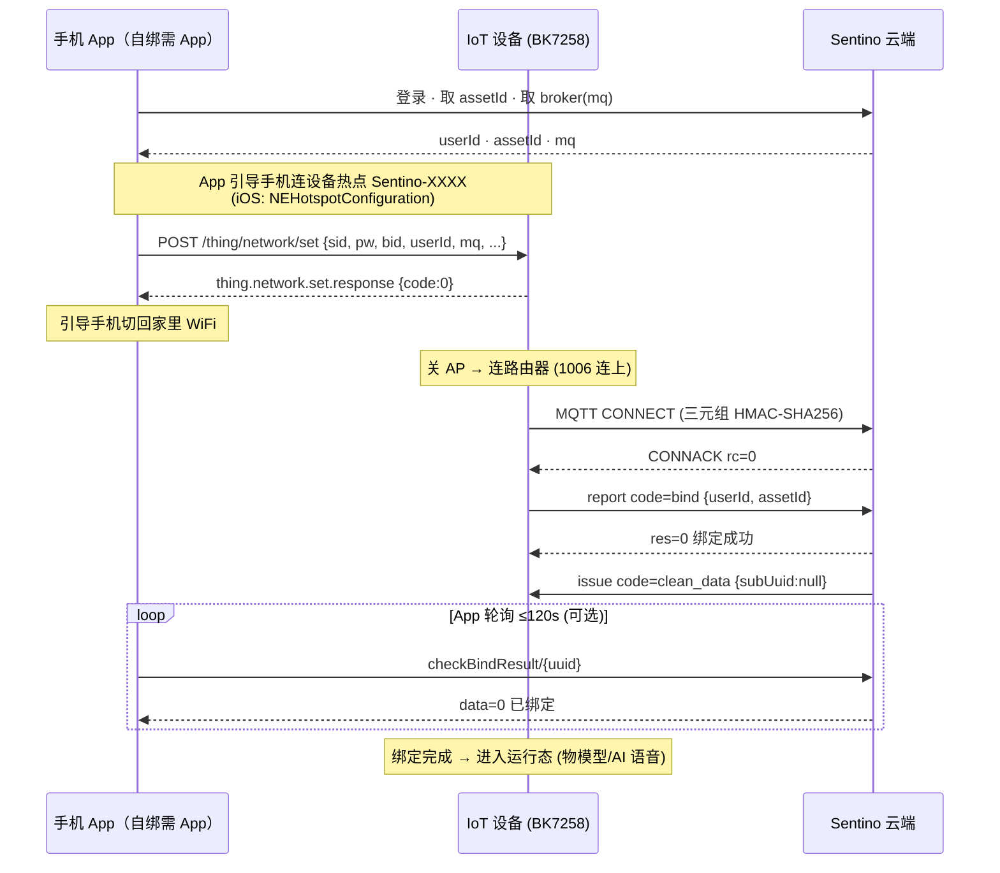
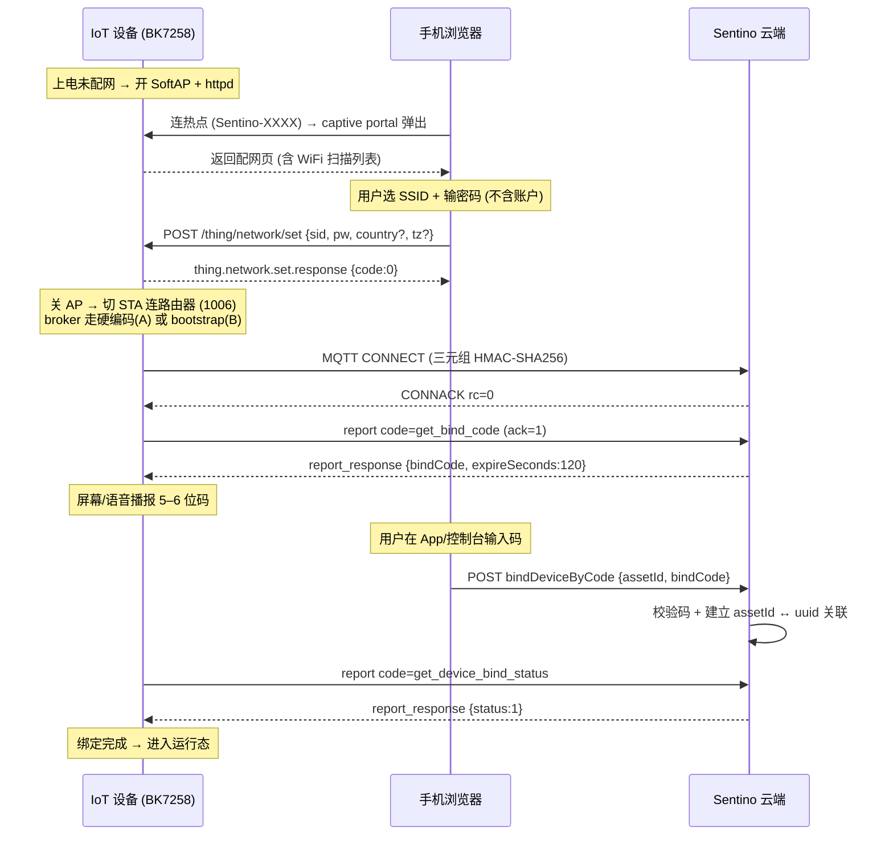

# 小智式 WiFi 配网（SoftAP）接入方案

> **TL;DR**：借鉴小智（xiaozhi-esp32）的 **SoftAP + 浏览器配网**，在 Sentino 平台落地一套**不依赖蓝牙**的 WiFi 配网。结论是**不需要引入新协议**：把已有的 `thing.network.set` 报文从 BLE 通道换到 HTTP(SoftAP) 通道即可。绑定按产品分三条路径——**本项目已有 App，主推「App 编排 SoftAP + 配网随包下发账户 + 设备自绑」（§5.2），与现状 BLE 路径 W 完全同构，只换本地传输通道，设备/云端下游逻辑零改动**；无 App 的产品可用设备播报码或扫码后置绑定（§5.3）。重活集中在固件侧（SoftAP + httpd + 配网页）与 App 侧（SoftAP 编排）。

> **状态**：🟡 **方案评估稿**。小智侧协议细节已对照 `78/xiaozhi-esp32`、`78/esp-wifi-connect`、`xinnan-tech/xiaozhi-esp32-server` 原始源码逐行核验；Sentino 侧映射基于现有协议文档推导。**主推路径（App 自绑）的两个待验证前提**：BK7258 是否支持 AP+STA 共存（见 §8 #1）、App 端 SoftAP 编排与 WiFi 切换体验（iOS 尤甚，见 §8 #4）。落地前需固件与 App 团队各验一项，并先确认「为什么放弃 BLE」（见 §5.5）。

> **前置知识**：建议先读 [设备初始化方案总结](../tutorials/device-init-overview.md)（四阶段 + 四条绑定路径 W/A/B/C）与 [架构与概念](../architecture.md)。

---

## 1. 背景与动机

Sentino 现有的 WiFi 配网是**路径 W（BLE 配网）**：App 登录取到 `userId`/`assetId` → BLE 扫描连设备 → 云端 `dataEncrypt` 加密整包配网信息 → 经 BLE GATT 分包下发 → 设备连 WiFi + MQTT → 发 `bind` → App 轮询 `checkBindResult`。它体验完整，但**强依赖专用 App + 手机 BLE + 分包协议实现**。

小智代表的是另一条路线：**零 App、任意浏览器即可配网**，特别适合 AI 语音优先、走通用零售渠道、不想强制用户装 App 的产品。评估它能否/如何在 Sentino 落地，对拓展产品形态有直接价值。

---

## 2. 小智配网工作原理（已核验）

### 2.1 两段式总览

小智最关键的设计，是把**「上网」和「绑账户」拆成两段互相独立的事**：

```
第一段（上网）：SoftAP 配网页  →  只收 SSID/密码  →  设备连路由器上线
第二段（绑定）：设备上线后申请激活码  →  用户输码  →  服务端建立 账户↔设备 关联
```

### 2.2 第一段：SoftAP 上网

配网逻辑抽在独立 ESP-IDF 组件 `78/esp-wifi-connect`（主仓库当依赖引用）：

| 环节 | 细节（源码核验） |
|---|---|
| 进配网触发 | NVS 无已存 SSID / STA 连接超时 60s / 开机按 BOOT 键，三者任一 |
| 热点 | **开放无密码** SoftAP，SSID = `Xiaozhi-XXXX`（XXXX = MAC 末两字节 HEX）；网关固定 `192.168.4.1` |
| Captive Portal | 自带 DNS server 把所有域名解析指向 `192.168.4.1`，并拦截各 OS 联网探测 URL（`captive.apple.com` 等）302 到配网页，连上热点自动弹窗 |
| 配网页字段 | `GET /scan` 拉周边 WiFi 列表 → 用户选 SSID + 填密码 → JSON `POST /submit` |
| **先连后存** | `/submit` 会**先拿凭证真的试连一次**（最多重试 2 次），连通了才写 NVS。密码错了网页当场反馈，不会存错码 |
| 凭证存储 | NVS namespace `wifi`，key `ssid`/`ssid1..ssid9` + `password/..9`，支持最多 10 套，STA 按信号择优连 |
| 收尾 | 配网成功走 `/exit` 关 AP → 切 STA 连路由器（v3.0.0 起不再 reboot） |

> 小智还支持 Blufi(BLE) 和声波两种配网，但都是编译期条件编译的备选，**SoftAP(Hotspot) 是默认路径**。

### 2.3 第二段：激活码绑定

| 环节 | 细节（源码核验） |
|---|---|
| 首个请求 | 设备一上网，**第一个 HTTP 请求不是连音频，而是 `POST /xiaozhi/ota/`**（身份走 header：`Device-Id`=MAC、`Client-Id`=UUID）。这一个端点同时干三件事：**版本检查 + 下发通信配置 + 激活判断** |
| 激活码生成 | 服务端没见过这台 MAC → 生成 **6 位纯数字激活码**，返回在 OTA 响应的 `activation` 对象 `{message, code, challenge, timeout_ms}` |
| 呈现 | 设备屏幕 Alert 显示 `message`，并用数字音频**逐位语音播报**激活码（无屏设备只靠语音） |
| 轮询 | 设备进 `Activating` 态，最多轮询 10 次 `POST /xiaozhi/ota/activate`：`200`=激活成功、`202`=还没绑（间隔 3s）；`/activate` body 带 `{algorithm:"hmac-sha256", serial_number, challenge, hmac}`，用 efuse 内不出芯片的 HMAC 密钥对 challenge 签名做 challenge-response |
| 用户输码 | 用户在控制台登录后输 6 位码，后端把设备 `insert` 进 `ai_device` 表关联到账户/角色；下次设备轮询即拿到"已激活"和运行配置 |

> ⚠️ **重要澄清**：**激活码这套只存在于官方云 `xiaozhi.me` 和"全模块部署"（manager-api Java + manager-web Vue + MySQL/Redis）**。开源的**单体 Python `xiaozhi-server` 的 OTA 接口根本不生成激活码**——它只校验 `Device-Id`/`Client-Id` header 存在，直接下发 websocket 配置，设备无激活门槛即可用。也就是说，"激活码绑定"是一个**服务端能力**，不是固件写死的行为。这正好说明它可以由任意后端实现——包括 Sentino。

### 2.4 一个重要澄清：小智不是 MQTT 物模型架构

小智**不是**"设备常连 MQTT broker、topic 上报物模型属性"的经典 IoT 架构，而是语音对话优先的三链路架构：

| 链路 | 协议 | 职责 |
|---|---|---|
| 启动/激活/发配置 | HTTP（`/xiaozhi/ota/`） | 版本检查、激活、下发连接配置 |
| 实时音频 | WebSocket **或** MQTT+UDP（编译期二选一） | Opus 音频帧 + JSON 控制消息 |
| 设备/云能力调用 | MCP（JSON-RPC 2.0） | 替代固定物模型 topic |

**MQTT 在小智里只是可选的音频信令通道，不承担物模型语义。** 这点对本方案很关键：**配网方式的改变不影响 Sentino 运行态的 MQTT 物模型协议**——设备上线后仍按 [设备端集成指南](../guides/guide-device.md) 走完整 MQTT 物模型（`model`/`property_*`/`ota`/`bind`）。这一点务必对客户讲清楚：我们借鉴的是小智的**配网/绑定 UX**，不是它的运行态架构。

---

## 3. 与 Sentino 现状（路径 W）逐维度对比

| 维度 | 小智（SoftAP + 激活码） | Sentino 现状（路径 W：BLE 全量下发） |
|---|---|---|
| 配网传输 | 设备自建 SoftAP，浏览器 `POST /submit`（HTTP） | BLE GATT（`0x1910`/`0x2B11`/`0x2B10`）+ V1 分包 |
| 需要专用 App | **否**，任意浏览器 | **是**（Sentino App 或 Web Bluetooth） |
| 需要 BLE | **否** | **是** |
| 凭证加密 | 否（局域网明文） | **是**（先 [`dataEncrypt`](../reference/ref-rest-api.md#42-配网数据加密) 再下发） |
| 配网页传什么 | **只传 WiFi 凭证**，不含账户 | **全量**：`sid`+`pw`+`bid`+`userId`+`mq`+`port`+`country`+`tz` |
| broker 从哪来 | 设备侧决定（编译期常量 / OTA 应答下发） | **App 下发**（`mq` 字段，源自数据中心接口 `mqttUrl`） |
| 绑定发起方 | 设备（上线后申请激活码，用户输码） | 设备（[`report bind`](../reference/ref-mqtt.md#41-bind--设备绑定)，但账户在配网时已注入） |
| 绑定校验 | 6 位激活码，设备轮询 `/ota/activate` | App 轮询 [`checkBindResult/{uuid}`](../reference/ref-rest-api.md#44-设备绑定状态查询)（10s×12）或监听 `bind_result` |
| 体验步数 | 连热点 → 填 WiFi → 提交 →（上线）→ 输码。**两段解耦** | 登录 → 取 assetId → 扫码 → BLE 连 → 选 WiFi → 下发 → 轮询。**合一但强依赖 App+BLE** |
| 运行态范式 | 会话/流驱动，MQTT 受限 | 属性/事件驱动，MQTT 承担完整物模型 |

---

## 4. 关键洞察：Sentino 大部分积木已经有了

这是整个方案成立的根据——**绝大部分是"换通道"，不是"造协议"**。

### 4.1 `thing.network.set` 本来就是通道无关的 JSON

配网报文 [`thing.network.set`](../reference/ref-ble.md#522-设置网络配置配网) 今天定义在 BLE 应用层，但它没有任何 BLE 绑定语义（没有 GATT 句柄、没有分包字段——分包是传输层 V1 协议的事，不是 payload 的事）。它走 BLE 的唯一原因是"BLE 是当前唯一的本地传输通道"。

因此 SoftAP 场景下，浏览器 `POST` 的 body 就是这段 JSON，固件 httpd handler 解析出 `data` 后，**走的还是现有那套"解析 → 连 WiFi → 连 MQTT"代码路径**：现有配网状态机 `TRY_CONNECT → STA_START` 完全复用，只是入口从 BLE parser 换成 httpd handler。连 WiFi 状态码（`1006`/`1007`/`1008`）也原样可用。

> **结论：固件里"配网数据结构 + 联网逻辑"100% 复用，只新增一个 HTTP 入口 adapter。**

### 4.2 `get_bind_code` 就是小智激活码的同构物（现只对 4G 开放）

小智的"6 位激活码 + 设备轮询判绑定完成"这套机制，Sentino **已有一个语义完全对应的实现**——4G 绑定码（[MQTT §4.10](../reference/ref-mqtt.md#410-get_bind_code--获取-4g-绑定码) + [REST §4.5](../reference/ref-rest-api.md#45-4g-绑定码配网)，即绑定路径 B）：

| 小智激活码 | Sentino `get_bind_code` |
|---|---|
| 设备上线申请激活码 | 设备 `report code=get_bind_code` (ack=1) |
| 返回码 + 有效期 | `report_response { bindCode, expireSeconds:120 }` |
| 设备播报/显示码 | 设备屏幕/语音播报 `bindCode` |
| 用户在网页/App 输码 | App `POST bindDeviceBy4gCode { assetId, bindCode }` |
| 到期重取、旧码作废 | 再发一次 `get_bind_code` 续期，旧码自动作废 |
| 轮询判完成 | [`get_device_bind_status`](../reference/ref-mqtt.md#411-get_device_bind_status--查询设备绑定状态) → `{status:1}` |

**唯一障碍**是业务语义上写着"仅 4G 用"，但它的机制**没有任何 4G 依赖**——只要求"设备已在线（能发 MQTT report）"。SoftAP 配好 WiFi 的设备上线后同样满足。所以复用它给 WiFi 设备，是"放开一个限制"，不是"实现新功能"。

> **注**：本项目主推的**路径 ③（App 自绑）不用这个**——账户在配网时已随包下发，设备直接 `bind`（见 §4.3 第一行、§5.2）。`get_bind_code` 只服务**零 App 的路径 ①**（设备播报码），列在这里是为了说明"若要支持零 App 场景，Sentino 也已有现成积木"。

### 4.3 其余可直接复用的积木

| 积木 | 出处 | 在小智式流程中的角色 |
|---|---|---|
| MQTT 三元组鉴权（`rlink_${uuid}_V2` + HMAC-SHA256） | [ref-mqtt §1](../reference/ref-mqtt.md#1-连接参数) | 设备上线连 broker，**完全不变** |
| `report code=bind {userId, assetId}` | [ref-mqtt §4.1](../reference/ref-mqtt.md#41-bind--设备绑定) | 服务端复用 bind 建立关联 |
| `info` 上报 + `clean_data`/`reset` reconcile | [ref-mqtt §4.2](../reference/ref-mqtt.md#42-info--设备信息上报)/§5.1/§5.5 | 绑定后清理逻辑照旧 |
| 出厂三元组 + PID + 云端预注册 | [device-init §2/§3](../tutorials/device-init-overview.md) | 阶段 1/2 完全不变 |
| broker 寻址方案 A/B | [4g-device-bootstrap-plan](../plan/4g-device-bootstrap-plan.md) | 补上"broker 从哪来"的空缺（见 §5.4） |
| 条码绑定 `bindDeviceFromBarcode`（路径 C） | [REST §4.6](../reference/ref-rest-api.md#46-条形码配网) | 无屏产品的绑定兜底 |

---

## 5. 推荐架构：绑定路径三选一（主推 App 自绑）

### 5.1 关键约束：离线配网页拿不到账户

设备自建的 SoftAP 配网页是**跑在设备本地、断网状态下的页面**——手机连着设备热点时上不了互联网，这个页面**登录不了 Sentino 云端，拿不到 `userId`（`cn…` 内部 ID）和 `assetId`**。而且账户身份**不能让用户在页面上手填**：手输邮箱/手机号就能绑，等于谁都能把设备绑到你账号上，且设备离线也无从验证真伪。

所以账户信息只有两种正当来路，对应两种风格：

| 风格 | 账户从哪来 | 适用 |
|---|---|---|
| **一体式**（配网时带账户，设备自绑） | 客户端在线登录时先取好 `userId`/`assetId`（+broker），随 WiFi 一起 POST 给设备 | **需原生 App**（网页做自绑受限，见 §5.6） |
| **解耦式**（绑定后置） | 配网页只收 WiFi；设备上线后再用播报码/扫码，在登录态完成绑定 | 零 App，网页即可 |

> **本项目已有 App**，主推「一体式 / App 自绑」——见 §5.2。它本质是把现状 **BLE 路径 W 的账户下发原样搬到 SoftAP 的 HTTP 通道**，设备与云端的下游逻辑零改动。**客户端不一定是原生 App**——收 WiFi 的那一端也可以是我们的 H5 网页 / 小程序，但不同绑定路径对客户端能力要求不同，详见 §5.6。

### 5.2 推荐路径 ③ — App 编排 SoftAP + 配网下发账户 + 设备自绑

> 本节以**原生 App** 为例（自绑首选）。客户端也可以是我们的网页 / 小程序，但网页做「自绑」有浏览器限制，见 §5.6。

流程（App 全程编排）：

1. App（在线、已登录）取到 `userId` / `assetId`，以及数据中心的 broker 地址 `mq`。
2. App 引导手机连上设备热点 `Sentino-XXXX`（iOS 用 `NEHotspotConfiguration`，见 §8 #4）。
3. App 向设备 httpd POST **完整 payload**（= 路径 W 的 BLE payload 原样改走 HTTP）：

```json
POST /thing/network/set   (设备 httpd，局域网)
{
  "type": "thing.network.set",
  "data": {
    "sid": "MyWiFi", "pw": "password123",
    "bid": "assetId", "userId": "userId",
    "mq": "mqtt-iot.sentino.jp", "port": 1883, "mqttSslPort": "8883",
    "country": "CN", "areaCode": "86", "tz": "Asia/Shanghai",
    "force_bind": false
  }
}
```

4. 设备回 `thing.network.set.response {code:0}`；App 引导手机切回家里 WiFi。
5. 设备存好账户 → 连路由器（`1006`）→ 连 broker（`mq` 来自 payload）→ MQTT 三元组鉴权。
6. 设备 `report code=bind {userId, assetId}` **自绑** → 云端 `res=0` → 下发 `clean_data`。
7. App 侧可轮询 `checkBindResult/{uuid}` 或直接确认，体验与路径 W 一致。

> **关键**：第 5–6 步走的是**现状 BLE 路径 W 完全相同的下游代码**（`thing.network.set` 解析 → 连网 → `bind` 自绑）。这条路径**不需要设备有屏/语音、不需要播报码、不需要解禁 `get_bind_code`、也不需要固件硬编码 broker**——账户和 broker 在配网时都已随包注入。

> **安全提醒**：payload 现在含 `userId`/`assetId`，而 SoftAP 是局域网明文。建议 App 下发的不是原始账户 ID，而是一枚**短时效绑定 token**（云端可校验、过期作废），设备把 token 回传云端换绑定，降低同热点被嗅探的风险（见 §8 #3）。

### 5.3 三种绑定路径速查 + 选型

| 绑定路径 | 需 App | 需屏/语音 | 配网页带账户 | 绑定动作 | 何时用 |
|---|---|---|---|---|---|
| **③ App 自绑**（推荐） | ✅ | ❌ | ✅ 随包下发 | 设备 `report bind` 自绑 | **有 App**（本项目） |
| ① 设备播报码 | ❌ | ✅ | ❌ | `get_bind_code` → 用户输码 `bindDeviceByCode` | 零 App、设备有屏/语音 |
| ② 设备二维码 | ❌ | ❌ | ❌ | 扫码 `bindDeviceFromBarcode`（路径 C） | 零 App、无屏、量产印码 |

**选型规则**：

- **有 App → 路径 ③**：一步到位，不挑设备形态（有屏无屏都行）。
- 零 App + 有屏/语音 → 路径 ①（设备联网后报 `get_bind_code` 拿 5–6 位码播报，用户在登录态输码）。
- 零 App + 无屏 → 路径 ②（出厂印码，登录态扫码）。
- 三条路径云端并存、互不冲突，同一固件可同时支持，按产品配置启用。

> 客户端形态（原生 App vs 网页 / 小程序）与各路径的匹配、以及网页的能力边界，见 §5.6。

### 5.4 broker 从哪来

- **路径 ③（有 App）**：`mq` 由 App **随配网 payload 下发**（同路径 W），**不需要固件硬编码或 bootstrap**。
- 路径 ①②（零 App）：配网页不下发 broker，固件自行决定——一期硬编码 `mqtt-iot.sentino.jp`（方案 A），未来多区域/多租户再上 Bootstrap `/v1/lookup`（方案 B，与 [4G bootstrap 计划](../plan/4g-device-bootstrap-plan.md) 复用基础设施）。

### 5.5 既然有 App，为什么不直接用 BLE？

这是走 SoftAP 前**必须先回答**的问题。SoftAP + App 与现成的 BLE + App（路径 W）**绑定体验完全一样**（都配网带账户、设备自绑），差别只在本地传输通道：

| | BLE + App（路径 W，现状） | SoftAP + App（路径 ③，本方案） |
|---|---|---|
| 需要蓝牙 | ✅ | ❌ |
| 配网中手机是否断网 | 否（BLE 不打断上网） | **是**（连设备热点期间断网，要切来切去） |
| iOS 体验 | 顺 | **切 WiFi 需 `NEHotspotConfiguration` 弹窗确认** |
| 数据吞吐 | 低（分包） | 高（HTTP） |
| 纯网页 / 小程序能否驱动配网 | ❌ 基本不行（iOS 无 Web Bluetooth） | ✅（设备自带页收 WiFi + 小程序配网 API） |

> **结论**：选 SoftAP 的正当理由是——**设备没有 BLE / BLE 不稳 / 目标机型 BLE 权限体验差 / 要传较大配置**，**或希望用网页 / 小程序即可配网、不必强制装 App**（BLE 基本只能靠原生 App，iOS 无 Web Bluetooth）。否则 BLE + App（现成路径 W）通常更顺，没有切 WiFi 的痛点。**立项前请据此确认走 SoftAP 的真实动机**，避免为了 SoftAP 而 SoftAP。

### 5.6 客户端可以是 App，也可以是网页 / 小程序

AP 配网里"收 WiFi、和设备本地交互"的那一端不一定是原生 App。三种客户端能力不同，**关键看它能否在离线态把账户下发到设备本地 http 端点**：

| 客户端 | 离线连热点 + 本地下发 WiFi | 自绑（账户随包下发） | 播报码 / 扫码 | 说明 |
|---|---|---|---|---|
| **原生 App** | ✅ | ✅ | ✅ | 能连 AP（iOS `NEHotspotConfiguration`）、能 POST 到 `192.168.4.1`、能带账户 token——**自绑首选** |
| **设备自带 captive 页**（`http://192.168.4.1`） | ✅ | ❌ | ✅ | 设备本地托管、同源、离线可用；但**未登录云端**拿不到账户 → 只配 WiFi，绑定走播报码 / 扫码 |
| **我们联网的 H5 登录页** | ⚠️ | ⚠️ | ✅（负责输码） | 已登录、持账户，但 https 页面受 **mixed-content** 限制**无法直接 POST 到设备的 http 局域网端点**；实际用于播报码里的"输码"一端 |
| **微信小程序** | ⚠️ 需实测 | ⚠️ 需实测 | ✅ | 有 `wx.connectWifi` 等 API，但 LAN http 请求受限，能否直下发设备本地端点需按微信配网能力实测 |

**结论**：

- **走「自绑」（路径 ③）现实中需要原生 App**——只有 App 能既登录拿账户、又在离线态 POST 到设备本地端点。纯网页受 mixed-content / LAN 限制做不到"登录态直接下发账户到设备"。
- **走「播报码 / 扫码」（路径 ①②）网页完全够用**：设备自带 captive 页离线收 WiFi，用户在我们联网的登录页 / 小程序里输码或扫码绑定——这就是"不必强装 App、用网页就能配"的落地形态。

> 一句话：**要自绑就得有 App；想纯网页配网，就走播报码 / 扫码。** 两者本方案都保留（见 §5.3）。

---

## 6. 需要新增/改造的组件清单

> **适用**列：**③** = 仅主推的 App 自绑路径需要；**①②** = 仅零 App 路径需要；**全部** = 通用。

| # | 侧 | 组件 | 适用 | 工作量 | 说明 / 落点 |
|---|---|---|---|---|---|
| 1 | 固件 | SoftAP 热点 + **AP+STA 共存** | 全部 | 中 | ⚠️ 先验证 BK7258 支持，见 §8 #1 |
| 2 | 固件 | httpd 服务 | 全部 | 中 | BK SDK 通常自带 lwIP httpd；托管配网页 + 收 POST |
| 3 | 固件 | 配网页（HTML/JS + captive portal） | 全部 | 小~中 | 编译进 flash；WiFi 扫描回显（复用 `thing.network.getwifis` 语义） |
| 4 | 固件 | HTTP 接 `thing.network.set` adapter | 全部 | **小** | BLE parser 入口抽一层，HTTP/BLE 共用下游；**路径 ③ 直接复用现状 `bind` 自绑逻辑** |
| 5 | **App** | **SoftAP 编排** | ③ | 中 | 连设备热点 → POST 完整 payload（含账户+broker）→ 切回家里 WiFi；iOS `NEHotspotConfiguration`，见 §8 #4。**自绑需原生 App**，网页做不到，见 §5.6 |
| 6 | 固件 | broker 寻址（硬编码/bootstrap） | ①② | 小 | 路径 ③ 由 App 随包下发 `mq`，**本项无需** |
| 7 | 固件 | 激活码播报 + `get_bind_code` 客户端 | ① | 小 | 复用现有 MQTT report 通道，协议零新增 |
| 8 | 云端 | 解禁 `get_bind_code`/`bindDeviceByCode` 给 WiFi + 防爆破 | ① | 小~中 | 去掉"仅 4G"限制、泛化命名、限频；`bindCode` 位数统一（现 5 位）。**路径 ③ 无需** |
| 9 | App/控制台 | 输码 / 扫码绑定入口 | ①② | 小 | 路径 ③ 自绑，无需 |
| 10 | 云端 | Bootstrap `/v1/lookup` | ①②（二期） | 大 | 仅方案 B，同 4g-plan 落地清单 #1 |

> **工作量小结（走主推路径 ③）**：只需固件 #1~#4（SoftAP + httpd + 配网页 + 接 payload）＋ App #5（SoftAP 编排）。**协议层与云端零改动**——设备联网后 `bind` 自绑走的就是现状路径 W 的逻辑。云端改造（#8）只在想同时支持零 App 路径 ① 时才需要。

---

## 7. 端到端时序

### 7.1 路径 ③：App 编排 SoftAP + 设备自绑（推荐）



> 与现状 BLE 路径 W 唯一的差别：`thing.network.set` 走 App→设备的 **HTTP POST** 而非 **BLE Notify**。设备联网、`bind` 自绑、`clean_data` 全部照旧。

### 7.2 路径 ①：零 App，设备播报码（备选）



---

## 8. 风险与开放问题

| # | 风险 / 问题 | 分析与建议 |
|---|---|---|
| 1 | **BK7258 是否支持 AP+STA 共存** | 一期最大不确定点。需固件团队先验证配网期能否同时扫描/连目标 WiFi。若不支持共存，则改"关 AP → 切 STA"（本文时序已按此保守画法），提交后热点断开、页面失联，需靠 App / 设备指示灯 / 语音反馈进度。**建议立项第一步就在真机验证。** |
| 2 | **captive portal 兼容性** | iOS/Android/各厂商探测 URL 行为不一，需固件 httpd 拦截探测请求并 302 到配网页。路径 ③ 由 App 主动打开配网页、对 captive portal 依赖较低；路径 ①② 强依赖它，需真机矩阵测试。 |
| 3 | **SoftAP 明文 + 路径 ③ 会带账户** | 局域网内明文收 SSID/密码；**路径 ③ 的 payload 还多带 `userId`/`assetId`**，同热点被嗅探即泄露账户关联。建议：① App 下发**短时效绑定 token** 而非原始账户 ID（云端可校验、过期作废）；② 热点开放时间窗限制、配网期禁止其他客户端接入、提交后立即关 AP。**不建议**在配网页做 `dataEncrypt`（依赖云端接口，配网页断网调不了）。 |
| 4 | **App 端 SoftAP 编排 + WiFi 切换体验**（路径 ③ 特有） | SoftAP+App 的核心痛点：App 要引导手机离开家里 WiFi → 连设备热点 → POST → 再切回。**iOS 需 `NEHotspotConfiguration` 且每次弹窗确认**，Android 各版本 API 差异大、部分需定位权限。这正是 §5.5「有 App 为何不直接用 BLE」的关键——**BLE 全程不打断手机上网**。App 团队须先验证此体验可接受。 |
| 5 | **激活码防爆破**（路径 ① 特有） | 现 `bindCode` 仅 5 位纯数字（10 万空间）、有效期 120s。大规模用需按 `assetId`/IP 限频、失败 N 次锁定，可选升 6 位对齐小智。绑定接口必须服务端强制校验码归属，固件侧不校验码。 |
| 6 | **三条绑定路径共存** | 建议**共存不替换**：同一固件可同时具备 BLE 与 SoftAP 入口，云端 `bind`（自绑）/ `get_bind_code`（播报码）/ `bindDeviceFromBarcode`（扫码）本就并存、不冲突，按产品配置启用。 |
| 7 | **`get_bind_code` 语义泛化**（仅路径 ①） | 若同时支持零 App 路径 ①：解禁/改名时勿破坏现有 4G 设备调用方，建议新增 `bindDeviceByCode` 并保留 `bindDeviceBy4gCode` 做别名。走主推路径 ③ 则无此项。 |
| 8 | **运行态范式差异要对客户讲清** | 我们借鉴的是小智的**配网 UX**，**不是**它的 WebSocket/MCP 运行态架构。设备上线后仍走 Sentino 完整 MQTT 物模型。 |
| 9 | **网页 / 小程序客户端的能力边界** | 「自绑」需登录态客户端在离线下 POST 到设备本地 http 端点——**纯网页受 mixed-content / LAN 限制做不到，现实需原生 App**；小程序 LAN http 受限需实测。若坚持"纯网页配网"，就走「播报码 / 扫码」而非自绑（见 §5.6）。 |

---

## 9. 下一步

1. **先确认走 SoftAP 的动机**（§5.5）：既然有 App，SoftAP+App 相比现成的 BLE 路径 W 只多不少（多了切 WiFi 痛点）。只有"设备没 BLE / BLE 不稳 / BLE 权限体验差 / 要传较大配置"才值得走 SoftAP，否则直接复用路径 W。
2. **固件团队**：在 BK7258 真机验证 AP+STA 共存（§8 #1），决定"共存"还是"关 AP 再切 STA"时序。
3. **App 团队**：验证 SoftAP 编排 + WiFi 切换体验（尤其 iOS `NEHotspotConfiguration` 弹窗，§8 #4），确认可接受。
4. （仅当还要支持零 App 路径 ①）云端确认 `get_bind_code`/`bindDeviceByCode` 解禁范围与防爆破（§6 #8）。
5. 上述确认通过后，去掉"方案评估稿"标记，补真实接口细节，升级为正式方案文档。

---

**相关文档**：[设备初始化方案总结](../tutorials/device-init-overview.md)（四阶段 + 路径 W/A/B/C） · [BLE 协议参考 §5.2.2](../reference/ref-ble.md#522-设置网络配置配网)（`thing.network.set`） · [MQTT 协议参考 §4.10](../reference/ref-mqtt.md#410-get_bind_code--获取-4g-绑定码)（`get_bind_code`）/[§4.11](../reference/ref-mqtt.md#411-get_device_bind_status--查询设备绑定状态) · [REST API §4.5](../reference/ref-rest-api.md#45-4g-绑定码配网)（4G 绑定码配网） · [4G 设备 Bootstrap 决策稿](../plan/4g-device-bootstrap-plan.md)（broker 寻址方案 A/B） · [设备端集成指南](../guides/guide-device.md) · [App 端集成指南](../guides/guide-app.md)
