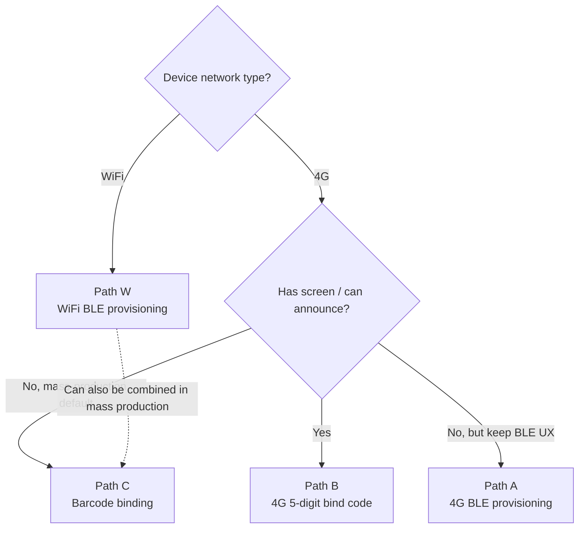

# Device Initialization — Solution Overview

> **Cross-cutting view**: factory provisioning -> cloud pre-registration -> binding-path selection -> binding sequence and cloud feedback.
> A side-by-side comparison for product managers and customer firmware engineers to make decisions; for field-level details and code, follow the links back to [`guides/`](../guides/) and [`reference/`](../reference/).

> **Prerequisites**: We recommend reading [Architecture & Concepts](../architecture-en.md) first.

---

## 1. Full-Flow Overview: Four Stages

| Stage | Who does it | Key deliverable |
|---|---|---|
| 1. Factory provisioning | Factory | Device NVS contains the triplet; enclosure Barcode printed on demand |
| 2. Cloud pre-registration | Sentino | Triplet registered into the platform database |
| 3. Provisioning + binding | User / App / device | Device UUID associated with a user's specific assetId |
| 4. Online operation | Device | Long-lived MQTT connection; handles `issue` commands and reports business events |

---

## 2. Stage 1: Factory Provisioning

**Burned into device NVS (unique per device):**

| Field | Scope | Participates in MQTT protocol? | Notes |
|---|---|---|---|
| `UUID` | Triplet | Yes — client_id / username / topic / HMAC content | Primary device identifier |
| `KEY` (SECRET) | Triplet | Yes — key for signing the HMAC password | 32-character secret, sensitive field |
| `MAC` | Triplet | No — does not participate | Device identity string on Sentino's business side, **not a network communication address**; distinct from the WiFi MAC / BLE MAC built into the SoC |

**Firmware-level constants (shared across the same model, compiled into the firmware):**

| Field | Participates in MQTT protocol? | Notes |
|---|---|---|
| `PID` | Yes — topic path `rlink/v2/${pid}/${uuid}/...` | Product model ID; **not part of the triplet** |

**Optional peripheral collateral:**

| Item | When required |
|---|---|
| Barcode (enclosure barcode) | **Only when the product uses the barcode-binding path** (see [§4 Path C](#42-side-by-side-comparison-of-the-4-paths)) |

> The triplet and PID are delivered by the Sentino team in batches sized to the expected production volume. For mass-production details, see [solution-ai-toy §8.1](../solutions/solution-ai-toy-en.md#81-triplet-management).

---

## 3. Stage 2: Cloud Pre-registration

The device triplet must be registered in the Sentino backend before the cloud can:

- Accept the device's MQTT CONNECT (the broker validates the HMAC signature)
- Associate the device with its PID, so it inherits the Thing Model / OTA / business routing

> If an unregistered triplet connects to the broker, CONNECT is rejected immediately (rc != 0). This is the first thing to verify when troubleshooting "device cannot connect".

---

## 4. Stage 3: Binding-Path Selection

Binding is essentially the act of associating a "device identity (UUID)" with an "App-side account (userId + assetId)". The Sentino platform supports 4 paths; pick one or several based on hardware capability, user experience, and mass-production process.

### 4.1 Decision Tree

### 4.2 Side-by-Side Comparison of the 4 Paths

| Path | Network type | App entry point | Device involvement | App polls? | Extra factory requirement | Reference |
|---|---|---|---|---|---|---|
| **W** WiFi BLE provisioning | WiFi | BLE `thing.network.set` `{ sid, pw, bid, userId, mq, port }` | Sends `thing.bind` | Yes (`checkBindResult`) | None | [guide-app §3.2](../guides/guide-app-en.md#32-wifi-mode-provisioning) |
| **A** 4G BLE provisioning | 4G | BLE `thing.network.set` `{ bid, userId }` (slimmed) | Sends `thing.bind` | Yes | None | [guide-app §3.3](../guides/guide-app-en.md#33-4g-mode-provisioning) |
| **B** 4G 5-digit bind code | 4G | POST `bindDeviceBy4gCode` `{ assetId, bindCode }` | Sends `get_bind_code` to obtain the code | No (synchronous response) | Device must have a screen / voice output | [REST §4.5](../reference/ref-rest-api-en.md#45-4g-binding-code-provisioning) + [MQTT §4.10](../reference/ref-mqtt-en.md#410-get_bind_code--get-4g-bind-code) |
| **C** Barcode binding | WiFi or 4G (universal) | POST `bindDeviceFromBarcode` `{ assetId, barcode }` | Not involved | No | **Barcode printed on enclosure** | [REST §4.6](../reference/ref-rest-api-en.md#46-barcode-provisioning) |

### 4.3 Path Notes

- **W vs A**: The core difference is *when* the device can come online over MQTT. WiFi devices must wait for BLE to deliver the SSID/password and then connect to the router before they can come online; 4G devices are **online immediately at power-on**, and the BLE payload is slimmed (no `sid` / `pw` / `mq`).
- **B 5-digit bind code**: `bindCode` is requested by the device via `report code=get_bind_code`; the cloud's `report_response` returns `{ bindCode, expireSeconds: 120 }`. Resending the same command after expiration renews it, and the old code is automatically invalidated.
- **C Barcode**: Works for both WiFi and 4G devices, but requires barcode printing in the factory process. The user just scans it with the App and is done — this is the most common zero-touch binding scheme in mass production.

---

## 5. Stage 4: Binding Sequence and Cloud Feedback

After a `bind` ack, the cloud dispatches different commands over the `issue` channel; **the device state machine must handle these cases separately**:

| `thing.bind` result | Device's prior `info.bindStatus` | Cloud `issue` dispatch | Recommended device handling |
|---|---|---|---|
| `res=0` (success) | Any | `code=clean_data, data={subUuid:null}` | Clean up the temporary cache from before binding; do **not** reset the network |
| `res!=0` (failure) | `1` (device self-reports as bound) | `code=reset, data={clearData:true}` | Clear local user / asset associations and return to the unprovisioned state |
| `res!=0` (failure) | `0` or not reported | Only `report_response`; nothing actively dispatched | Prompt the user to retry |

> For protocol field details, see [ref-mqtt §4.1 bind](../reference/ref-mqtt-en.md#41-bind--device-binding) / [§5.1 reset](../reference/ref-mqtt-en.md#51-reset--remote-device-reset) / [§5.5 clean_data](../reference/ref-mqtt-en.md#55-clean_data--post-binding-cleanup).

If the device needs to self-check "am I currently bound?" (to avoid local NV being out of sync with the cloud), it can actively send [`get_device_bind_status`](../reference/ref-mqtt-en.md#411-get_device_bind_status--query-device-binding-status); the cloud reply `{ status: 0|1 }` is the authoritative value.

---

## 6. Error Code Cheat Sheet

| Error | Meaning | The 90% case |
|---|---|---|
| MQTT CONNECT `rc != 0` | Broker rejected the signature | Triplet not registered on the cloud / `ts` timestamp drift too large / wrong `KEY` |
| `res=1007` Asset does not exist | At `bind` time, `assetId` does not exist on the cloud / does not belong to this user | `assetId` is misspelled or belongs to someone else |
| `res=11222` No permission | At `bind` time, `userId` is not the real cloud-side ID, or `assetId` does not belong to that `userId` | **The `uid` string from `grant_type=uid` was mistakenly placed into `data.userId`** (see [§7.1](#71-uid--userid)) |
| Polling `checkBindResult` always returns `data=null` | The UUID has no provisioning flow in progress | The device never sent `bind`, or the binding flow has already completed |

> Full `res` business code table: [ref-mqtt §3.5](../reference/ref-mqtt-en.md#35-res-business-codes).

---

## 7. Common Firmware Integration Pitfalls

### 7.1 `uid` != `userId`

The `uid` (developer-defined string such as `test_user_001`) used as the input to `grant_type=uid` mode is **not the same field** as the `userId` returned in the login response (an internal cloud-assigned ID prefixed with `cn`):

| Field | Source | What it looks like | Where it is used |
|---|---|---|---|
| `uid` | Request input / `username` in the response | `test_user_001` | Only as input to `grant_type=uid` login |
| `userId` | `data.userId` in the response | `cn2046098354843037696` | **Subsequent business APIs and the device-side MQTT `thing.bind data.userId` MUST use this value** |

Filling the wrong one triggers `res=11222`. See the callout under [REST §3.1](../reference/ref-rest-api-en.md#31-user-login-authorization).

### 7.2 Do Not Hard-code `userId` / `assetId`

Hard-coding these two values in the firmware is demo behavior; in production they must be fetched in real time after the App logs in, and then passed to the device via BLE provisioning / barcode scan / bind code entry. Different accounts inevitably have different `userId` / `assetId`, and a hard-coded device can only ever bind to a single account.

### 7.3 Keep `clean_data` and `reset` State Machines Separate

Both `issue` commands appear "after `bind`", but their semantics are opposite:

- `clean_data` = post-binding **success** cleanup notification -> only clean up the temporary cache from before binding
- `reset` = binding **failure** + local state out of sync -> forced reconcile -> clear network + clear user associations and return to the unprovisioned state

If firmware unconditionally resets on every `issue`, it will kick a successfully bound device back offline.

---

## 8. Detailed Reference Navigation

| Topic | Document |
|---|---|
| Device-side MQTT implementation | [guides/guide-device-en.md](../guides/guide-device-en.md) |
| App-side BLE provisioning + binding flow | [guides/guide-app-en.md](../guides/guide-app-en.md) |
| Full MQTT protocol fields | [reference/ref-mqtt-en.md](../reference/ref-mqtt-en.md) |
| REST provisioning / device / account APIs | [reference/ref-rest-api-en.md](../reference/ref-rest-api-en.md) |
| BLE fragmentation protocol | [reference/ref-ble-en.md](../reference/ref-ble-en.md) |
| Architecture and concepts | [../architecture-en.md](../architecture-en.md) |
| Mass-production collateral and launch checklist | [solutions/solution-ai-toy-en.md §8](../solutions/solution-ai-toy-en.md) |
| 10-minute MQTT walkthrough | [tutorials/quickstart-device-en.md](./quickstart-device-en.md) |
| 10-minute REST walkthrough | [tutorials/quickstart-app-en.md](./quickstart-app-en.md) |
