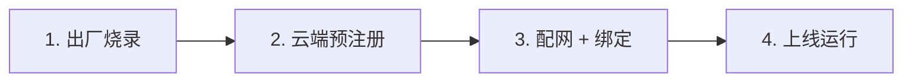
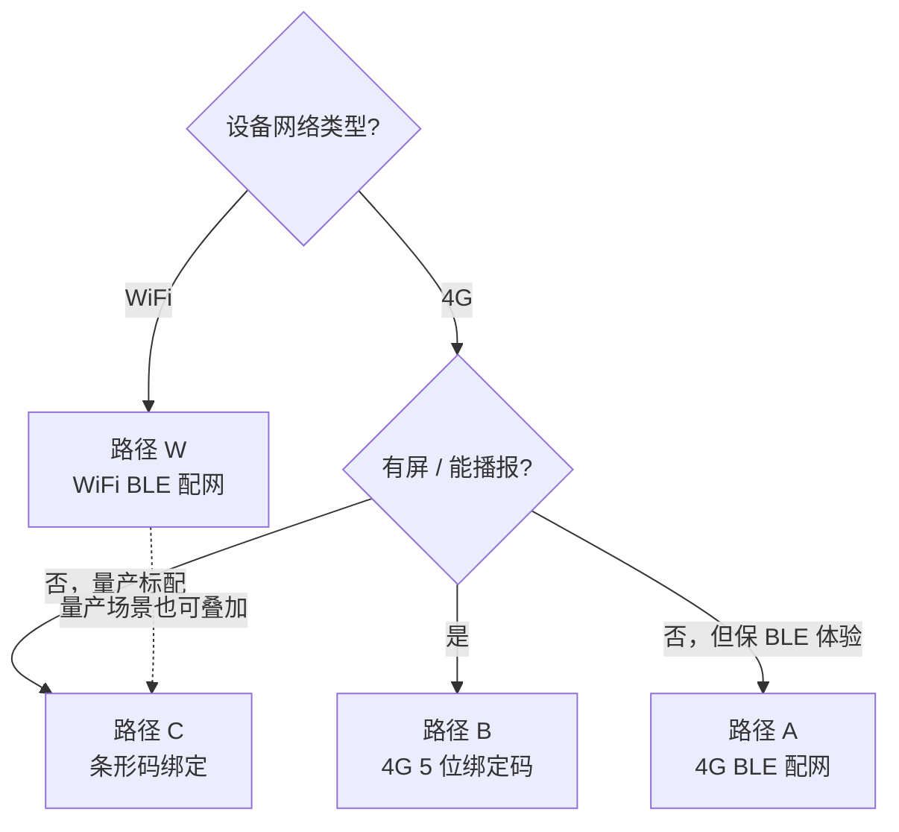

# 设备初始化方案总结

> **横向视图**：出厂烧录 → 云端预注册 → 绑定路径选型 → 绑定时序与云端反馈。
> 给产品经理和客户固件工程师对照决策用，详细字段 / 代码链回 [`guides/`](../guides/) 与 [`reference/`](../reference/)。

> **前置知识**：建议先阅读 [架构与概念](../architecture.md)。

---

## 1. 全景四阶段

| 阶段 | 谁做 | 关键产出 |
|---|---|---|
| 1. 出厂烧录 | 工厂 | 设备 NVS 含三元组；按需印刷外壳 Barcode |
| 2. 云端预注册 | Sentino | 三元组登记到平台数据库 |
| 3. 配网 + 绑定 | 用户 / App / 设备 | 设备 UUID 关联到某 user 的某 assetId 下 |
| 4. 上线运行 | 设备 | 长连 MQTT，处理 issue 指令、上报业务事件 |

---

## 2. 阶段 1：出厂烧录

**烧到设备 NVS（每台唯一）：**

| 字段 | 范围 | 是否参与 MQTT 协议 | 备注 |
|---|---|---|---|
| `UUID` | 三元组 | ✅ client_id / username / topic / HMAC content | 设备主标识 |
| `KEY`（SECRET） | 三元组 | ✅ HMAC 签名 password 的 key | 32 字符密钥，敏感字段 |
| `MAC` | 三元组 | ❌ 不参与 | Sentino 平台业务侧的设备身份串，**不是网络通信地址**；与 SoC 自带的 WiFi MAC / BLE MAC 是不同字段 |

**固件级常量（同型号共用，编译进固件）：**

| 字段 | 是否参与 MQTT 协议 | 备注 |
|---|---|---|
| `PID` | ✅ topic 路径 `rlink/v2/${pid}/${uuid}/...` | 产品型号 ID，**不属于三元组** |

**可选周边物料：**

| 物料 | 何时需要 |
|---|---|
| Barcode（外壳条码） | **仅当产品选用条码绑定路径**（见 [§4 路径 C](#42-四条路径横向对比)） |

> 三元组与 PID 由 Sentino 团队按预计产量批次交付，量产环节详见 [solution-ai-toy §8.1](../solutions/solution-ai-toy.md#81-三元组与产品-id-管理)。

---

## 3. 阶段 2：云端预注册

设备三元组必须在 Sentino 后台登记完成，云端才能：

- 接受设备的 MQTT CONNECT（broker 校验 HMAC 签名）
- 把设备关联到 PID 下，享受物模型 / OTA / 业务路由

> 未注册的三元组直接连 broker → CONNECT 立刻被拒（rc ≠ 0）。这是排查"设备连不上"问题时第一步要确认的事。

---

## 4. 阶段 3：绑定路径选型

绑定本质是把"设备身份（UUID）"关联到"App 端账户（userId + assetId）"。Sentino 平台支持 4 条路径，按硬件能力 / 用户体验 / 量产工艺选其一或其多。

### 4.1 决策树

### 4.2 四条路径横向对比

| 路径 | 网络类型 | App 入口 | 设备参与 | App 是否轮询 | 出厂额外要求 | 详细参考 |
|---|---|---|---|---|---|---|
| **W** WiFi BLE 配网 | WiFi | BLE `thing.network.set` `{ sid, pw, bid, userId, mq, port }` | 发 `thing.bind` | 是（`checkBindResult`） | 无 | [guide-app §3.2](../guides/guide-app.md#32-wifi-模式配网) |
| **A** 4G BLE 配网 | 4G | BLE `thing.network.set` `{ bid, userId }`（瘦身） | 发 `thing.bind` | 是 | 无 | [guide-app §3.3](../guides/guide-app.md#33-4g-模式配网) |
| **B** 4G 5 位绑定码 | 4G | POST `bindDeviceBy4gCode` `{ assetId, bindCode }` | 发 `get_bind_code` 拿码 | 否（同步返） | 设备需有屏 / 语音输出 | [REST §4.5](../reference/ref-rest-api.md#45-4g-绑定码配网) + [MQTT §4.10](../reference/ref-mqtt.md#410-get_bind_code--获取-4g-绑定码) |
| **C** 条形码绑定 | WiFi 或 4G 通用 | POST `bindDeviceFromBarcode` `{ assetId, barcode }` | 不参与 | 否 | **外壳印 Barcode** | [REST §4.6](../reference/ref-rest-api.md#46-条形码配网) |

### 4.3 路径补充说明

- **W vs A**：核心差别是设备何时能上 MQTT。WiFi 设备必须等 BLE 收到 SSID/密码连上路由器后才能上线；4G 设备**开机即在线**，BLE 包瘦身（不传 `sid` / `pw` / `mq`）。
- **B 5 位绑定码**：`bindCode` 由设备主动 `report code=get_bind_code`，云端 `report_response` 返回 `{ bindCode, expireSeconds: 120 }`；过期重发同一指令续期，旧码自动作废。
- **C 条形码**：WiFi/4G 都能用，但需要在出厂工艺加印条码；用 App 扫一下就完事，是量产最常用的零接触绑定方案。

---

## 5. 阶段 4：绑定时序与云端反馈

绑定 ack 之后，云端会通过 `issue` 通道下发不同的指令，**设备状态机必须分开处理**：

| `thing.bind` 结果 | 设备先前 `info.bindStatus` | 云端 `issue` 下发 | 设备建议处理 |
|---|---|---|---|
| `res=0`（成功） | 任意 | `code=clean_data, data={subUuid:null}` | 清绑定前的临时缓存，**不**走网络重置 |
| `res≠0`（失败） | `1`（设备自报已绑定） | `code=reset, data={clearData:true}` | 清掉本地 user / asset 关联，回未配网态 |
| `res≠0`（失败） | `0` 或未上报 | 仅 `report_response`，不主动下发 | 提示用户重试 |

> 协议字段详见 [ref-mqtt §4.1 bind](../reference/ref-mqtt.md#41-bind--设备绑定) / [§5.1 reset](../reference/ref-mqtt.md#51-reset--远程重置设备) / [§5.5 clean_data](../reference/ref-mqtt.md#55-clean_data--绑定后清理)。

如果设备需要自检"我现在到底有没有被绑定"（避免本地 NV 与云端不一致），主动发 [`get_device_bind_status`](../reference/ref-mqtt.md#411-get_device_bind_status--查询设备绑定状态)，云端回 `{ status: 0|1 }` 为权威值。

---

## 6. 错误码速查

| 错误 | 含义 | 90% 是这个原因 |
|---|---|---|
| MQTT CONNECT `rc ≠ 0` | broker 拒绝签名 | 三元组未在云端注册 / `ts` 时间戳偏差大 / `KEY` 错 |
| `res=1007` Asset does not exist | `bind` 时 `assetId` 在云端不存在 / 不属于该 user | `assetId` 拼错或用了别人的 |
| `res=11222` No permission | `bind` 时 `userId` 不是云端真实 ID，或 `assetId` 不属于该 `userId` | **把 grant_type=uid 的 uid 字符串误填到 `data.userId`**（见 [§7.1](#71-uid--userid)） |
| 轮询 `checkBindResult` 永远返回 `data=null` | 该 UUID 没有进行中的配网流程 | 设备根本没发 bind，或已经走完绑定流程 |

> 完整 `res` 业务码表：[ref-mqtt §3.5](../reference/ref-mqtt.md#35-res-业务码)。

---

## 7. 客户固件常踩的 3 个坑

### 7.1 `uid` ≠ `userId`

`grant_type=uid` 模式入参的 `uid`（开发者自定义字符串，如 `test_user_001`）跟登录响应里的 `userId`（云端分配的 `cn` 前缀内部 ID）是**两个不同字段**：

| 字段 | 来源 | 长什么样 | 用在哪 |
|---|---|---|---|
| `uid` | 请求入参 / 响应里的 `username` | `test_user_001` | 仅用于 `grant_type=uid` 登录入参 |
| `userId` | 响应里的 `data.userId` | `cn2046098354843037696` | **后续业务 API、设备 MQTT `thing.bind data.userId` 必须用这个** |

错填会撞 `res=11222`。详见 [REST §3.1](../reference/ref-rest-api.md#31-用户登录授权) 的 callout。

### 7.2 不要硬编码 `userId` / `assetId`

固件里写死这两个值是 demo 行为；生产必须由 App 端登录后实时取，通过 BLE 配网 / 扫码 / 输绑定码等途径传给设备。不同账号必然有不同 `userId` / `assetId`，硬编码的设备只能绑到一个账户上。

### 7.3 `clean_data` 与 `reset` 状态机要分开

两个 issue 都"在 bind 之后"出现，但语义相反：

- `clean_data` = 绑定**成功**后的清理通知 → 仅清绑定前的临时缓存
- `reset` = 绑定**失败** + 设备本地状态不一致时的强制 reconcile → 清网络 + 清 user 关联，回未配网态

固件如果一收到 issue 就无条件 reset，会把已成功绑定的设备又踢下线。

---

## 8. 详细参考导航

| 主题 | 文档 |
|---|---|
| 设备侧 MQTT 实现 | [guides/guide-device.md](../guides/guide-device.md) |
| App 侧 BLE 配网 + 绑定流程 | [guides/guide-app.md](../guides/guide-app.md) |
| MQTT 协议字段全集 | [reference/ref-mqtt.md](../reference/ref-mqtt.md) |
| REST 配网 / 设备 / 账户接口 | [reference/ref-rest-api.md](../reference/ref-rest-api.md) |
| BLE 分包协议 | [reference/ref-ble.md](../reference/ref-ble.md) |
| 架构与概念定位 | [../architecture.md](../architecture.md) |
| 量产物料与上线清单 | [solutions/solution-ai-toy.md §8](../solutions/solution-ai-toy.md) |
| 10 分钟跑通 MQTT | [tutorials/quickstart-device.md](./quickstart-device.md) |
| 10 分钟跑通 REST | [tutorials/quickstart-app.md](./quickstart-app.md) |
